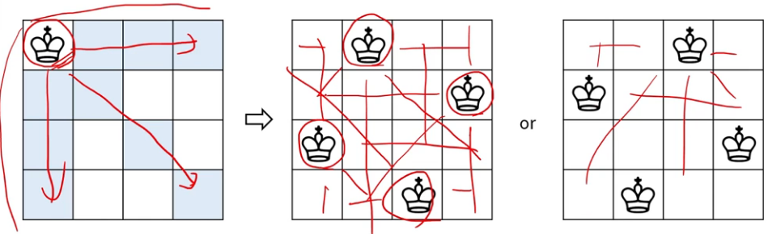
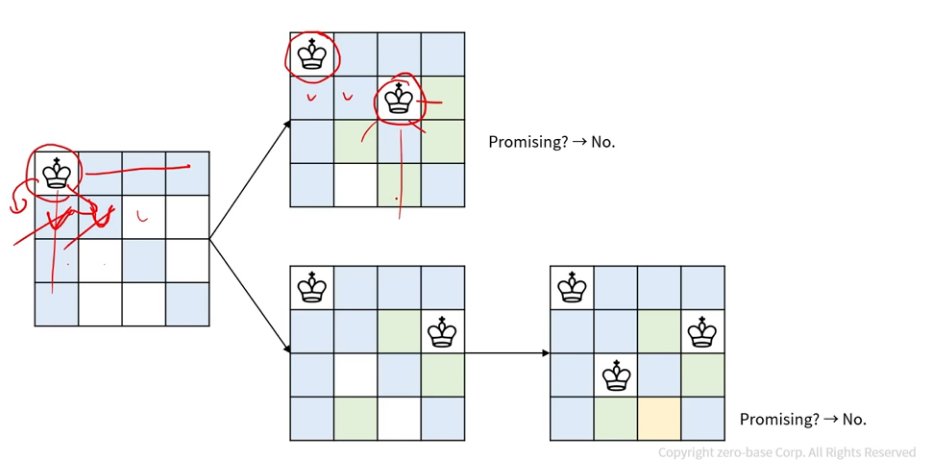
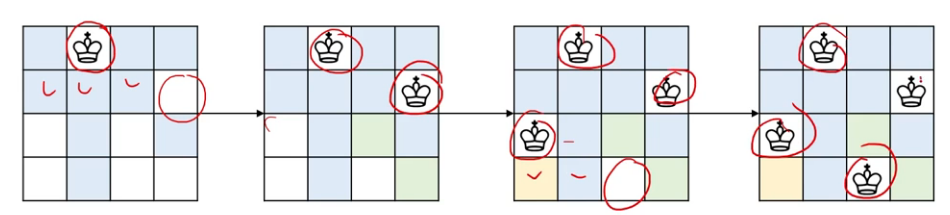

## 백트래킹
- 모든 경우의 수를 탐색하며 최적해를 구하는 과정에서 유망하지 않은 쪽은 더 이상 구하지 않는 방법
- 돌다리 두드려보고 가는 느낌
- 용어
    - 유망(Promising) : 해가 될 가능성이 있는 경우 유망
    - 가지치기(Pruning) : 해가 될 가능성이 없는 경우 해당 노드를 제외
    - 백트래킹(Backtracking) : 유망하지 않은 쪽으로 가지 않고 되돌아 오는 것

### 백트래킹 예시(1)
- N-Queen 문제
    - N * N 체스판에서 퀸 N개를 서로 공격할 수 없도록 배치하는 경우의 수

### 백트래킹 예시(2)

### 백트래킹 예시(3)
