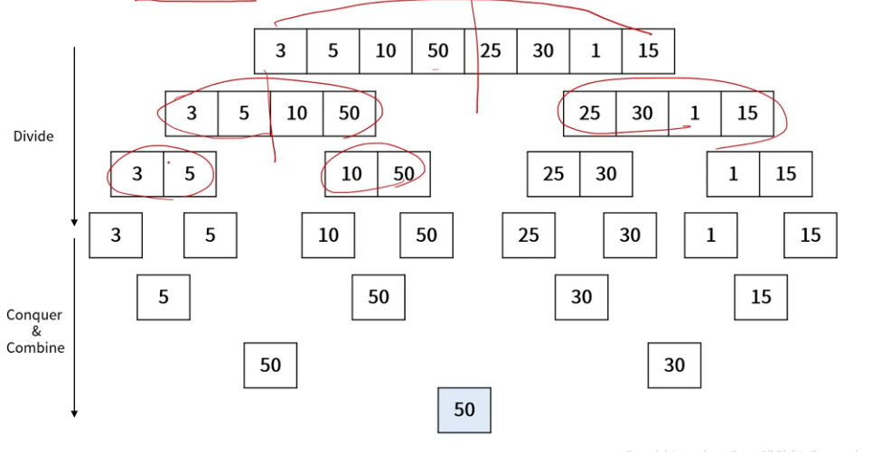
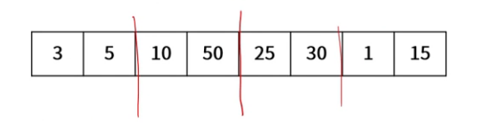

## 분할 정복 (Divide and Conquer)

- 큰 문제를 작은 부분 문제로 나누어 해결하는 방법
    - 합병 정렬, 퀵 정렬, 이진 검색, ...

- 분할 정복 과정
    1. 문제를 하나 이상의 작은 부분들로 분할
    2. 부분들을 각각 정복
    3. 부분들의 해답을 통합하여 원래 문제의 답을 구함

### 분할 정복의 장/단점
- 장점
    - 문제를 나누어 처리하며 어려운 문제 해결 가능
    - 병렬 처리에 이점이 있음

- 단점
    - 메모리를 많이 사용 (재귀 호출 구조)


### 분할 정복 예시(1)
- 최대 값 찾기



### 분할 정복 예시(2)
- 최대 값 찾기

```java
public static ing getMax(int[] arr, int left, int right){
    int m = (left + right) / 2;
    if (left == right) return arr[left];

    left = getMax(arr,left,m);
    right = getMax(arr,m + 1, right);

    return (left > right) ? left : right;
}
```