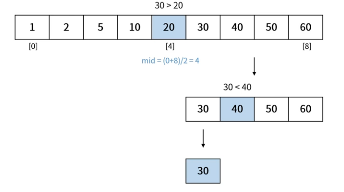

## 이진 탐색(Binary Search)
- 정렬된 상태의 데이터에서 특정 값을 빠르게 탐색하는 방법
    - 찾고자 하는 값과 데이터 중앙에 있는 값을 비교
    - 찾고자 하는 값이 더 작으면 데이터 왼족 부분에서 이진 탐색
    - 찾고자 하는 값이 더 크면 데이터 오른쪽 부분에서 이진 탐색
- 알고리즘 시간 복잡도: $O(logn)$

### 이진 탐색 과정
- 데이터가 우선 정렬된 상태여야 이진 탐색 진행 가능
- 찾고자 하는 데이터: 30

