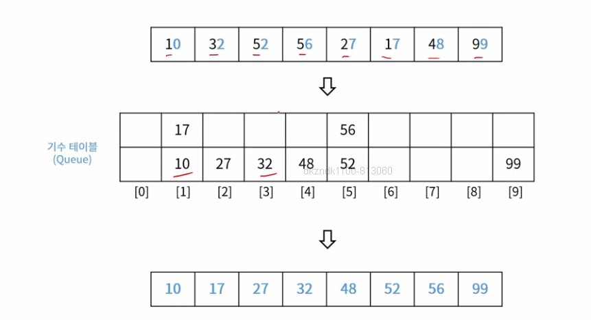

## 목차
1. [버블 정렬](#버블-정렬bubble-sort)
2. [삽입 정렬](#삽입-정렬)
3. [선택 정렬](#선택-정렬selection-sort)
4. [합병 정렬](#합병-정렬merge-sort)
5. [힙 정렬](#힙-정렬heap-sort)
6. [퀵 정렬](#퀵-정렬quick-sort)
7. [기수 정렬](#기수-정렬radix-sort)
8. [계수 정렬](#계수-정렬counting-sort)
9. [셸 정렬](#셸-정렬-shell-sort)

## 정렬
- 특정 값을 기준으로 데이터를 순서대로 배치하는 방법
- 구현 난이도는 쉽지만, 속도가 느린 알고리즘
    - 버블 정렬, 삽입 정렬, 선택 정렬
- 구현 난이도는 조금 더 어렵지만, 속도는 빠른 알고리즘
    - 합병 정렬, 힙 정렬, 퀵 정렬, 트리 정렬
- 기타 정렬 알고리즘
    - 기수 정렬, 카운팅 정렬, 셀 정렬, 보고 정렬

## 버블 정렬(Bubble Sort)
- 인접한 데이터를 비교하며 자리 바꾸는 방식
- 알고리즘 복잡도 : $O(n^{2})$


### 버블 정렬 과정 (1)


### 버블 정렬 과정 (2)


### 버블 정렬 구현
- 의사 코드(Psuedocode)
```
bubbleSort(arr[]){
    arr[SIZE]
    for i = 1 to SIZE - 1{
        for j = 0 to SIZE - i{
            if (arr[j] > arr[j + 1])
                swap(arr[j], arr[j + 1])
        }
    }
}
```

## 삽입 정렬
- 앞의 데이터를 정렬 해 가면서 삽입 위치를 찾아 정렬하는 방식
- 알고리즘 복잡도 : $O(n^{2})$


### 삽입 정렬 과정


### 삽입 정렬 구현
- 의사 코드(Psuedocode)
```
insertionSorti(arr[]){
    arr[SIZE]
    for i = 1 to SIZE {
        for j = i to 0 (j--){
            if (arr[j] < arr[j - 1])
                swap(arr[j], arr[j - 1])
        }
    }
}
```

## 선택 정렬(Selection sort)
- 최소 또는 최대 값을 찾아서 가장 앞 또는 뒤부터 정렬하는 방식
- 알고리즘 복잡도 $O(n^{2})$

### 선택 정렬 괴정


### 선택 정렬 구현
- 의사 코드(Psuedoicode)
```
selectionSort(arr[]){
    arr[SIZE]
    for i = 0 to SIZE - 1 {
        min = i
        for j = i + 1 to SIZE {
            if (arr[j < arr [min]])
                min = j
        }
        swap (arr[i], arr[min])
    }
}
```

## 합병 정렬(Merge Sort)
- 배열을 계속 분할해서 길이가 1이 되도록 만들고,
인접한 부분끼리 정렬하면서 합병하는 방식
- 알고리즘 복잡도 : $O(nlogn)$

### 합병 정렬 과정


## 힙 정렬(Heap Sort)
- 힙 자료구조 형태의 정렬 방식
- 기존 배열을 최대 힙으로 구조 변경 후 정렬 진행
- 알고리즘 복잡도 : $O(nlogn)$ 

## 퀵 정렬(Quick Sort)
- 임의의 기준 값을 정하고 그 값을 기준으로 좌우로 분할하며 정렬하는 방식
- 알고리즘 복잡도: $O(n^{2})$

### 퀵 정렬 과정(1)


### 퀵 정렬 과정(2)


## 트리 정렬 (Tree Sort)
- 이진 탐색 트리(BST)를 만들어 정렬하는 방식
- 알고리즘 복잡도: O(nlogn)

## 기수 정렬(Radix Sort)
- 낮은 자리 수부터 정렬하는 방식
- 각 원소 간의 비교 연산을 하지 않아 빠른 대신,
기수 테이블을 위한 메모리 필요
- 알고리즘 복잡도: O(dn)

### 기수 정렬 과정 (1)


### 기수 정렬 과정 (2)


## 계수 정렬(Counting Sort)
- 숫자 끼리 비교하지 않고 카운트를 세서 정렬하는 방식
- 카운팅을 위한 메모리 필요
- 알고리즘 복잡도 : $O(n+k)$

### 계수 정렬 과정


## 셸 정렬 (Shell Sort)
- 삽입 정렬의 약점 보완한 정렬 방식
- 삽입 정렬의 약점
    - 오름차순 정렬 기준, 내림차순으로 구성된 데이터에 대해서는 앞의 데이터와
    하나씩 비교하며 모두 교환 필요
- 이전의 모든 데이터와 비교하지 않고 일정 간격을 두어 비교
- 알고리즘 복잡도: $O(n^{2})$
    - 간격 설정에 따라 Worst case는 삽입 정렬과 동일
    - 일반적인 산포 데이터 기준으로는 삽입 정렬에 비해 빠르다.

### 셸 정렬 과정(1)


### 셸 정렬 과정(2)


## 정렬 알고리즘 복잡도 Summary
