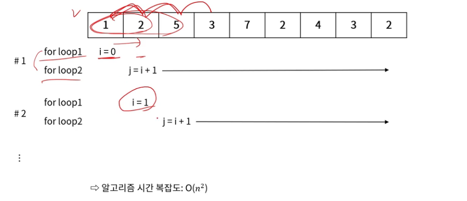
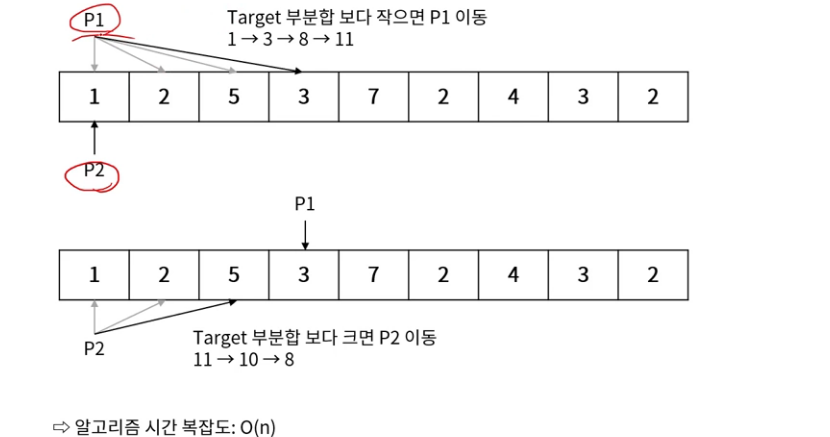

## 투 포인터(Two Pointers)
- 배열에서 두 개의 포인터를 사용하여 원하는 결과를 얻는 방법
- 두 개 포인터의 배치 방법
    - 같은 방향에서 시작 : 첫 번째 원소에 둘 다 배치
    - 서로 다른 방향에서 시작 : 첫 번째 원소와 마지막 원소에 배치
- 다중 for 문의 복잡도를 좀 더 선형적으로 풀 수 있음

### 투 포인터 예시

- 아래 배열에서 부분합이 9가 되는 구간을 찾는 방법
    - 기존 단순 for문 이용 방법

- 아래 배열에서 부분합이 9가 되는 구간을 찾는 방법
    - 투 포인터 방법

