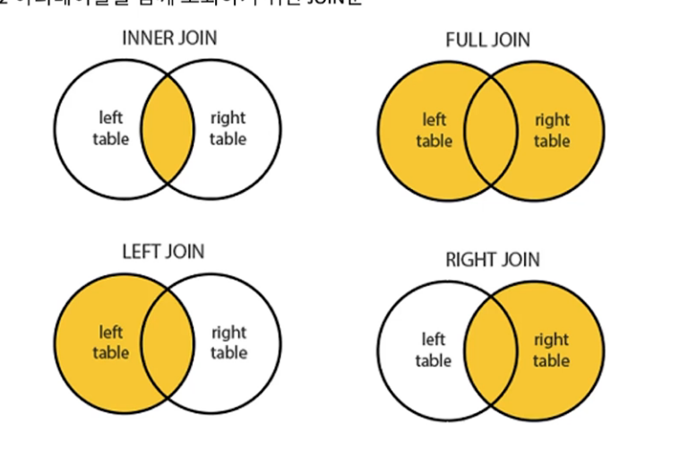

## Join

### 여러 테이블을 함께 조회하기 위한 JOIN 문
- 2개 이상의 테이블을 연결해 데이터를 출력
- 일반적으로 사용되는 SQL 문장의 상당수가 조인 이요
- JOIN은 관계형 데이터베이스의 가장 큰 장점이면서 핵심 기능
- 일반적인 경우 행들을 PK나 FK값의 연관에 의해 조인 성립
(하지만 특별한 경우에는 PK나 FK의 관계가 없어도 논리적인 값들의 연관만으로 조인 가능)
- JOIN은 2개의 테이블을 JOIN하지만, 여러개의 테이블이 있더라도 JOIN이 가능함(먼저 특정 2개의 테이블만 JOIN 처리하고, 그 결과 집합을 다시 나머지 테이블과 JOIN. 다만, 이때 JOIN 순서는 내부적으로 DBMS 옵티마이저가 결정함.)



```SQL
create table member
(
    member_type varchar(10) not null comment '회원구분',
    user_id     varchar(50) not null comment '회원 아이디',
    password    varchar(50) null comment '비밀번호'
    name        varhcar(20) null comment '이름',
    primary key (member_type, user_id)
) comment '회원정보';

create table member_detail
(
    member_type varchar(10) not null comment '회원구분',
    user_id     varchar(50) not null comment '회원 아이디',
    mobile_no   varchar(12) null comment '휴대폰 번호',
    marketing_yn bit        null comment '마케팅 수신 여부',
    register_date datetime default current_timestamp() null comment '가입일',
    primary key (member_type, user_id)
    constraint fk_member_detail foreign key (member_type, user_id) references member (member_type, user_id)
) comment '회원상세정보';

```