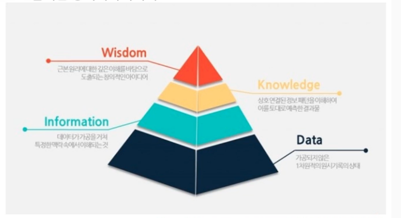
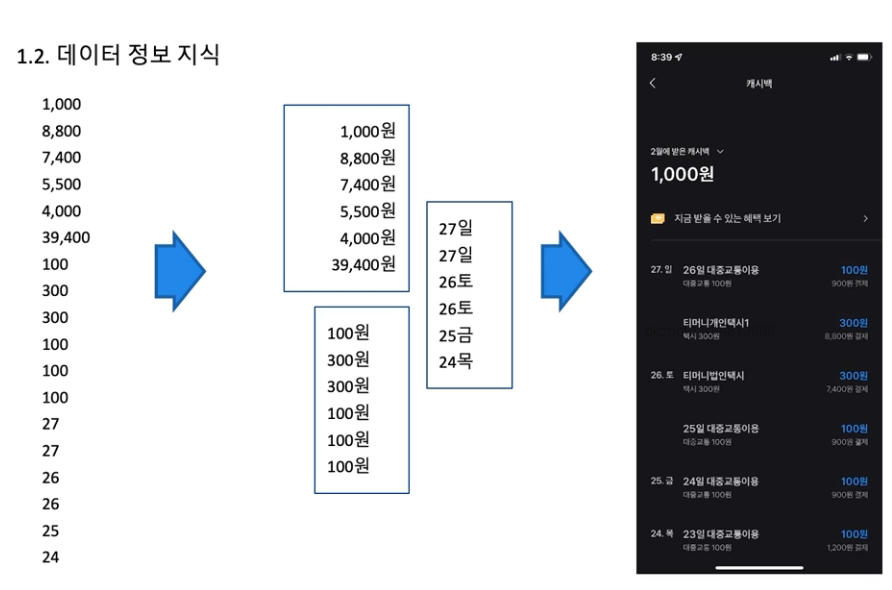
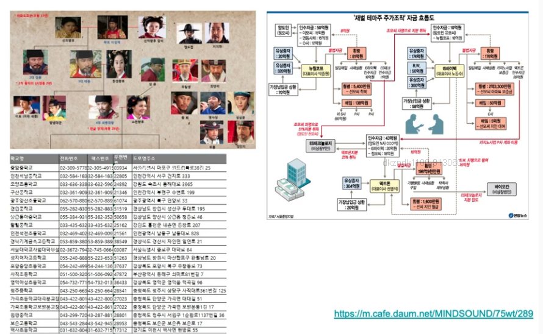
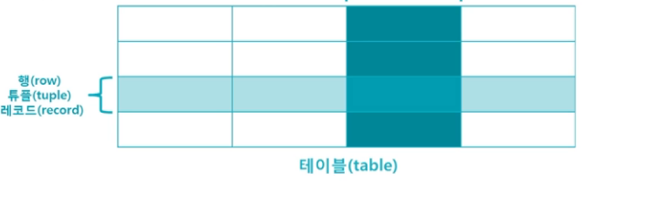
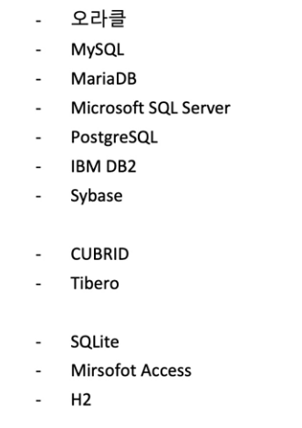

## 데이터베이스 개념
1. [데이터 정보 지식](#데이터-정보-지식)
2. [파일 시스템](#파일-시스템)
3. [데이터베이스의 특징](#데이터베이스-특징)
4. [데이터베이스 관리시스템](#데이터베이스관리시스템)
5. [RDBMS 소프트웨어](#rdbms-소프트웨어)

## 데이터 정보 지식
- 데이터 : 관찰의 결과로 나타난 정량적 혹은 정성적인 실제 값
- 정보 : 데이터의 의미를 부여한 것
- 지식 : 사물이나 현상에 대한 이해
- 지혜 : 지식을 기반으로 도출되는 창의적 아이디어

## 파일 시스템
- 파일 시스템은 컴퓨터에서 파일이나 자료를 쉽게 발견 및 접근할 수 있도록 보관 또는 조직하는 체계
- 일반적으로 하드디스크나 CD-ROM 같은 물리적인 저장장치를 이용하여 관리하는 것
- 운영체제가 저장되어 있는 파일이나 폴더들을 효율적으로 관리 및 읽고 쓰는 방법을 말함
- 파일 시스템의 종류 : FAT, NTFS, ext, APFS
- 데이터를 저장하기 위해서 파일 시스템을 이용하지만, 데이터베이스 관리 시스템을 통해서 저장하고 함.
### 데이터 처리에 있어서 파일 시스템의 단점
1. 데이터 중복성
- 데이터 불일치
- 같은 데이터에 동일한 보안수준 적용이 불가
- 저장공간 낭비 및 갱신에 대한 비용
- 데이터의 정확성 확보 불가

2. 데이터 종속성
- 응용 프로그램에 종속적(예를 들어, 구조, 접근방법이 변경되면 프로그램도 같이 변경해야 함. 반대로 프로그램이 변경되면 데이터파일도 같이 변경해야 함)

### 파일 시스템의 장점
- 처리속도가 빠름
- 구현이 간편
- 비용이 저비용

## 데이터베이스 특징
- 실시간 접근성(real time accessibllity) : 데이터베이스는 실시간으로 서비스, 사용자가 데이터를 요청하면 몇 시간이나 몇 일 뒤에 결과를 전송하는 것이 아니라 수 초 내에 결과를 서비스
- 계속적인 변화(continuous change) : 데이터베이스에 저장된 내용은 어느 한 순간의 상태를 나타내지만, 데이터 값은 시간에 따라 항상 바뀜, 데이터베이스는 삽입(insert), 삭제(delete), 수정(update) 등의 작업을 통하여 바뀐 데이터 값을 저장
- 동시 공유(concurrent sharing) : 데이터베이스는 서로 다른 업무 또는 여러 사용자에게 동시에 공유된다. 동시(concurrent: 병행)는 이라고도 하며, 데이터베이스에 접근하는 프로그램이 여러 개 있다는 의미
- 내용에 따른 참조(reference by content) : 데이터베이스에 저장된 데이터는 데이터의 물리적인 위치가 아니라 데이터 값에 따라 참조한다. 사용자가 원하는 데이터를 얻기 위해 데이터 값을 사용하여 조건을 제시하면 데이터베이스는 이에 해당하는 데이터를 검색해 준다.
- 데이터 독립성(Data Independence) : 응용 프로그램과 데이터베이스를 독립데이터의 논리적 구조를 변경시켜도 응용 프로그램은 변경되지 않음.

## 데이터베이스 관리시스템

- DBMS(DataBase Management System)은 데이터베이스를 체계적으로 관리하기 위한 시스템
- 시스템 소프트웨어
- 데이터의 관리에 특화된 프로그램

- DBMS의 유형 : 계층형, 망형, 관계형. 객체지향형, 객체관계형

- 정형화된 데이터를 관리하는 RDBMS
- 비정형 데이터를 관리하는 NoSQL

- 데이터베이스 : 데이터의 저장소
- DBMS : 데이터베이스를 운영하고 관리하는 소프트웨어

### 관계형 데이터베이스
- 가장 많이 사용하는 데이터베이스의 한 종류
- 제목(속성이 n개 모인 집합)과 본체(속성값의 집합인 행)
- 테이블의 행과 열로 구성

## RDBMS 소프트웨어

