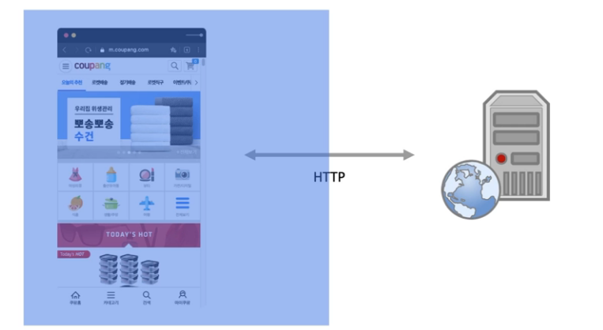

## 목차
1. [프론트엔드, 백엔드](#프론트엔드-프로그래밍과-백엔드-프로그래밍)
2. [백엔드 프로그래밍 데이터 처리](#백엔드-프로그래밍-데이터-처리)

## 프론트엔드 프로그래밍과 백엔드 프로그래밍

### 프론트엔드 프로그래밍과 백엔드 프로그래밍 - 프로그래밍

- 프로그래밍은 컴퓨터 프로그래밍을 내포함
- 소위 코딩이라고함.
- 필요에 따라(의뢰가 될 수도 있고, 내 의지가 될 수도 있고) 프로그램 언어의 명령어 혹은 문법을 이용하여 프로그램 혹은 프로그램 코드를 작성하는 일 또는, 개발한다고 함

- 다시 얘기해서, 프로그래밍 관련 툴을 이용해서 코딩하는 일

- 컴퓨터는 0과1만을 인식하지만, 사람인 우리 개발자들은 0과1로는 코딩을 할 수 없기 때문에 프로그램 관련 언어가 있고 프로그래밍 관련 툴이 있으며, 이를 통해서 코딩 혹은 개발을 함.

### 프론트엔드 프로그래밍과 백엔드 프로그래밍 - 잡코리아 IT, 인터넷 직무
- 프로그래밍은 여러가지 다양한 분야가 존재
- 대표적으로 게임개발, 기기제어(IoT), 그리고 비즈니스 업무를 위한 어플리케이션(한글 오피스, 캐드 등이 대표적인 어플리케이션(앱))
- 그리고 웹 프로그래밍이 있음.(흔히 IT. 인터넷 직무라고 함.)
- 잡코리아 IT. 인터넷 직무

### 프론트엔드 프로그래밍과 백엔드 프로그래밍 - 백엔드 프로그래밍과 프론트엔드 프로그래밍

- 에이전시를 통한 웹 서비스 런칭

- SI 웹서비스 런칭

- 개발이 복잡해지고 작업 공수가 많은 경우 혹은 분리되는 경우 -> 프론트엔드와 백엔드로 분리

### 프론트엔드 프로그래밍 언어 - 프론트엔드 개발

- 프론트엔드 개발은 일반적으로 웹 브라우저에 표시되는 UI나 화면을 HTML을 통해서 표시하고 CSS로 디자인을 입히고 Javascript로 이펙트와 데이터 처리에 대한 업무를 진행

### 프론트엔드 프로그래밍 언어 - 프론트엔드 개발 언어
- HTML
- CSS
- JavaScript

### 백엔드 프로그래밍 언어 - 백엔드 개발
- 백엔드 개발은 웹브라우저를 넘어 네트워크를 타고 웹서버에 요청한 이후부터 처리하는 과정 및 프로그램을 말하며, 보통 요청 주소(URI) 처리, 데이터 처리에 대한 업무 진행

### 백엔드 프로그래밍 언어 - 백엔드 프레임워크
- JSP(JAVA)에서 사용할 수 있는 프레임워크는 Spring
- 다만, 언어적인 면에서 kotlin 같은 언어 사용

### 백엔드 로드맵

[백엔드 로드맵](https://roadmap.sh/backend)

## 백엔드 프로그래밍 데이터 처리

### 업무처리와 프로그래밍
- 대부분의 시스템  이나 서비스는 동적으로 내용 표시
- 예를 들어, 쿠팡의 경우 이벤트를 새로 진행하기 위해서는 어디선가 이벤트 정보가 있어야 하며, 이는 매일 매일 변경되기 때문에 정적으로 구성 불가
- 웹 브라우저에서 보여지는 부분은 프론트엔드 처리, 데이터는 어딘가에서 가져와야 함
- 이를 백엔드세어 처리해서 프론트엔드에 전달.

- HTML,CSS,Javascript <(HTTP)> JAVA, JSP <(JDBC)> SQL
