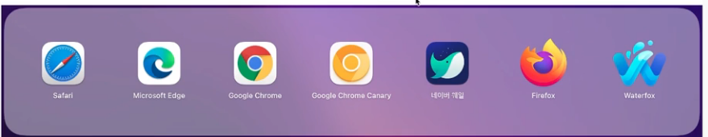
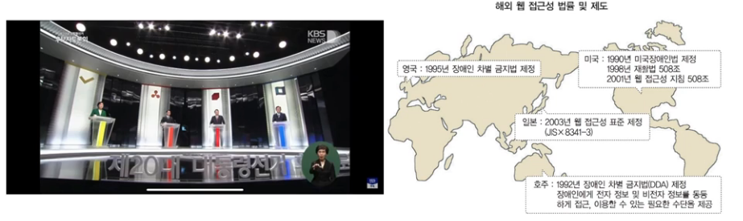
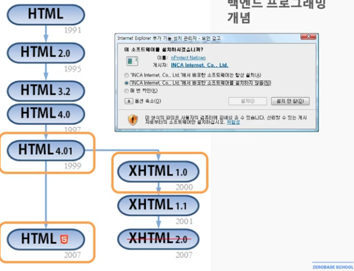
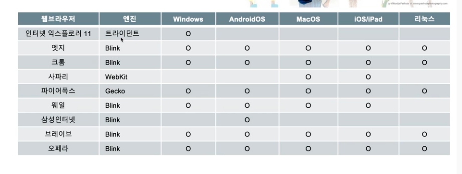
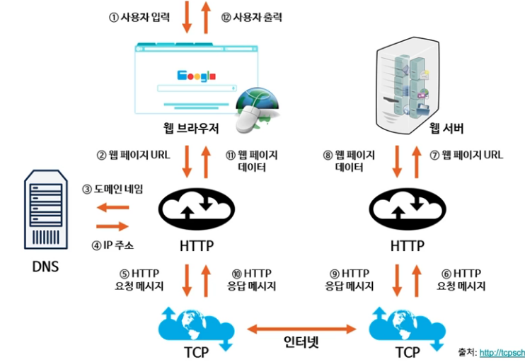

## 웹 프로그래밍
1. [인터넷과 웹](#인터넷과-웹)
2. [웹브라우저와 웹표준](#웹-브라우저와-웹-표준)
3. [웹과 모바일웹 및 기타 디바이스](#pc-웹과-모바일웹-및-기타-디바이스)

## 인터넷과 웹

### 인터넷과 웹 - 인터넷
- 전 세계적으로 연결되어 있는 컴퓨터 네트워크 통신망
- 흔히 웹(World Wide Web) 이라고 함
- 인터넷은 웹, 전자메일, 파일 공유 등 다양한 서비스들을 포함
- 시초 => 아파넷(ARPANET)에서 시작(미국방부 전쟁시 군사 정보가 집중되어 있는 곳이 공격받으면 어쩌지?)해서 정보들을 여러 지역에 분산해서 설치하고 이를 서로 연결하자는 네트워크 연구에서 시작(1969년도에)
- 로런스 래리 로버츠(인터넷의 아버지)

### 인터넷과 웹 - 팀버 너스리
- 1989년 팀버너스리(경) : 실험의 결과에 대한 문서들의 유실에 대한 방안으로 "Information System: A Proposal"문서를 통해 제안
- 문서뿐만 아니라 이미지, 음성, 동영상을 열람하는 방식을 제안 => 월드 와이드 웹의 탄생 배경
- 월드와이드웹을 만들 때 HTML 표준을 비롯한 웹 표준안을 제작
- 1990년 12월 20일 => http://info.cern.ch/hypertext/WWW/TheProject.html 세계 최초의 웹사이트

### 인터넷과 웹 - 인터넷의 시작
- PC통신 하이텔, 천리안, 나우누리, 유니텔 레츠고
- PC방의 보급
- 스타크래프트 붐

### 인터넷과 웹 - 윈도우의 역사

### 인터넷과 웹 - HTML
- HTML(Hyper Text MarkUp Language)
- 프로그래밍 언어라기 보다는 마크업 언어
- 웹에서 사용되는 문서(확장자는 보통 htm, html)
- 그냥 텍스트 (메모장에서 작성할 수 있는)파일
- 브라우저를 만나야 빛을 볼 수 있다.

- 프로그래밍 언어로 보기 힘든 이유
    - 조건 or 분기문이 없다.
    - 메모리에 있는 임의의 값(변수)를 수정할 수 없다.
    - 마크업 언어의 또다른 예는 git에서 사용하는 마크다운

## 웹 브라우저와 웹 표준

### 웹 브라우저와 웹 표준 - 웹 브라우저

- HTML을 비롯하여 이미지, 멀티미디어 파일등의 콘텐츠를 월드와이드웹을 기반으로 검색 및 뷰잉하기 위한 응용 프로그램
- 세계 최초의 웹 브라우저는 팀버너스리가 Objective-C를 이용한 NeXTSTEP 용으로 개발한 WorldWideWeb임. 이후, 1993년 모자이크 라는 브라우저가 최초로 이미지를 바로 표시할 수 있는 기능을 통해서 상용화에 성공
- 이 모자이크는 이후 네스케이프 네비게이터라는 이름을 통해서 서비스 되다가 파이어폭스로 계승됨.
- 현재 대표적인 웹 브라우저는 크롬(구글), 엣지(마이크로소프트), 사파리(애플), 파이어폭스(모질라재단)등이 있다.
- 이외, 네이버의 웨일, 인터넷익스플로러가 있다.
- 추가로, 크롬 카나리(크롬 개발자 버전), 워터폭스(파이어폭스 개발자 버전)

### 웹 브라우저와 웹 표준 - 웹 접근성
- 장애인 차별 금지 및 권리 구제 등에 관현 법률 -> 2009.04.11 부터는 공공기관, 특수학교, 종합병원, 복지시설 등과 관련된 웹사이트에서 웹접근성 보장이 의무화
- 2013년 부터는 모든 법인에서 의무적으로 웹 접근성을 준수하여야 함
- 웹사이트에서 제공하는 정보를 차별 및 제한 없이 동등하게 이용할 수 있도록 보장하는 것
- 장애인 및 고령자 등을 포함한 모든 사람이 다양한 플랫폼 및 장치나 웹 브라우저 등의 모든 환경에서 차별 및 제한 없이 동등하게 이용할 수 있도록 보장

### 웹 브라우저와 웹표준 - 웹표준과 HTML
- 웹 접근성을 준수하고 수준을 높이는 것은 웹 표준을 지키는 것임
- 웹 접근성을 높이기 위해서는 웹 표준을 잘 지켜야 함.
- 웹 표준을 결정하는 기술은 HTML, CSS Script(Javascript)가 결정함.
- HTML 마크업을 표준에 맞게 잘하고,
- CSS또한 핵이나 벤더프리픽스 같은 것보다는 표준 속성을 사용하여야 함

- 잘된 웹접근성 적용 사이트 : 청와대 사이트
- 잘되지 않은 웹접근성 적용 사이트 : 정당 사이트

### 웹 브라우저와 웹 표준 - RIA과 HTML5
- HTML은 부족함
- UI가 무언가 부족함
- 해서, 이런 갭을 커버하기 위해서 다양한 기술들이 나옴.
- 대표적인 기술이 Flash, 실버라이트, ActiveX가 있음.
- 엑티브엑스는 거의 사라짐.
- 실버라이트 역시 진작에 사라지고, 플래시도 얼마전 제거됨.
- 참고로, 플래시가 흥할때 나왔던 대표적인 것들이 엽기토끼, 졸라맨, 오인용 등...
- 플래시가 고고할 때, 스티븐 잡스가 우리는 HTML5로 할껀데 라고 함.
- 해서 모바일은 HTML5가 평정함
- W3C : 월드 와이드 웹을 위한 표준을 개발하고 장려하는 조직으로 팀 버너스 리를 중심으로 1994년 10월에 설립.

### 웹 브라우저와 웹표준 - 웹브라우저의 종류
- 공공데이터 포털을 통한 브라우저 테스트

## PC 웹과 모바일웹 및 기타 디바이스

### PC 웹과 모바일웹 및 기타 디바이스
- 모바일이 없을 때는 PC만 잘 맞추면 서비스 가능
- 아이폰 3GS가 KT를 통해서 보급됨에 따라, 스마트폰에서 모바일 웹 브라우저를 통해서 인터넷 이용 가능
- 따라서, 웹 서비스 기업들은 2개의 화면 작업에 대한  이슈가 발생함(이때 웹 해상도가 아이폰 3GS, 갤럭시가 대략 320, 360)
- 이후, 삼성전자에서 갤럭시 탭과 애플의 아이패드가 출시됨.(해상도가 또 추가됨에 따른 화면 추가 작업이 필요해짐)
- 이후, 다양한 화면 사이즈가 출시됨.
- 데이터는 동일한데 표시되는 화면은 각각 다름.
- 이는, 프론트엔드와 백엔드로 나눠지는 부분에도 영향을 미침

- 테스트도구로는 다음에서 만든 트로이라는 사이트가 있었음.(2020년도에 서비스 중지)
- 현재는 크롬 개발자도구를 대부분 사용

### 웹 동작 원리

### 기본 웹작성 환경 및 실습

- 기본 웹 개발 환경 설정(HTML, CSS, JavaScript 관련)
- 메모장(노트패드)
- vi(vim)
- Visual Studio Code
- WebStorm 
- Eclipse
- Atom
- Sublime
- EditPlus

- 어도비 드림위버
- 마이크로소프트 프론트페이지
- 마이크로소프트 익스프레션 웹
- 비주얼 스튜디오