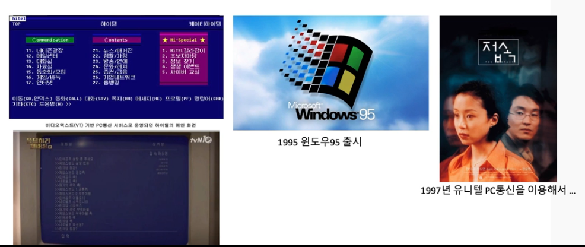
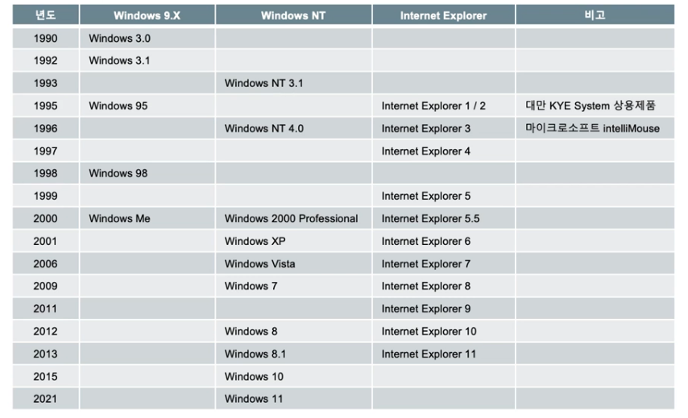
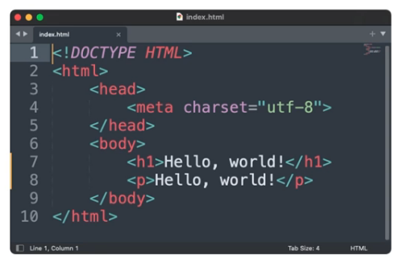

## 웹 프로그래밍
1. [인터넷과 웹](#인터넷과-웹)

## 인터넷과 웹

### 인터넷과 웹 - 인터넷
- 전 세계적으로 연결되어 있는 컴퓨터 네트워크 통신망
- 흔히 웹(World Wide Web) 이라고 함
- 인터넷은 웹, 전자메일, 파일 공유 등 다양한 서비스들을 포함
- 시초 => 아파넷(ARPANET)에서 시작(미국방부 전쟁시 군사 정보가 집중되어 있는 곳이 공격받으면 어쩌지?)해서 정보들을 여러 지역에 분산해서 설치하고 이를 서로 연결하자는 네트워크 연구에서 시작(1969년도에)
- 로런스 래리 로버츠(인터넷의 아버지)

### 인터넷과 웹 - 팀버 너스리
- 1989년 팀버너스리(경) : 실험의 결과에 대한 문서들의 유실에 대한 방안으로 "Information System: A Proposal"문서를 통해 제안
- 문서뿐만 아니라 이미지, 음성, 동영상을 열람하는 방식을 제안 => 월드 와이드 웹의 탄생 배경
- 월드와이드웹을 만들 때 HTML 표준을 비롯한 웹 표준안을 제작
- 1990년 12월 20일 => http://info.cern.ch/hypertext/WWW/TheProject.html 세계 최초의 웹사이트

### 인터넷과 웹 - 인터넷의 시작
- PC통신 하이텔, 천리안, 나우누리, 유니텔 레츠고
- PC방의 보급
- 스타크래프트 붐

### 인터넷과 웹 - 윈도우의 역사

### 인터넷과 웹 - HTML
- HTML(Hyper Text MarkUp Language)
- 프로그래밍 언어라기 보다는 마크업 언어
- 웹에서 사용되는 문서(확장자는 보통 htm, html)
- 그냥 텍스트 (메모장에서 작성할 수 있는)파일
- 브라우저를 만나야 빛을 볼 수 있다.

- 프로그래밍 언어로 보기 힘든 이유
    - 조건 or 분기문이 없다.
    - 메모리에 있는 임의의 값(변수)를 수정할 수 없다.
    - 마크업 언어의 또다른 예는 git에서 사용하는 마크다운