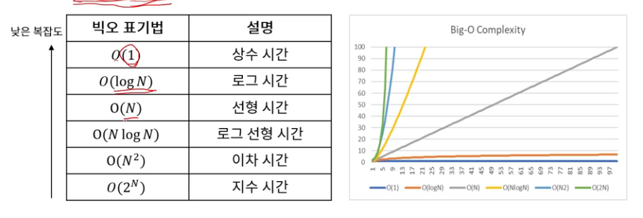

## 복잡도 (Complexity)
> 알고리즘 성능을 나타내는 척도
>
> 시간 복잡도(Time Complexity)
>
> - 알고리즘의 필요 연산 횟수
>
> 공간 복잡도(Space Complexity)
>
> - 알고리즘의 필요 메모리
>
> 시간 복잡도와 공간 복잡도는 Trade-off 관계

## 시간 복잡도 (Time Complexity)
> 어떤 문제를 해결하기 위한 알고리즘의 필요 연산 횟수
>
> 빅오(Big-O) 표기법을 통해 나타냄 : 최악의 경우 걸리는 시간을 나타낸다.



## 공간 복잡도
> 어떤 문제를 해결하기 위한 알고리즘의 필요 메모리 사용량
>
> 빅오 표기법을 통해 나타냄
>
> 일반적으로 메모리 사용량 기준은 MB 단위
```java
int[] a = new int[1000]; // 4KB
int[][] a = new int[1000][1000]; // 4MB
```