## 목차
1. [Instruction Set](#instruction-set과-코드)
2. [CPU의 기본 구조](#cpu의-기본-구조)
3. [CPU 파이프라인](#cpu-파이프라인)
4. [CISC,RISC](#cisc-risc)
5. [메모리](#메모리)
6. [DMA](#dma-direct-memory-access)
7. [IO Device](#io-devices)
8. [더 공부할것](#더-공부할-것)

## Instruction Set과 코드
- SoftWare: Code + Data
    - Software Engineer: Code를 작성하는 사람
    - Machine language: CPU는 Instruction code를 만들어놓고, 제공함
    - 컴파일: 프로그래밍 언어로 작성된 프로그램은 컴파일러를 통해 CPU가 제공하는 Instruction code를 기반으로 변환됨

> 파이썬은 컴파일을 하지않음? => [참고](https://www.fun-coding.org/PL&OOP1-1.html)

> 하드웨어를 고려하지 않고, 코드레벨에 집중

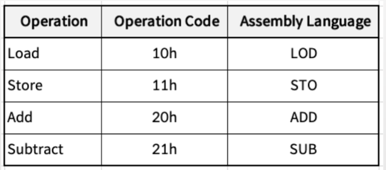

### Instruction Code를 약자로.
- LOD A, `[1003h]`
    - LOD는 10h의 Instruction Code를 나타내는 약자
    - A는 accumulator를 나타내는 약자, 나타낸다고 하면
    - 1003h 주소에 있는 데이터를 로드해서 accumulator에 넣어라.

### 주소도 약자로 만들기
- BEGIN: LOD A, `[1005h]` - 코드 재작성시 주소 변경되므로 이름붙이기
    - 고급 언어에서는 함수와 변수에 이름을 붙이는 작업이 됨

## CPU의 기본 구조

### 다시 이해하는 폰노이만 구조 (현 컴퓨터 구조)
- Controller Unit: Program Counter
- ALU: 가산기 + 논리연산 + Register

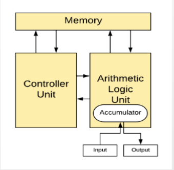

> 코드만 알맞은 주소에 써넣으면, 원하는대로 동작한다!

### 컴퓨터의 CPU 기본 구조
- CPU에 레지스터라는 저장공간이 있음 - 빠른 실행
    - PC(Program Counter): 다음 실행할 명령어 주소를 가리키는 레지스터
    - IR(Instruction Register): 가장 최근에 인출한 명령어 보관 레지스터
    - 누산기(ACC, Accumulator): 데이터 일시 보관 레지스터
    - MAR(Memory Address Register): CPU가 메모리 참조위해 보관하는 데이터 주소를 가진 레지스터
    - MBR(Memory Buffer Register): CPU가 메모리로부터 읽거나 저장할 데이터 자체를 보관하는 레지스터

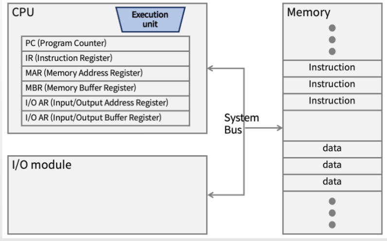

### 함수의 return은 왜 하나의 변수만 넣을 수 있을까?.
- 불가능하지는 않다. 이를 응용해서 파이썬은 여러 변수를 한번에 리턴하는 것도 가능.
    - 데이터가 여러개 있는 주소를 만들고 해당 주소를 리턴한다.

## CPU 파이프라인

### 현 컴퓨터의 CPU 기본 실행 구조
1. Instruction Fetch: 실행할 명령어를 메모리에서 읽어 CPU로 가져옴
    - PC가 가리키는 주소를 MAR에 보냄
    - MAR에 적힌 주소를 메모리에서 읽어서 MBR에 보냄
    - MBR에 있는 명령어를 IR에 저장
    - 다음 명령어를 가리키도록 PC는 주소값 증가
2. Instruction Decode: 인출한 명령어에 포함된 데이터 가져오고 명령어 해독
3. Instruction Excution: 명령어 실행
    - MBR의 데이터와 ACC (Accumulator)의 데이터로 연산 후, ACC(Accumulator)에 저장
4. Write Back: 실행 결과를 저장

### 현 컴퓨터의 CPU 명령어 구조
> CPU 마다 방식은 조금씩 다를 수 있지만, 기본적으로 하나의 명령은 opcode + argument(operand) 구조를 가질 수 있음

- 3E는 사전에 약속된 load 명령, 이 때 바로 이어지는 데이터는 operand
- load 명령에서 operand는 데이터가 있는 주소임
- 그래서 데이터를 operand 주소로 부터 가져와서, 약속된 레지스터에 저장

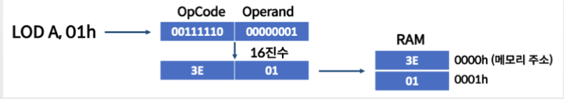

### CPU 성능을 높이는 기법 - 파이프라인
> 세탁기에 옷을 세탁하는 법 - 총 8시간

- 세탁기에 옷 넣기, 세탁하기, 옷 잘 개기, 옷장에 넣기

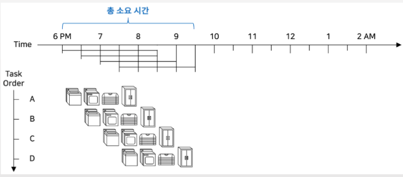

> 세탁기에 옷을 세탁하는 법 - 총 3.5 시간

- 파이프라인: 하나의 작업에 필요한 일을 세부적으로 나누어서 동시에 다른 세부작업을 실행하는 기법

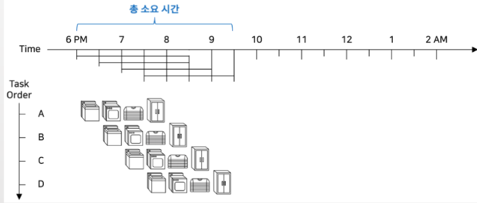

> 하나의 명령을 실행하는데 필요한 세부작업을 나눠보자

- Fetch Stage (Instruction Fetch/Decode)   
- Execution Stage (Instruction Execution)

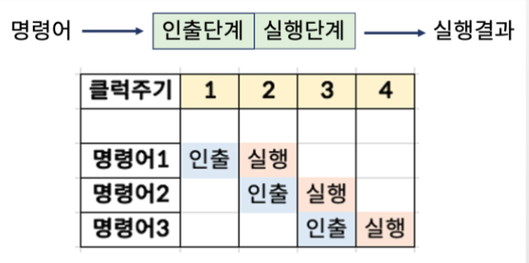

> 하나의 명령을 실행하는데 필요한 세부작업을 더 나눠보자

- 명령어 인출 (IF: Instruction Fetch)
- 명령어 해독 (ID: Instuction Decode): 인출된 명령어 해석
- 오퍼랜드 인출(OF: Operand Fetch): 메모리에서 데이터 인출
- 명령어 실행(EX: Execute)

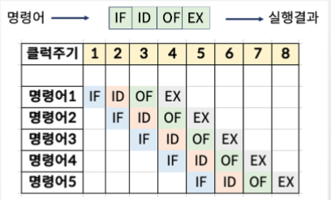

> 하나의 명령을 실행하는데 필요한 세부작업을 더 나눠보자
- 명령어 인출 (IF: Instruction Fetch)
- 명령어 해독 (ID: Instuction Decode): 인출된 명령어 해석
- 오퍼랜드 인출(OF: Operand Fetch): 메모리에서 데이터 인출
- 명령어 실행(EX: Execute)
- 실행 결과 저장(SR: STore)

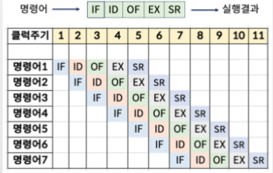

- 하나의 명령을 실행하는데 5 cycle이 걸린다
- 상기해보기: cycle - 1개의 세부작업을 하는 단위
    - 1Hz = 1cycle / sec
    - 최초 인텔 CPU 4004: 108,000 cycles / sec (108 kilohertz, KHZ)
    - 108,000 / 5 cycle(한 명령 실행 시간): 초당 21600 명령 실행

- [인텔 CPU 파이프라인](https://namu.wiki/w/%ED%8C%8C%EC%9D%B4%ED%94%84%EB%9D%BC%EC%9D%B8)

### 최근 뉴스 : [인텔 보안 패치 성능 저하](https://namu.wiki/w/CPU%20%EA%B2%8C%EC%9D%B4%ED%8A%B8?from=CPU%EA%B2%8C%EC%9D%B4%ED%8A%B8)
- 파이프라인을 타고 실행이 되다가, 마지막에 보안에 이슈가 있으면 전체 취소.
    - 그 때까지 줄을 서서 실행되고 있는 나머지 코드도 다 실행 취소됨. 따라서 그만큼 CPU 사용 낭비

## CISC, RISC

### ARM vs Intel?
- [ARM과 손정의](https://www.youtube.com/watch?v=BpRu8o4DkVk)

### CPU 명령어를 정의하는 전략 - RISC vs CISC
- CISC(Complex Instruction Set Computer)
    - 하나의 명령어 실행으로 가능한 한 많은 작업을 수행(복합 명령어)
    - 복합 명령어 수행을 위해 CPU 로직 회로 복잡도 증가
        - 하나의 명령어 실행 시간 증가
- RISC(Reduced Instruction Set Computer)
    - 간단한 명령어를 조합해서 실행하면 더 효율적이지 않을까?

### CISC의 특성
- 명령어의 포맷이나 길이에 관한 규칙이 없음
- 하나 이상의 사이클로 명령어(세부 작업) 실행
- 전체 명령이 얼마나 걸릴지 시간 예측이 어려움

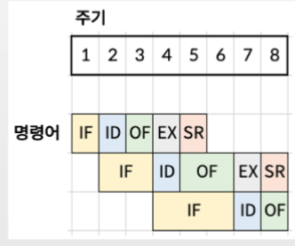

### RISC의 특성
- 명령어의 포맷과 길이 고정
- 하나의 사이클로 명령어(세부 작업) 실행
- 전체 명령 시간 예측이 가능

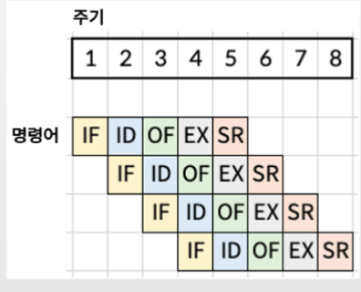

### CISC/RISC CPU
- 대표적인 CISC CPU: 인텔 CPU
- 대표적인 RISC CPU: ARM
    - 스마트폰, 임베디드, IoT 기기

## 메모리
- 메모리가 비싸서, 성능을 높이기 위한 전략
    - 비싼 메모리는 CPU 바로 옆에, 단 작게
    - 느린 메모리는 먼 곳에, 단 크게

> 프로그래밍 시 최대한 메모리에서 해결하는 것이 프로그램 전체의 성능을 높인다.

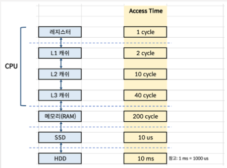

- Register: CPU 안에서 데이터 보관
- SRAM: L1, L2, L3 캐쉬
    - 최대한 가장 많이 사용하는 메모리의 데이터를 넣어놓아서, 메모리까지 접근하지 않고 CPU가 가져다 쓸 수 있게 함
- DRAM: 메모리
- SSD/HDD(하드디스크): 컴퓨터를 꺼도 데이터 보전

## DMA (Direct Memory Access)
- CPU가 캐쉬까지는 데이터를 가져오는데 관여하지만(Instruction Fetch)
- 메모리, SSD에서 데이터를 가져오는데까지 관여하면 CPU 활용도가 낮아진다
    - DMA라고 만들어서 메모리, SSD에서 데이터를 관리하면 CPU는 이 시간을 명령실행에 더 쓸 수 있다.

## IO Devices
- Input/Output Devices
    - CDROM, Mouse, Keyboard
    - Printer
    - Network Card
- Bus를 통해 IO Device에 데이터를 송수신

## 더 공부할 것
1. OP Code
2. Bus
3. 더 생기면..
