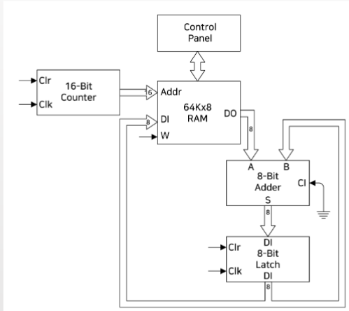
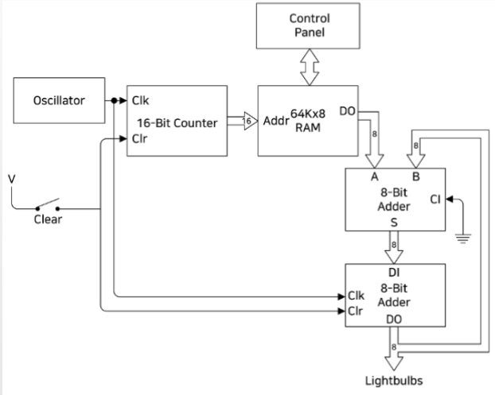
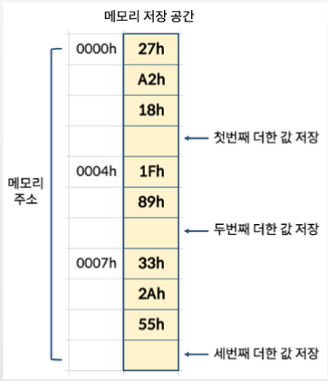
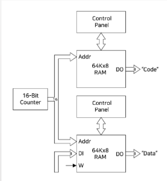
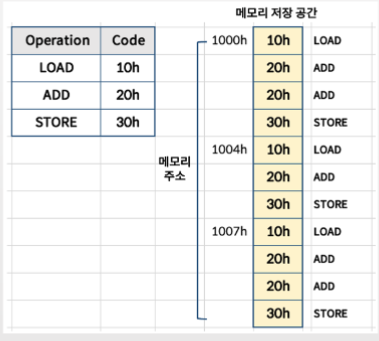
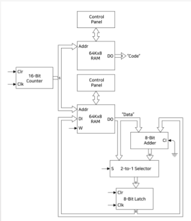

## 목차
1. [PC](#pc-program-counter)
2. [Automation](#automation)
3. [Programming](#programming)

## PC (Program Counter)
- 16-Bit Counter: 1씩 증가하는 조합논리회로

### 여러 숫자를 더하고 싶다.
1. 각 숫자를 0000h부터 순차적으로 써넣는다.
    - Control Panel에 Takeover 스위치를 1로 한 후, 각 숫자를 각 주소에 써넣는다.
2. Takeover 스위치를 0으로 해서, 더이상 Control Panel이 RAM을 제어하지 않도록 만든다.
3. PC의 Clear 스위치가 0이 되면, PC는 0000h 부터 RAM에서 데이터를 가져온다.
4. Adder가 값을 더한다.
5. 클럭(Oscillator)이 0과 1로 변할 때마다, PC 값이 증가한다.

## Automation
- 000h주소부터 데이터 저장되어 있음
- 세 수를 더하고, 두 수를 더하고, 세 수를 더한다고 가정

## Programming
> format
>
> 1. command address => address 
> 2. command(value) address => address
> 3. command(value) subcommand address

- Load 000h address
- Add 0001h address
- Add 0002h address
- Store 값 in 0003h
- Load 0004h address
- Add 0005h address
- Store 값 in 0006h
- Load 0007h address
- Add 0008h address
- Add 0009h address
- Store 값 in 000Ah

### `Data` & `Code`

- 각 주소에 대응해서 Load, Add, Store를 의미하는 값을 만들어야 함.
- RAM을 분리하여, 명령을 의미하는 값을 순차적으로 넣어주면, 코드를 실행할 수 있음.

- h는 Hex(16진수)를 의미함
- 아래와 같이 각 명령을 의미하는 숫자를 만들고, 각 주소에 맞는 코드 넣기
- 명령 숫자: Instruction Code, Operation Code, 또는 opcode 라고 함.

> [x86code](https://en.wikipedia.org/wiki/X86_instruction_listings#x86_integer_instructions)

### Load와 Store 명령
- Load: 2-to-1 Selector로 Data를 Add하지 않고 바로 8-bit Latch에 넣음
- Store: 8-bit latch의 Output을 바로 64Kx8 RAM에 저장 (Write 스위치를 1로 만듬)

### Digital Computer
> 여기까지 -- 이제 CPU가 Code를 사용해서 동작 가능함을 이해
- CPU, Memory, PC, Input(Switches), Output(출력전구)
    - Digital Computer: 구분된 숫자를 기반으로 동작하는 컴퓨터
    - Memory: 64KB RAM