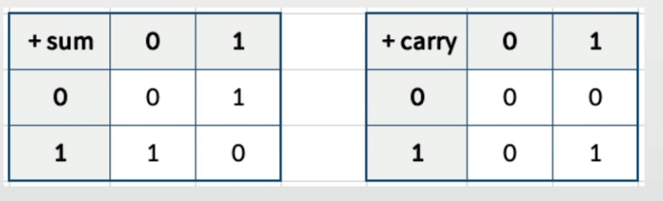

## 가산기

### 이진수의 덧셈 1 (가산기)
> 간단한 논리연산을 가지고 계산기를 만들 수 있다.
- 0 + 0 = 0
- 0 + 1 = 1
- 1 + 0 = 1
- 1 + 1 = 0, 하지만 다음 자릿수를 1 더해야 함(carry 라고 한다.)

### 이진수의 덧셈 2 - carry(가산기)

- 0 + 0 = 0, carry 는 0
- 0 + 1 = 1, carry 는 0
- 1 + 0 = 1, carry 는 0
- 1 + 1 = 0, 하지만 carry는 1

### 이진수의 덧셈 3 (가산기)
- 기존 논리 게이트로는 sum 을 만들 수 없음

### 이진수의 덧셈 4 (가산기)
- sum을 위한, 논리 게이트를 만들어본다면?
    - OR와 NAND 게이트를 연결해보면?

- 그런데 원하는 결과를 나타낼 게이트가 부족하다. => 더 연결해 본다면?

| A | B |OR Out|NAND Out|바라는 결과|
|:-:|:-:|:----:|:------:|:--------:|
| 0 | 0 | 0    | 1      | 0        |
| 0 | 1 | 1    | 1      | 1        |
| 1 | 0 | 1    | 1      | 1        |
| 1 | 1 | 1    | 0      | 0        |

### 이진수의 덧셈 5 (가산기)
- sum을 위한, 논리 게이트를 만들어본다면?
    - OR와 NAND 게이트에 AND 게이트를 연결해보면?

| A | B |OR Out|NAND Out|AND Out   |
|:-:|:-:|:----:|:------:|:--------:|
| 0 | 0 | 0    | 1      | 0        |
| 0 | 1 | 1    | 1      | 1        |
| 1 | 0 | 1    | 1      | 1        |
| 1 | 1 | 1    | 0      | 0        |

### 이진수의 덧셈 6 - XOR 게이트 (가산기)
- OR와 NAND 게이트에 AND 게이트를 연결할 경우, XOR 게이트와 동일한 값을 만들 수 있음

### 이진수의 덧셈 7 (가산기)
- sum과 carry를 계산할 수 있는 논리 게이트 만들기
    - XOR와 AND 게이트를 사용하면 한 자리의 덧셈 가능.

### 이진수의 덧셈 8 (반가산기)
- 반가산기 (half adder)
- 반가산기: 두 bit를 덧셈하는 가산기를 의미
    - 전가산기: 두 bit 외, carry 까지 계산할 수 있는 가산기를 의미
- 각각 하나의 bit인 A와 B를 더해서, 합 S와 자리 올림(Carry) C를 출력하는 조합논리회로

### 이진수의 덧셈 9 (가산기)
- 전가산기 (full adder)
- 반가산기를 조합해서 전가산기 만들기
- 전가산기는 A bit, B bit, carry bit 값을 입력으로 받아서, sum 과 carry 값을 출력해줌.

### 예시(Carry In 1, A in 1, B in 1 계산) 
- Carry In 1, A in 1, B in 1
- 처음 반가산기 : $H_{1}$
- 두번째 반가산기 : $H_{2}$

- Step 1.
    1. $H_{1}SumOut => 1 \oplus 1 => 0 $ 
    2. $H_{1}CarryOut => 1 \otimes 1 => 1$ 
    3. $H_{1}SumOut = 0, H_{1}CarryOut = 1$

- Step 2.
    1. $CarryIn(1) => H_{2}A = 1$
    2. $H_{1}SumOut(0) => H_{2}B = 0$
    3. $H_{2}SumOut = 1 \oplus 0 => 1$
    4. $H_{2}CarryOut = 1 \otimes 0 => 0$

- Step 3.
    1. $H_{2}CarryOut(0) => CarryOut_{A} = 0$
    2. $B(1) => CarryOut_{B} = 1$
    3. $0 | 1 => 1 => CarryOut$

- Step 4.
    1. $H_{2}SumOut => 1 \oplus 0 => 1$
    2. $ SumOut = 1, CarryOut = 1 $

### 이진수의 덧셈 10 (가산기)
- 전가산기
    - Carry, A, B 를 입력으로, S(합), Carry(자리올림)을 출력으로

