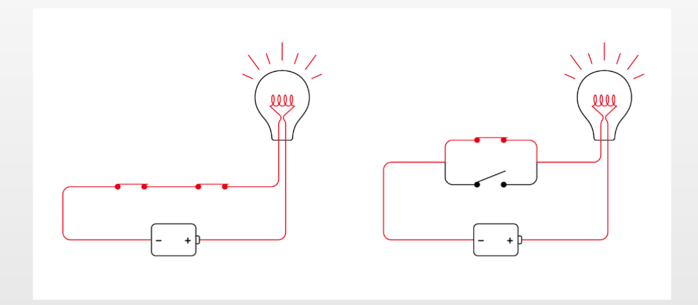
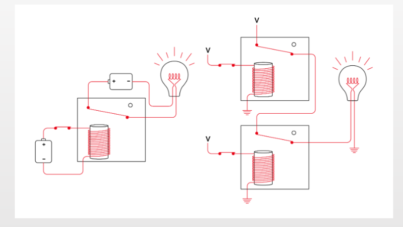
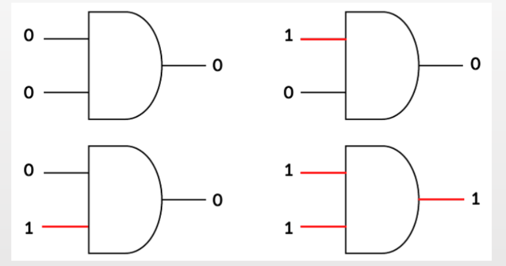
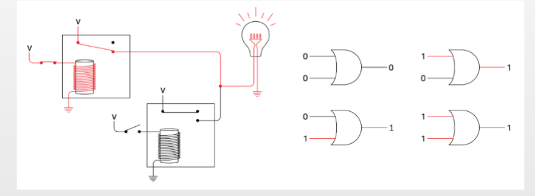
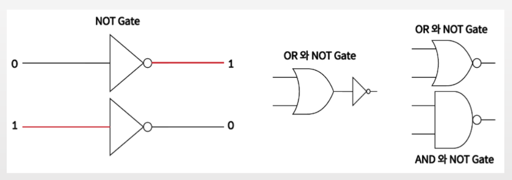
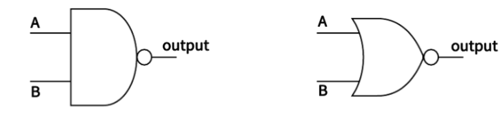
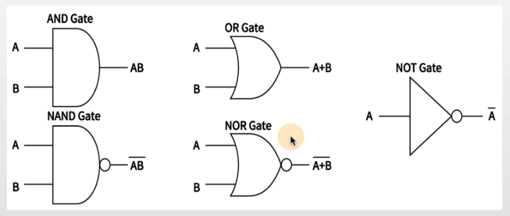

## 목차
1. [논리연산](#논리-연산)

## 논리 연산

### AND GATE
| A | B |output| 
|:-:|:-:|:----:|
| 0 | 0 | 0    |
| 0 | 1 | 0    |
| 1 | 0 | 0    |
| 1 | 1 | 0    |

### OR GATE
| A | B |output| 
|:-:|:-:|:----:|
| 0 | 0 | 0    |
| 0 | 1 | 1    |
| 1 | 0 | 1    |
| 1 | 1 | 1    |

### AND와 OR 논리 연산

### AND Gate 연산 (switch를 만들다.)
> 외부 스위치를 누르면 내부 전류가 흘러서 자기장을 만들고 내부 스위치가
>
> 자기장으로 인해 눌러진 상태로 변경된다.

 

### OR Gate 연산 
> OR Gate 연산 (2개의 Input과 1개의 Output)

### NOT Gate, 그리도 다른 Gate와의 조합

### NAND와 NOR Gate 
> (AND와 OR 의 결과값과 반대면 됨)

### NAND Gate

| A | B |output| 
|:-:|:-:|:----:|
| 0 | 0 | 1    |
| 0 | 1 | 1    |
| 1 | 0 | 1    |
| 1 | 1 | 0    |

### NOR 
| A | B |output| 
|:-:|:-:|:----:|
| 0 | 0 | 1    |
| 0 | 1 | 0    |
| 1 | 0 | 0    |
| 1 | 1 | 0    |

### 부울 대수식

### 예제
> $ AB + CD = Y \; (A + B)(C + D) = Y $