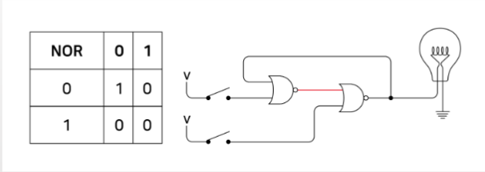
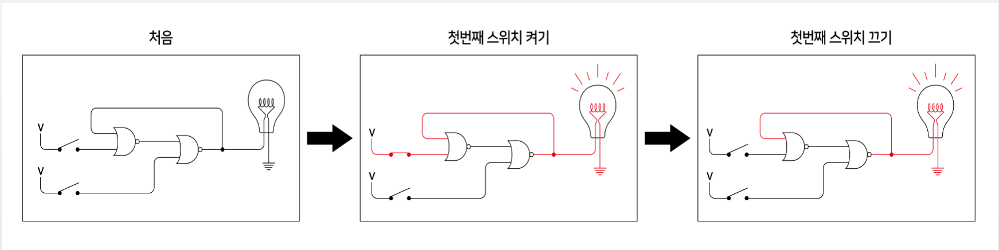
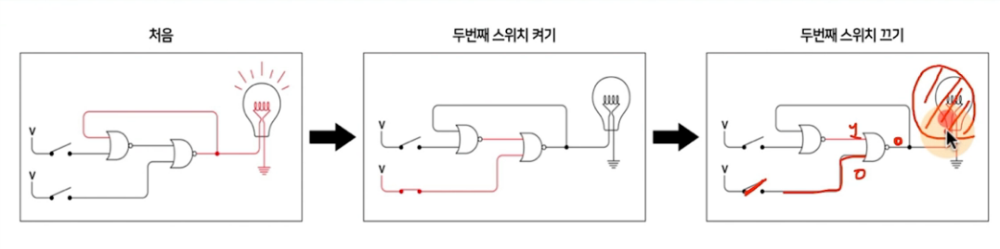
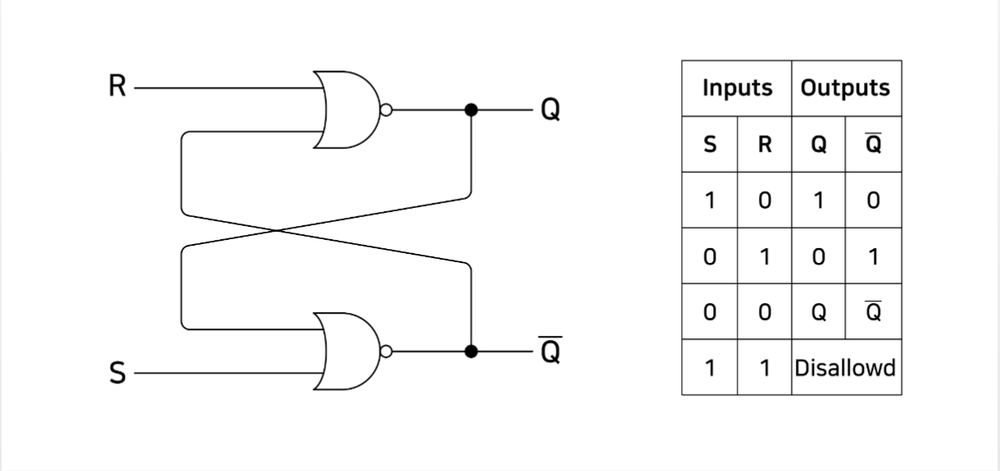
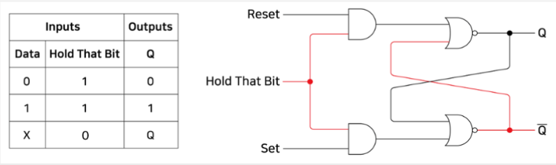
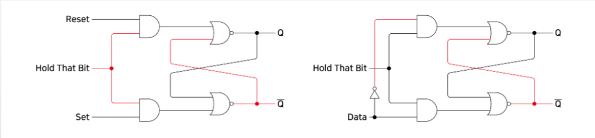
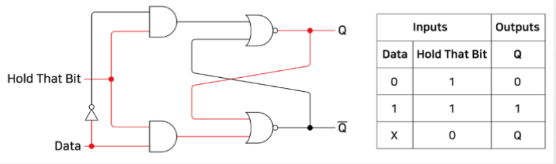

## 플립 플롭이란? - 메모리
- NOR 게이트를 조합해보자.

- 첫번째 스위치를 킨 후, 끄면?
    - 기억 기능

> $NOR_{1}, NOR_{2}, V_{1}, V_{2}, L$ : NOR 게이트, 버튼 1 2, 전구
> 
> Step1. (V1스위치를 키면?)
> 
> $1. V_{1}on => output : 1
\\ 2. \; NOR_{1} \;in\; (V_{1}out(1), ?) => output : 0 
\\ 3. \; V_{2} out => output : 0 
\\ 4. NOR_{2} \;in\; (NOR_{1}out(0), V_{2}out(0)) => output : 1 
\\ 5. L_{on}$
>
> Step2. (V1스위치를 끄면?)
>
> $1. V_{1}off => output : 0
\\ 2. \; NOR_{1} \; in (V_{1}out(0), L_{on}out(1)) => output : 0 
\\ 3. \; V_{2} out => output : 0 
\\ 4. NOR_{2} \;in\; (NOR_{1}out(0), V_{2}out(0)) => output : 1 
\\ 5. L_{on}$

- 두번째 스위치를 킨 후, 끄면?(첫번째 스위치가 켜졌었던 상태)
    - 삭제 기능

> $NOR_{1}, NOR_{2}, V_{1}, V_{2}, L$ : NOR 게이트, 버튼 1 2, 전구
> 
> Step1. V2 스위치를 키면? (첫번째 스위치가 켜졌었던 상태)
>
> $1. V_{2}on => output : 1
\\ 2. \; NOR_{1} \;in\; (V_{1out}(0), L_{onout}(1)) => output : 0 
\\ 3. \; V_{2} \;on\; => output : 1 
\\ 4. NOR_{2} \;in\; (NOR_{1out}(0), V_{2out}(1)) => output : 0
\\ 5. L_{off}$
>
> Step2. (V2 스위치를 끄면?) 
>
> $ 1. L_{off} => output : 0 
\\ 2. NOR_{1} \;in\;(V_{1out}(0), L_{off \; out}(0)) => output : 1
\\ 3. V_{2} \;off\; => output : 0 
\\ 4. NOR_{2} (NOR{1out}(1), V_{2out}(0)) => output : 0
\\ 5. L_{off}$
>
> 한번 $V_{2}$ 스위치를 킨 뒤에 끄게 되면
>
> $V_{1}$의 경우에는 전구의 불이 지속적으로 켜졌었던 것이 꺼지게 된다.

## 플립플롭
- flip-flop (플립플롭): 데이터를 저장하는 조합논리회로
    - 두번째 스위치를 킨 후, 끄면?
        - 첫 번째 스위치를 키면 불이 켜지고, 스위치를 꺼도 불은 켜진채로 지속됨
        - 두 번째 스위치를 끄면 불이 꺼지고, 스위치를 꺼도 불은 꺼진채로 지속됨 

    - 스위치를 키고 끄고를 저장할 수 있다!
        - 불이 켜져 있다: 최근에 첫 번째 스위치가 켜졌었다.
        - 불이 꺼져 있다: 최근에 두 번째 스위치가 꺼졌었다.

### RS 플립플롭
- R-S(Reset-Set) flip-flop
    - Q는 output, ${\bar Q}$ 는 Q의 반대값
    - 단, S와 R이 1인 상태는 피하도록 설계 (Q값과 ${\bar Q}$ 이 둘다 0이 되므로)

### 플립플롭 (Level-triggered flip-flop)
- Hold That Bit 라는 이름으로 조합논리회로를 추가해봅니다.

> Hold That Bit이 1일 때만, Data가 1일 때 출력값에 적용이 된다.

### 플립플롭 (D-type flip-flop)
- R/S (두 input)를 Data(하나의 input)으로 바꿔봅니다.
    - R/S 둘다 1일 경우는 피하도록 설계하기로 함.
    - R/S 둘다 0일 경우도 Q 값에 영향을 안주므로 삭제

### 예시(R = 1, S = 0, HoldThatBit = 1)

- (HoldThatBit => HTB로 축약)
> Step 1. R 스위치를 켰을 때
>
> $ 1. AND_{1} in (R_{out}(1), HTB_{out}(1)) => output : 1 
\\  2. AND_{2} in (HTB_{out}(1), S_{out}(0)) => output : 0
\\  3. NOR_{1} in (AND_{1out}(1), ?) => output: 0
\\  4. NOR_{2} in (NOR_{1out}(0), AND_{2out}(0)) => output : 1
\\  5. Q =0, {\bar Q} = 1$
>
> Step 2. R 스위치를 껐을 때(R 스위치를 킨 상태에서)
>
> $ 1. AND_{1} \;in\; (R_{out}(0), HTB_{out}(1)) => output : 0 
\\  2. AND_{2} \;in\; (HTB_{out}(1), S_{out}(0)) => output : 0
\\  3. NOR_{1} \;in\; (AND_{1out}(0), {\bar Q}_{out}(1)) => output: 0
\\  4. NOR_{2} \;in\; (NOR_{1out}(0), AND_{2out}(0)) => output : 1
\\  5. Q =0, {\bar Q} = 1$
>
> 스위치를 키고 껐을 때 동일한 출력 결과가 나오게 된다.

### Level-triggered D-type flip-flop(플립플롭)
- D는 Data를 의미함
- Level-triggered는 Hold That Bit이 1일 때만 Data 값을 저장한다는 의미
- RS 플립플롭에서 R/S 둘다 1,0일 경우를 피하도록 설계한 조합논리회로

- HoldThatBit => HTB로 축약 
> Step 1. Data 1, HTB 1
>
> $1. NOT \;in\; (1) => output : 0 
\\ 2. AND_{1} \;in\;(NOT_{out}(0), HTB_{out}(1)) => output : 0
\\ 3. AND_{2} \;in\;(DATA_{out}(1), HTB_{out}(1)) => output : 1
\\ 4. NOR_{2} \;in\;(AND_{2out}(1), ?) => output : 0
\\ 5. {\bar Q} = 0
\\ 6. NOR_{1} \;in\;(AND_{1out}(0), {\bar Q}(0)) => output : 1
\\ 7. Q = 1 $
>
> Step 2. Data X, HTB 0 / Q가 1이였을 때
> $1. NOT \;in\; (X) => output : ~X 
\\ 2. AND_{1} \;in\;(NOT_{out}(~X), HTB_{out}(0)) => output : 0
\\ 3. AND_{2} \;in\;(DATA_{out}(X), HTB_{out}(0)) => output : 0
\\ 4. NOR_{1} \;in\;(AND_{1out}(0), {\bar Q}_{out}(0)) => output : 1
\\ 5. NOR_{2} \;in\;(AND_{2out}(0), Q_{out}(1)) => output : 0
\\ Q = 1, {\bar Q} = 0$