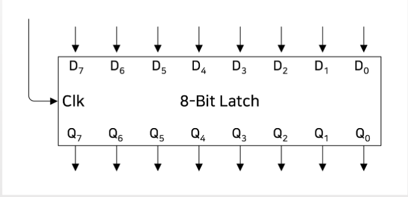

## 플립 플롭이란? - 메모리
- NOR 게이트를 조합해보자.

- 첫번째 스위치를 킨 후, 끄면?
    - 기억 기능

> $NOR_{1}, NOR_{2}, V_{1}, V_{2}, L$ : NOR 게이트, 버튼 1 2, 전구
> 
> Step1. (V1스위치를 키면?)
> 
> $1. V_{1}on => output : 1
\\ 2. \; NOR_{1} \;in\; (V_{1}out(1), ?) => output : 0 
\\ 3. \; V_{2} out => output : 0 
\\ 4. NOR_{2} \;in\; (NOR_{1}out(0), V_{2}out(0)) => output : 1 
\\ 5. L_{on}$
>
> Step2. (V1스위치를 끄면?)
>
> $1. V_{1}off => output : 0
\\ 2. \; NOR_{1} \; in (V_{1}out(0), L_{on}out(1)) => output : 0 
\\ 3. \; V_{2} out => output : 0 
\\ 4. NOR_{2} \;in\; (NOR_{1}out(0), V_{2}out(0)) => output : 1 
\\ 5. L_{on}$

- 두번째 스위치를 킨 후, 끄면?(첫번째 스위치가 켜졌었던 상태)
    - 삭제 기능

> $NOR_{1}, NOR_{2}, V_{1}, V_{2}, L$ : NOR 게이트, 버튼 1 2, 전구
> 
> Step1. V2 스위치를 키면? (첫번째 스위치가 켜졌었던 상태)
>
> $1. V_{2}on => output : 1
\\ 2. \; NOR_{1} \;in\; (V_{1out}(0), L_{onout}(1)) => output : 0 
\\ 3. \; V_{2} \;on\; => output : 1 
\\ 4. NOR_{2} \;in\; (NOR_{1out}(0), V_{2out}(1)) => output : 0
\\ 5. L_{off}$
>
> Step2. (V2 스위치를 끄면?) 
>
> $ 1. L_{off} => output : 0 
\\ 2. NOR_{1} \;in\;(V_{1out}(0), L_{off \; out}(0)) => output : 1
\\ 3. V_{2} \;off\; => output : 0 
\\ 4. NOR_{2} (NOR{1out}(1), V_{2out}(0)) => output : 0
\\ 5. L_{off}$
>
> 한번 $V_{2}$ 스위치를 킨 뒤에 끄게 되면
>
> $V_{1}$의 경우에는 전구의 불이 지속적으로 켜졌었던 것이 꺼지게 된다.

## 플립플롭
- flip-flop (플립플롭): 데이터를 저장하는 조합논리회로
    - 두번째 스위치를 킨 후, 끄면?
        - 첫 번째 스위치를 키면 불이 켜지고, 스위치를 꺼도 불은 켜진채로 지속됨
        - 두 번째 스위치를 끄면 불이 꺼지고, 스위치를 꺼도 불은 꺼진채로 지속됨 

    - 스위치를 키고 끄고를 저장할 수 있다!
        - 불이 켜져 있다: 최근에 첫 번째 스위치가 켜졌었다.
        - 불이 꺼져 있다: 최근에 두 번째 스위치가 꺼졌었다.

### RS 플립플롭
- R-S(Reset-Set) flip-flop
    - Q는 output, ${\bar Q}$ 는 Q의 반대값
    - 단, S와 R이 1인 상태는 피하도록 설계 (Q값과 ${\bar Q}$ 이 둘다 0이 되므로)

### 플립플롭 (Level-triggered flip-flop)
- Hold That Bit 라는 이름으로 조합논리회로를 추가해봅니다.

> Hold That Bit이 1일 때만, Data가 1일 때 출력값에 적용이 된다.

### 플립플롭 (D-type flip-flop)
- R/S (두 input)를 Data(하나의 input)으로 바꿔봅니다.
    - R/S 둘다 1일 경우는 피하도록 설계하기로 함.
    - R/S 둘다 0일 경우도 Q 값에 영향을 안주므로 삭제

### 예시(R = 1, S = 0, HoldThatBit = 1)

- (HoldThatBit => HTB로 축약)
> Step 1. R 스위치를 켰을 때
>
> $ 1. AND_{1} in (R_{out}(1), HTB_{out}(1)) => output : 1 
\\  2. AND_{2} in (HTB_{out}(1), S_{out}(0)) => output : 0
\\  3. NOR_{1} in (AND_{1out}(1), ?) => output: 0
\\  4. NOR_{2} in (NOR_{1out}(0), AND_{2out}(0)) => output : 1
\\  5. Q =0, {\bar Q} = 1$
>
> Step 2. R 스위치를 껐을 때(R 스위치를 킨 상태에서)
>
> $ 1. AND_{1} \;in\; (R_{out}(0), HTB_{out}(1)) => output : 0 
\\  2. AND_{2} \;in\; (HTB_{out}(1), S_{out}(0)) => output : 0
\\  3. NOR_{1} \;in\; (AND_{1out}(0), {\bar Q}_{out}(1)) => output: 0
\\  4. NOR_{2} \;in\; (NOR_{1out}(0), AND_{2out}(0)) => output : 1
\\  5. Q =0, {\bar Q} = 1$
>
> 스위치를 키고 껐을 때 동일한 출력 결과가 나오게 된다.

### Level-triggered D-type flip-flop(플립플롭)
- D는 Data를 의미함
- Level-triggered는 Hold That Bit이 1일 때만 Data 값을 저장한다는 의미
- RS 플립플롭에서 R/S 둘다 1,0일 경우를 피하도록 설계한 조합논리회로

- HoldThatBit => HTB로 축약 
> Step 1. Data 1, HTB 1
>
> $1. NOT \;in\; (1) => output : 0 
\\ 2. AND_{1} \;in\;(NOT_{out}(0), HTB_{out}(1)) => output : 0
\\ 3. AND_{2} \;in\;(DATA_{out}(1), HTB_{out}(1)) => output : 1
\\ 4. NOR_{2} \;in\;(AND_{2out}(1), ?) => output : 0
\\ 5. {\bar Q} = 0
\\ 6. NOR_{1} \;in\;(AND_{1out}(0), {\bar Q}(0)) => output : 1
\\ 7. Q = 1 $
>
> Step 2. Data X, HTB 0 / Q가 1이였을 때
> $1. NOT \;in\; (X) => output : ~X 
\\ 2. AND_{1} \;in\;(NOT_{out}(~X), HTB_{out}(0)) => output : 0
\\ 3. AND_{2} \;in\;(DATA_{out}(X), HTB_{out}(0)) => output : 0
\\ 4. NOR_{1} \;in\;(AND_{1out}(0), {\bar Q}_{out}(0)) => output : 1
\\ 5. NOR_{2} \;in\;(AND_{2out}(0), Q_{out}(1)) => output : 0
\\ Q = 1, {\bar Q} = 0$

## 1 bit latch
- Level-triggered D-type flip-flop
    - Hold That Bit를 Write로 표시
    - Data In이 데이터를 넣을 때, Write도 1이 되어야 함
    - 1 bit를 일시적으로 저장할 수 있는 메모리

## 8 bit latch
- Write이 1일 때 8 bit Data Inputs이 8 bit Data Outputs에 저장됨
- Write이 0 이면 8 bit Data Outputs 값이 유지됨.

## 8-to-1 selector
- 8 bit 데이터에서 특정 bit 값만 출력하기
- 하나의 백열 전구로 8개 각 비트의 값을 알려면?

> 저장한 데이터를 어떤 데이터를 가지고 오고 싶으면 어느 위치에 데이터를 읽어올 지 선택한다.
>
> 이를 컴퓨터 프로그래밍에서는 일반적으로 `주소(address)`라 한다.
>
> V는 스위치 000, 001, 010, 011, 100, 101, 110, 111 이렇게 3개 스위치로 8개 비트를 구분 가능.

> 8-to-1 selector를 사용해서 8개의 1 bit latch 중에서 하나의 데이터 출력 신호를 선택할 수 있음

## 3-to-8 decoder
- 8개의 출력 중, V 스위치로 단 하나의 출력 외에는 O
- Write가 1, V 스위치로 특정 출력 선정, Data In의 값이 특정 latch에 쓰여짐

## 온전한 8 bit latch 회로
- 3-to-8 decoder와 8-to-1 selector로 구성 (이게 바로 주소, Address 임)
- S0, S1, S2가 decoder와 selector에 동일하게 적용 (데이터 읽고 쓸 수 있는 Address)
- Write가 1이면, Address에 Data In 값이 씌여짐.
- Data Out은 항상 Address에 해당하는 값을 출력.

> `1 ~ 255`의 데이터를 읽을 수도 있고 쓸 수 도 있다.
>
> 읽는 경우에는 `Write`를 0으로 사용하고, 쓰는 경우에는 1로 사용한다.
>
> 8개 중에 특정 bit의 데이터를 읽을 수도 있고, 쓸 수도 있는 회로가 완성됨.

## RAM (Random Access Memory)
- 온전한 8 bit latch 회로가 바로 RAM
    - 3-to-8 decoder와 8-to-1 selector로 구성
    - 3 Address 가 있으면 8 개중 하나의 비트를 선택해서 쓰거나, 읽을 수 있다.

- 8 * 1 RAM: 8개 비트 중 1개의 특정 비트를 쓰고, 읽을 수 있는 메모리
    - 특징1 - Memory: 데이터를 저장할 수 있음
    - 특징2 - Read/Write: 특정 공간에 새로운 데이터 저장, 읽기 가능
    - 특징3 - Random Access: Address 지정을 통해 특정 공간 값 접근 가능
        - 반면 어떤 메모리는 순차접근만 가능
        - 예 100주소를 읽기 위해 99를 읽어야 함.

## RAM array
- 8 X 1 RAM 을 두 개 엮어보자
    - Data In은 각 8 X 1 RAM에 별도로 입력이 들어감
    - Address와 Write는 두 8 X 1 RAM에 동일하게 입력이 들어감.

### 8 X 2 RAM array 
- 8 개의 데이터를 저장하고 읽는데, 각 데이터는 2 bits 이다.

### 16 X 1 RAM array
- 8 X 2 RAM array 구조에서, Select 와 1-to-2 Decoder/2-to-1 Selector 추가
- 즉, Select는 4번째 Address 역할을 함
- 16 개의 데이터를 저장하고 읽는데, 각 데이터는 1 bit가 됨.

### m*n RAM array
- 많은 데이터를 저장하는 RAM array 만들기
    - 8 X 1 RAM을 여러개 연결하고, 여러 개의 Select로 Decoder/Selector를 구성하면 많은 데이터를 읽고, 저장할 수 있음
    - 예:
        - Address 10개: 2의 10승 -> 1024
        - DI 8개: 1 byte(8 bits)
        - 1024 X 8 bits = 8196 bits를 다루는 RAM array

### Kilobyte와 kilobit
- 1024 kilobytes = 1 megabyte
- 1024 megabytes = 1 gigabyte
- kilobits/megabits -> 네트워크에서 많이 사용
    - kilobits per second 또는 megabits per second
    - 예: 56K 모뎀 - 56 kilobits per second

> 1 Megabytes = 1 Mega X 8 bits = 8 Megabits

### 64K RAM
- Address 수 / Data In/Out 수로 RAM array 만들기
    - 65,536(2의 16승) X 8 bits
    - 2의 16승 --> 16은 2 bytes, byte 단위가 편하기 때문

> 64K = 65536 => 토막 상식 (삼성전자가 최초로 만듬.)