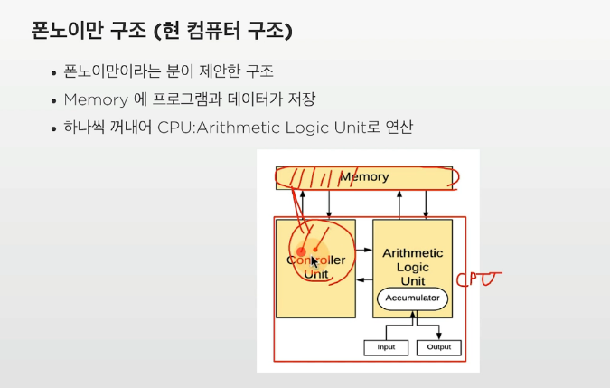

## 목차
1. [폰노이만구조](#폰노이만-구조-현-컴퓨터-구조)
2. [컴퓨터의주요구성요소](#컴퓨터의-주요-구성-요소)

## 폰노이만 구조 (현 컴퓨터 구조)
> 폰노이만이 제안한 구조
>
> Memory에 프로그램과 데이터가 저장
>
> 하나씩 꺼내어 CPU:Arithmetic Logic Unit로 연산

## 폰노이만 구조는 CPU, 메모리, 프로그램으로 구성
> 폰노이만 구조 이전 컴퓨터들은 다른 작업을 하려고 할 때 스위치 설치, 전선 재배치하여 데이터 전송, 신호 처리
>
> 폰노이만 구조 이후 : 소프트웨어만 교체하면 됨.

## 컴퓨터의 주요 구성 요소

### CPU(중앙 처리 장치)
> 연산: ALU(Arithmetic Logic Unit)
>
> 산술 연산 : Arithmetic Operation
>
> 논리 연산 : Logic Operation
>
> 제어 : Control Device
>
> IO Device(입출력장치), Memotry, ALU 동작 제어

### Memory(코드와 데이터를 저장 하는 장치)
> 프로그램과 프로그램 수행에 필요한 데이터를 저장
>
> 내부 기억장치 (주기억 장치)
>
> CPU 안에 레지스터(register), 캐쉬(cache memory)
>
> DRAM등 메모리 (램, RAM, DDR4)
>
> 외부 기억장치 (보조기억장치)
>
> SSD, HDD

### IO Devices(입출력 장치)
> IO Devices(입출력 장치)
>
> 입력 장치 : 마우스, 키보드, 터치패드 등
>
> 출력 장치 : 모니터, 프린터, 스피커 등

### Bus(버스)
> CPU, Memory, IO Devices를 연결해주는 장치
>
> 개별적인 IO Devices를 연결해주고 데이터를 송수신해주는 장치

