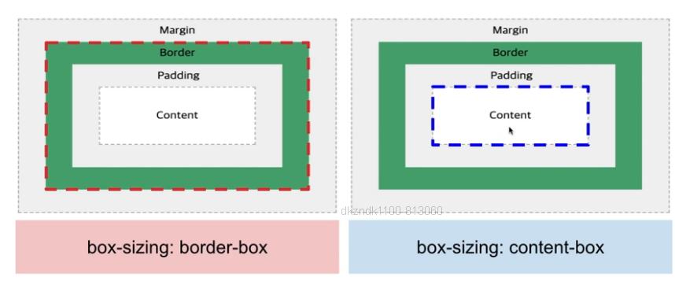

## CSS란?
> HTML와 같이 CSS는 실제로 프로그래밍 언어는 아닙니다.
>
> 마크업(markup) 언어도 아닙니다. Style Sheet 언어입니다.
>
> HTML 문서에 있는 요소들에 선택적으로 스타일을 적용할 수 있다는 말입니다.
>
> 예시로 HTML 페이지에서 모든 문단 요소들을 선택하고 그 문단 요소들 안에 있는 텍스트를 빨갛게 바꾸려고 한다면 다음과 같이 CSS를 작성할 것입니다. 

## CSS 문법
```
p { color: red;}
선택자(selector) { 속성(property) : 속성 값(property value) ; } 정의(declaration)
```

## 핵심 CSS 속성 맛보기 + 표기 Tip
```
box-sizing: border-box 
position: relative | absolute | fixed | sticky
display: flex | block | inline-block | block
margin: 100px
padding: 100px
width: 100px
height: 100px
border: 1px solid #000
background: #fff
font-size: 16px
font-weight: 300(thin) | 400(normal) | 500(medium) | 700(bold)
color: #000
text-align: center | left | right
overflow: auto | scroll | hidden
z-index : 1
```

## CSS Box Model



> 태그의 범위는 Content > padding > Border > margin이다.

### box-sizing : border-box
> 태그의 border 범위까지 size를 지정한다.

```
ex) div{ 
    box-sizing : border-box;
    width: 100px;
    height: 100px;
    padding : 20px;
    border: 10px solid #000;
}
=> content의 길이는??
padding right, left : 20px, 20px (40px)
border right, left : 10px, 10px (20px)
content : 20 * 20 (20px)
```

### box-sizing : content-box
> 태그의 content 범위까지 size를 지정한다.
```
ex) div{
    box-sizing : content-box;
   width: 100px;
    height: 100px;
    padding : 20px;
    border: 10px solid #000;
}
=> content의 길이는??
padding right, left : 20px, 20px (40px)
border right, left : 10px, 10px (20px)
content : 100px; 
```

### 선택자 (Selector)
> 1. 기본 선택자
>>   - *(전체), div(요소), .(클래스), #(아이디), `[attr]`(특성)
> 2. 그룹 선택자: ,
> 3. 결합자
>>  - 공백(자손 결합자), >(자식 결합자), ~(일반 형제 결합자), +(인접 형제 결합자)
> 4. 가상 클래스 선택자
>>   - :hover, :focus, :focus-visible, :active, :checked, :disabled, :not()
>>   - :first-child, :last-child, :nth-child, :only-child
> 5. 가상 요소 선택자
>>   - ::before, ::after, ::placeholder
- [MDN-CSS선택자]https://developer.mozilla.org/ko/docs/Web/CSS/CSS_Selectors

### 단축속성 (여백 속성)

바깥과 안쪽 여백의 단축 속성도 똑같이 동작합니다.<br>
바깥 여백, margin 속성은 한 개, 두 개, 세 개, 네 개의 값을 사용해 지정합니다.

> margin-top: 10px;
>
> margin-right: 5px;
>
> margin-bottom: 10px;
>
> margin-left: 5px;

다음의 네 값 구문 단축 속성을 사용한 선언과 같습니다.<br>
방향이 시계방향임을 기억하세요.
> margin: 10px 5px 10px 5px;

### 단축속성 (글꼴 속성)

> font-style: italic;
>
> font-weight: bold;
>
> font-size: .8em;
>
> line-height: 1.2;
>
> font-family: Arial, sans-serif;
>

### 단축속성 (테두리 속성)

테두리의 너비, 색상, 스타일을 하나의 선언으로 단축할 수 있습니다.
> border-width: 1px;
> border-wtyle: solid;
> border-color: #000;

다음처럼 단축할 수 있습니다.
> border: 1px solid #000;

### 단축속성 (배경 속성)

> background-color: #000;
>
> background-image: url(images/bg.gif);
>
> background-repeat: no-repeat;
>
> background-position: top right;

다음과 같이 선언 단 하나를 사용해서 단축할 수 있습니다.
> background: #000 url(image/bg.gif) no-repeat top right;

### CSS Emmet

많이 쓰는 Emmet 예제 
> mt10 => margin-top: 10px;
>
> pb10 => padding-bottom: 10px;
>
> w100 => width: 100px;
>
> h100p => hegiht: 100%;
>
> bd => border: 1px solid #000;
>
> bgc => background-color: #fff;
>
> fsz10 => font-size: 10px;
>
> fw700 => font-weight: 700;
>
> c#ddd => color: #ddd;
>
> z10 => z-index: 10;
[cheat-sheat]https://docs.emmet.io/cheat-sheet/

### CSS 학습 팁

> 1. 구글에서 검색하기.
> 2. 질문하기 전에 찾아보기.
> 3. 검색은 영문이 유리하다. => 영문 문서를 읽는 것을 두려워말자.
> 4. 공식 문서나 튜토리얼 문서를 잘 확인하자.
> 5. 배운 것을 기록하자.
>> - ex) 예제 코드 모음집 만들기.
> 6. 개발자 도구 확인하기.