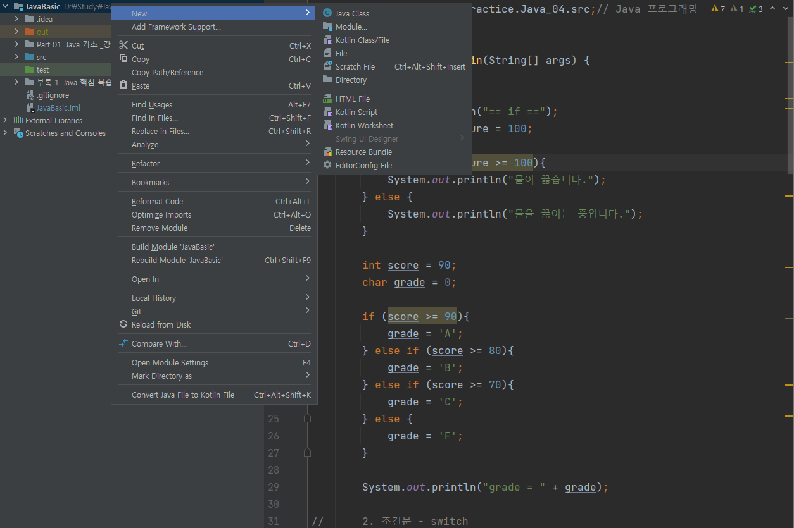
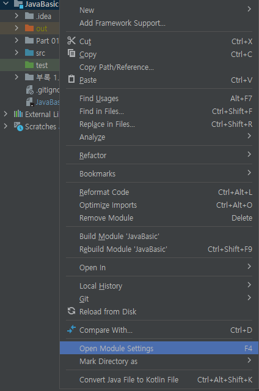
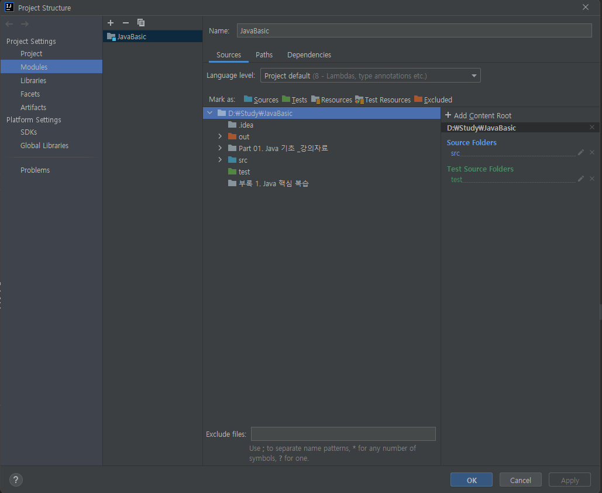

## JUnit5

## IntelliJ JUnit5 사용법

### 테스트 폴더 생성

> 1. root Directory 오른쪽 클릭 
>
> 2. new => Directory(테스트 폴더 생성)

### 테스트 폴더 지정

> 1. root Directory 오른쪽 클릭 `Open Module Settings` 클릭.

> 2. `Mark as:`에서 아까 만든 폴더를 Tests로 설정.

### 테스트 코드 작성

> 1. 테스트 코드를 작성할 클래스에서 클래스명을 드래그 하고 오른쪽 클릭 후 `Go To` => `Test`

> 2. Create New Test 클릭

> 3. `Testing library JUnit5` 선택 후 아래의 `Fix` 버튼 클릭 후 다운로드

> 4. 테스트 클래스 파일 이름을 입력하고 실행하고자 하는 메서드를 선택하고 `OK`를 클릭한다.

## Reference
[JUnit](https://steady-coding.tistory.com/349)
[IntelliJ-JUnit](https://ildann.tistory.com/5)