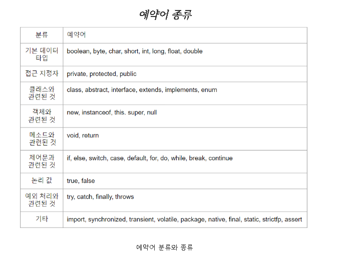
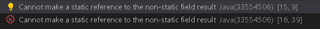
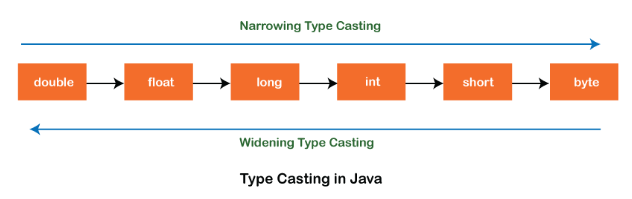
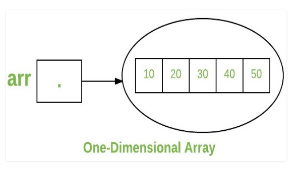
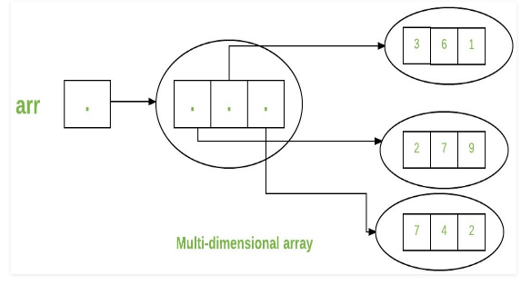

## 자바 데이터타입, 변수, 그리고 배열
- [프리미티브타입 종류와 값의 범위 그리고 기본 값](#1-프리미티브타입-종류,값의-범위-기본-값)
- [프리미티브 타입과 레퍼런스 타입](#2-프리미티브-타입과-레퍼런스-타입)
- [리터럴](#3-리터럴)
- [변수 선언 및 초기화하는 방법](#4-변수-선언-및-초기화하는-방법)
- [변수의 스코프와 라이프타임](#5-변수의-스코프와-라이프타임)
- [타입 변환, 캐스팅 그리고 타입 프로모션](#6-타입-변환,-캐스팅-그리고-타입-프로모션)
- [1차 및 2차 배열 선언하기](#7-1차-및-2차-배열-선언하기)
- [타입 추론, var](#8-타입-추론,-var)

## 1. 프리미티브타입 종류,값의 범위 기본 값

### 기본형 타입(Primitive type)
```java
byte : byte 데이터 유형은 8비트 부호가 있는 2의 보수 정수
byte 데이터 형식은 큰 메모리를 저장하는데 유용 할 수 있고, 메모리 절약은 실제로 문제되는 사항임. 
변수의 범위가 제한되어 있다는 사실은 일종의 문서화 역할을 수행함

short : short 데이터 유형은 16비트 부호가 있는 2의 보수 정수.
byte와 마찬가지로 동일한 지침 적용. 메모리 절약이 실제로 중요한 상황에서 
short는 큰 배열에서 메모리를 절약하는데 사용 가능함.
값의 범위 : -32,768 ~ 32,767

int : 기본적으로 int 데이터 타입은 32비트 부호가 있는 2의 보수 정수이며 
JavaSE 8 이상에서는 int데이터 유형을 사용하여 최소값이 0이고 
최대값이 2^32 -1인 부호 없는 32비트 정수를 나타낼 수 있음. 
int 데이터 유형을 부호 없는 정수로 사용하려면 Integer클래스를 사용.
값의 범위 : (-2)^31 ~ 2^31-1 

long : long 데이터 유형은 64비트 부호가 있는 2의 보수 정수.
부호가 있는 Java SE 8 이상에서는 long 데이터 유형을 사용하여 
최소값이 0이고 최대값이 2^64 -1인 부호 없는 64비트 길이를 나타낼 수 있음.
값의 범위 : (-2)^63 ~ 2^63 -1

float : float 데이터 유형은 단정밀도 32비트 IEEE 754 부동 소수점임. 
Java 언어 사양의 부동 소수점 유형, 형식 및 값 섹션에 지정되어 있음, 
byte에 대한 권장사항과 마찬가지로 부동 소수점 숫자의 큰 배열에 
메모리를 저장해야 하는 경우 short를 사용.
값의 범위 : 1.40239846 * 10^(-45) ~ 3.40282347 x 10^38

double : double 데이터 유형은 배정밀도 64비트 IEEE 754 부동 소수점임. 값의 범위는
논의의 범위를 벗어나지만 Java 언어 사양의 부동 소수점 유형, 형식 및 값 섹션에 지정되어 있음.
값의 범위 : 4.9406564584124654 x 10^(-324) ~ 1.7976931348623157 x 10^308

boolean : boolean 데이터 유형은 두가지 값만 사용 가능. true 및 false 참/거짓 조건을
추적하는 단순 플래그에 이 데이터 유형을 사용하면 됨. 데이터 유형은 1비트의 정보를
나타내지만 '크기'는 정의된 것이 아님.

char : char 데이터 유형은 단일 16비트 유니코드 문자. 
값의 범위 : '\u0000' or 0 ~  '\uffff' or 65,535 
```

### 기본 자료형(Primitive type)의 값의 범위와 기본 값
|자료형  |기본 값 | 값의 범위|
|:-----:|:------:|:-------:|
|byte   | 0      |     -    |
|short  | 0      |      -32,768 ~ 32,767   |
|int    | 0      |      (-2)^31 ~ 2^31-1    |
|long   | 0L     |      (-2)^63 ~ 2^63 -1   |
|float  | 0.0f   |     1.40239846 * 10^(-45) ~ 3.40282347 x 10^38    |
|double | 0.0d   |   4.9406564584124654 x 10^(-324) ~ 1.7976931348623157 x 10^308      |
|char   |'\u0000'|   '\u0000' or 0 ~  '\uffff' or 65,535       |
|boolean| False  |   -     |


- [Primitive Data Type](https://docs.oracle.com/javase/tutorial/java/nutsandbolts/datatypes.html)

## 2. 프리미티브 타입과 레퍼런스 타입

### 기본형 타입(Primitive type)

> 총 8가지의 기본형 타입을 미리 정의하여 제공함
>
> 기본값이 있기 때문에 Null이 존재하지 않음.
>
> 실제 값을 저장하는 공간으로 스택(Stack) 메모리에 저장된다.
>
> 만약 컴파일 시점에 담을 수 있는 크기를 벗어나면 에러를 발생시키는 컴파일 에러가 발생. 
>
> 주로 문법상의 에러가 많음.

|  -    |자료형  |기본 값 | 값의 범위|
|:-----:|:-----:|:------:|:-------:|
| 정수형|byte   | 0      |     -    |
| 정수형|short  | 0      |      -32,768 ~ 32,767   |
| 정수형|int    | 0      |      (-2)^31 ~ 2^31-1    |
| 정수형|long   | 0L     |      (-2)^63 ~ 2^63 -1   |
| 실수형|float  | 0.0f   |     1.40239846 * 10^(-45) ~ 3.40282347 x 10^38    |
| 실수형|double | 0.0d   |   4.9406564584124654 x 10^(-324) ~ 1.7976931348623157 |       x 10^308      |
| 문자형|char   |'\u0000'|   '\u0000' or 0 ~  '\uffff' or 65,535       |
| 논리형|boolean| False  |   -     |

### 참조형 타입(Reference type)
> 기본형 타입을 제외한 타입들이 모두 참조형 타입이다.
>
> 빈 객체를 의미하는 Null이 존재.
>
> 값이 저장되어 있는 곳의 주소 값을 저장하는 공간으로 힙(Heap) 메모리에 저장된다.
>
> 문법상으로는 에러가 없지만 실행시켰을 때 에러가 나는 `Runtime Error`가 발생.
>
> 예시로 객체나 배열을 Null 값으로 받으면 NullPointException이 발생하므로 변수값을 넣어야함.

|자료형  |기본 값 | 할당되는 메모리 크기|
|:-----:|:------:|:------------------:|
|Array(배열)          | Null   | 4 byte(객체 주소값) |
|Enumeration(열거)    | Null   | 4 byte(객체 주소값) |
|Class(클래스)        | Null   | 4 byte(객체 주소값) |
|Interface(인터페이스)| Null   | 4 byte(객체 주소값) |

- [기본형 타입과 참조형 타입](https://gbsb.tistory.com/6)

## 3. 리터럴

### 자바의 리터럴(Literal)

> Java의 Literal은 부울, 숫자, 문자 또는 문자열 데이터의 합성 표현임.
>
> 프로그램에서 특정 값을 표현하는 수단.
>
> Java의 Literal은 6가지 유형으로 분류됨.

```java
1. 정수 리터럴
2. 부동 소수점 리터럴
3. 문자 리터럴
4. 문자열 리터럴
5. 부울 리터럴
6. 널 리터럴
```

1. 정수 리터럴
```java
10 진수 : 10진법으로 0부터 9까지의 숫자를 가진다.
ex) int x = 108;

8 진수 : 기본 8을 가지며 0에서 7까지의 숫자를 허용.
리터럴을 할당하는 동안 숫자에는 접두사 0이 있어야 함.
ex) int x = 0745;

16 진수 : 0에서 9까지의 숫자와 문자열 A부터 F까지를 허용함
Java는 대소문자를 구분하지만 16진수 리터럴에 대한 코드에서 대문자 또는
소문자를 사용하는 것에 대한 예외도 제공
ex) int x = 0X123Fadd;

2 진수 : 접두사 0b 또는 0과 1인 이진 리터럴로 지정 가능
ex) int x = 0b1011;

지정 타입 : byte, char, short, int, long
```

2. 부동 소수점 리터럴
```java
부동 소수점 리터럴은 소수만 사용하거나 지수 표기법으로 표현 가능
부동 소수점 리터럴은 양수 또는 음수 값을 나타낼 수 있으며 각각 `+` 또는
`-` 기호를 선행함. 지정하지 않으면 항상 양수로 간주됨.
정수 숫자(0에서 9까지의 숫자) 다음에 정수 리터럴과 구별하기 위해
접미사 또는 지수가 옴.

ex) 10진수 = 89d;
ex) 10진수 = 3.14159e0;
ex) 10진수 = 1.0e-6D;

지정 타입 : float, double
```

3. 문자 리터럴
```java
작은 따옴표('')로 묶은 텍스트는 하나의 문자 리터럴로 간주.
ex ) 'A', '\t', '\n'

역슬래쉬(\)가 붙은 문자 리터럴은 이스케이프(escape)문자라고도 하고, 
특수한 용도도 있음.

지정 타입 : char
```
- escape 문자의 용도

|종류| 기능   |
|:--:|:-----:|
|'\t'| 수평 탭|
|'\n'| 줄 바꿈|
|'\r'| 리턴   |
|'\"'| "(큰 따옴표)|
|'\''| "(작은 따옴표)|
|'\\'|\ |
|'\u16진수'|16진수에 해당하는 유니코드|

4. 문자열 리터럴
```java
큰따옴표("")로 묶인 텍스트, 큰 따옴표 안에 텍스트가 없어도 문자열 리터럴,
내부에서 이스케이프 문자를 사용할 수 있음.
ex ) "T \t"
지정 타입 : String
```

5. 논리 리터럴
```java
traue와 false는 논리 리터럴로 간주
True : 실제 부울 값을 나타냄
False : 거짓 부울 값을 나타냄.
지정 타입 : boolean
```

6. 널 리터럴
```java
Null 리터럴은 null값을 나타내는 Java의 특정 리터럴.
해당 값은 개체가 없음을 나타냄. Java에서 NullPointerException이 발생.
Null은 종종 프로그램의 초기화되지 않은 상태를 설명함.
```

- [자바 리터럴](https://park-youjin.tistory.com/4)
- [Java Literal](https://www.upgrad.com/blog/types-of-literals-in-java/)

## 4. 변수 선언 및 초기화하는 방법

### 변수 선언
```java
자바에서 모든 변수는 사용하기 전에 선언되어야 한다.
변수 선언의 기본 형식은 다음과 같다.

데이터 유형 변수 이름;
type identifier [ = value][, identifier [= value]...];
ex) int(데이터 유형) age(변수 이름) = 20;

- 유형은 Java의 기본 타입 유형 중 하나이거나 클래스 또는 인터페이스의 이름.
- 식별자는 변수의 이름. 등호와 값을 지정하여 변수를 초기화 가능.
- 등호와 값을 지정하여 변수를 초기화 할 수 있음. 초기화 표현식은
변수에 지정된 것과 동일한 유형의 값을 생성해야 함.
- 지정된 유형의 변수를 둘 이상 선언하려면 쉼표로 구분된 목록 사용.
```

1. 변수 이름 규칙
```java
'''
Convention
- 첫 번째 글짜는 문자이거나 '$','_'이어야 하고 숫자로 시작 불가능.
    - Ex)
        - O : price, &price, _compnayName
        - x : 1v, @spped, $#value

- 영어 대소문자가 구분됨.
    - Ex hellojava와 helloJava는 다른 변수

- 첫 문자는 영어 소문자로 시작하되, 다른 단어가 붙을 경우 첫 문자를 대문자로함.
    - Ex) helloJava, memberName, userId

- 문자 수(길이)의 제한이 없음.
- 예약어를 사용할 수 없음 : 자바에서 지원하는 예약어를 변수로 사용 시 컴파일 단계에서 문제 발생
'''
```

2. 예약어의 종류


### 변수 초기화

1. 변수 초기화
```java
'''
명시적 초기화 : 선언 이후 바로 값을 넣는 경우를 명시적 초기화라고 함.
    - EX) int var1 = 1004;

변수를 처음 선언했을 경우에는 아무런 값이 들어있지 않은가? => 아니다.
멤버 변수에서 선언을 하였을 경우에는 타입의 기본값으로 초기화가 되고,
지역 변수에서 선언을 하였을 경우에는 아무런 값도 들어있지 않다.
'''

public class Test{

    // 멤버변수
    int var1; // var1 == 0

    double var2; // var2 == 0.0

    // 지역 변수
    void region(){

        int var1; // var1 not initialization

        double var2; // var2 not initialization
    }
}

```

2. 블록 초기화
```java
public class Block {


    int hello = 3;
    static int var = 10;

    // 일반적인 초기화 블록
    {
        System.out.println("hello => initalization");
        hello = 5;
    }

    // 정적 초기화 블록
    static{
        System.out.println("var => initalization");
        var =20;
    }

    public static void main(String [] args){
		System.out.println("Instance create");
        Block block = new Block();
	}
    
}

'''
- 일반적인 초기화 블록 : Class가 new를 통해 인스턴스를 생성하는 순간 초기화가 진행.
- 정적 초기화 블록 : JVM이 클래스 로더로 로딩 시점에 초기화 진행
- 초기화 순서: 정적 초기화 블록 => 일반적인 초기화 블록
'''
```

- [자바 변수 선언 및 초기화](https://catch-me-java.tistory.com/16)

## 5. 변수의 스코프와 라이프타임

### 변수의 종류와 범위
```java
'''
세가지 유형의 변수가 존재

1. 인스턴스 변수
2. 클래스 변수
3. 지역 변수
'''
```

1. 인스턴스 변수
```java
'''
정의 : 클래스 내부에서 선언되었지만 메서드와 블록 외부에서 
선언된 변수를 인스턴스 변수라고 함.
범위 : 정적 메서드를 제외한 클래스 전체
수명 : 클래스의 객체가 메모리에 머무를 때까지
'''
```

2. 클래스 변수
```java
'''
정의 : 클래스 내부, 모든 블록 외부에서 선언되고 
정적으로 선언된 변수를 클래스 변수라고 함.
범위 : 클래스 전체.
수명 : 프로그램이 종료되는 시기까지
'''
```

3. 지역 변수
```java
'''
정의 : 인스턴스와 클래스 변수가 아닌 모든 변수는 지역 변수라고 불려짐.
범위 : 블록 내에서 선언됨.
수명 : 제어가 선언된 블록을 떠날 때까지.
'''
```

### 예시
```java
// 올바른 예시
public class Scope{

    int num1, num2; // Instance Variable
    static int result; // Class Variable

    int add(int a, int b){ //Local Variables

        num1 = a;
        num2 = b;
        return a+b;
    }

    public static void main(String args[]){
        Scope sc = new Scope();
        result = sc.add(10,20); // Class Variable 사용
        System.out.println("Sum = " + result);
    }

}
'''
Scope 클래스에서의 정적 메서드는
선언된 클래스 변수 result를 참조하여 오류없이 값을 나타낸다.
'''
```

```java

// 잘못된 예시
public class ScopeTest{

    int num1, num2; // Instance Variable
    int result; // Instance Variable

    int add(int a, int b){ //Local Variables

        num1 = a;
        num2 = b;
        return a+b;
    }

    public static void main(String args[]){
        ScopeTest sc = new ScopeTest();
        result = sc.add(10,20); // Instance Variable 사용 => Scope error
        System.out.println("Sum = " + result);
    }

}
'''
ScopeTest 클래스에서의 정적메서드는
선언된 Instance 변수 result를 참조할 수 없기 때문에 오류가 나온다.
'''
```


- 정적 메서드는 비정적 필드를 참조할 수 없다.

### 중첩 범위

```java
'''
코드 블록 내에서 코드 블록을 사용할 수 있다. 이 프로그래밍 기술을 
블록 중첩이라고 한다. 
범위: 외부 블록의 모든 변수는 내부 블록에서 액세스할 수 있지만
내부 블록 내의 변수는 외부 블록에서 액세스할 수 없음.
'''
public class scope_and_lifetime {
    public static void main(String args[]){
        int a = 10;
        //Outer Block
        {
            //Inner Block
            int x = a;
            {
                int y = x;
            }
        }
        System.out.println(y);
    }
}
```

[자바에서의 변수의 스코프와 생명주기](https://www.learningjournal.guru/article/programming-in-java/scope-and-lifetime-of-a-variable/)<br>


## 6. 타입 변환, 캐스팅 그리고 타입 프로모션

### 타입 변환
```java
'''
Java에서 타입 캐스팅은 수동 및 자동으로 데이터 유형을 다른 데이터 유형으로
변환하는 방법 또는 프로세스임. 자동 변환은 컴파일러가 수행하지만 수동 변환은
프로그래머가 수행함.

한 데이터 유형에서 다른 데이터 유형으로 값을 변환하는 것을 타입 캐스팅이라고함.
'''
```


1. 타입 프로모션(묵시적 형 변환) = > Widening Casting(automatically)
- 더 작은 data type을 더 큰 data type로 변환한다. 
```java
byte => short => char => int => long => float => double

public class Main {
  public static void main(String[] args) {
    int myInt = 9;
    double myDouble = myInt; // Automatic casting: int to double

    System.out.println(myInt);      // Outputs 9
    System.out.println(myDouble);   // Outputs 9.0
  }
}
```

2. 타입 캐스팅(명시적 형 변환) => Narrowing Casting(manually)
- 큰 data type을 작은 data type으로 변환한다.
- 바꿀 유형을 명시해야한다.
```java
double => float => long => int => char => short => byte

public class Main {
  public static void main(String[] args) {
    double myDouble = 9.78d;
    int myInt = (int) myDouble; // Manual casting: double to int

    System.out.println(myDouble);   // Outputs 9.78
    System.out.println(myInt);      // Outputs 9
  }
}
```

- [자바 타입변환](https://www.w3schools.com/java/java_type_casting.asp)

## 7. 1차 및 2차 배열 선언하기

### 자바의 배열
```java
'''
Java의 배열은 공통 이름으로 참조되는 유사한 유형의 변수 그룹

- Java에서는 모든 배열이 동적으로 할당된다.
- 배열은 Java에서 객체이기 때문에 객체 속성 length를 사용하여 배열의 
  길이를 찾을 수 있음. 이것은 sizeof를 사용하여 길이를 찾는 C/C++와 다름.
- Java 배열 변수는 데이터 유형 뒤에 []를 사용하여 다른 변수와 같이 선언할
  수도 있음.
- 배열의 변수는 순서가 지정되며 각각은 0부터 시작하는 인덱스를 갖음.
- Java 배열은 정적 필드, 지역 변수 또는 메소드 매개변수로도 사용할 수 있음.
- 배열의 크기는 long이 아닌 int 또는 short값으로 지정해야 함.
- 배열 유형의 직접적인 수퍼클래스는 Object임.
- 모든 배열 유형은 Cloneable 및 java.io.Serializable 인터페이스를 구현함.
'''
```

1. 일반적인 선언 방법
```java
type var-name[]; OR type[] var-name;

//ex
int intArray[];
int[] intArray[];

// 객체에 대한 참조 배열.
MyClass myClassArray[];

object[] obj, // 객체 배열
Collection[] collect;
```

2. 배열의 인스턴스화
```java
'''
- 배열이 선언되면 배열의 참조만 생성됨. 배열을 생성하거나
  배열에 메모리를 제공하려면 배열의 사이즈를 지정 해줘야 함.
- new에 의해 할당된 배열의 요소는 자동으로 0(숫자 유형의 경우),
  false(부울의 경우) 또는 null(참조 유형의 경우)로 초기화 됨.
- 원하는 배열 유형의 변수를 선언하고, new를 사용하여 배열이 보유할
  메모리를 할당하고 배열 변수에 할당 해야함 => Java에서는 모든 배열이
  동적으로 할당 됨.
'''
intArray = new int[10]; // 배열에 메모리 할당
//ex

```
3. 배열 리터럴
```java
'''
배열의 크기와 배열의 변수를 이미 알고 있는 상황에서는 배열 리터럴을
사용 가능함.
'''
int[] intArray = new int[]{ 1, 2, 3, 4, 5, 6, 7, 8, 9, 10};
// 배열 리터럴 선언
```

4. 객체 배열
- 객체 배열의 size는 각 객체의 주소를 저장할 수 있는 메모리 공간을 나타냄.
```java

// Java program to illustrate creating
//  an array of objects
class Student
{
    public int roll_no;
    public String name;
    Student(int roll_no, String name)
    {
        this.roll_no = roll_no;
        this.name = name;
    }
}
 
// Elements of the array are objects of a class Student.
public class GFG
{
    public static void main (String[] args)
    {
        // declares an Array of integers.
        Student[] arr;
 
        // allocating memory for 5 objects of type Student.
        arr = new Student[5];
 
        // initialize the first elements of the array
        arr[0] = new Student(1,"aman");
 
        // initialize the second elements of the array
        arr[1] = new Student(2,"vaibhav");
 
        // so on...
        arr[2] = new Student(3,"shikar");
        arr[3] = new Student(4,"dharmesh");
        arr[4] = new Student(5,"mohit");
 
        // accessing the elements of the specified array
        for (int i = 0; i < arr.length; i++)
            System.out.println("Element at " + i + " : " +
                        arr[i].roll_no +" "+ arr[i].name);
    }
}
```

5. 다차원 배열
- 배열의 각 요소가 다른 배열의 참조를 보유하는 배열의 배열임.
```java
public class multiDimensional
{
    public static void main(String args[])
    {
        // declaring and initializing 2D array
        int arr[][] = { {2,7,9},{3,6,1},{7,4,2} };
 
        // printing 2D array
        for (int i=0; i< 3 ; i++)
        {
            for (int j=0; j < 3 ; j++)
                System.out.print(arr[i][j] + " ");
 
            System.out.println();
        }
    }
}
```

### 1차원 배열 


### 다차원 배열


- [1차 및 2차 배열 선언](https://www.geeksforgeeks.org/arrays-in-java/)

## 8. 타입 추론, var

### 타입추론
```java
'''
개발자가 변수의 타입을 명시적으로 적어주지 않고도, 
컴파일러가 알아서 이 변수의 타입을 대입된 리터럴로 추론하는 것.
자바에서는 JDK 10 버전 이상부터 지원해주는 기능이다.
'''

//ex
public static void main(String[] args){

    var str2 = "Hello type String";

    if(str2 instance of String){
        System.out.println("str2 변수의 타입은 String 임.");
    }

}
```

### Var
```java
'''
var는 초기화값이 있는 지역변수로만 선언이 가능함.
var는  멤버변수, 또는 메소드의 파라미터, 리턴 타입으로 사용이 불가능.
또한, 무조건 선언시에 초기화 값이 존재 해야함. => null 값 불가능
'''

//ex
public class SyntaxAnalysis{
    public static void main(String[] args){

        Map<String, Integer> map1 = new HaspMap<>();

        var map2 = new HasHmAP<String, Integer>();

    }
}

'''
var는 키워드(KeyWord)가 아니다.
'''

//ex
public static void main(String[] args){
    int var = 3;
}

public static void main(String[] args){
    var i = 3;
}

'''
var 는 런타임 오버헤드가 없다.
컴파일 시점에 var를 초기화된 값을 보고 추론에서 바이트코드에
명시적으로 타입이 결정되어 있기 때문에 타입 추론 변수를 읽을 때 마다
타입을 알아내기위한 연산을 하지 않는다.
그래서 var로 선언된 변수는 중간에 타입이 절대 변경되지 않는다.
'''

//ex
var integer =3;

integer = "string"; // => error! 

'''
var의 잘못된 사용법
1. Var는 초기화 없이 사용할 수 없다.
2. Var타입 변수에는 null값이 들어갈 수 없다.
3. Var타입은 로컬 변수에만 선언이 가능함.
4. Lambda Expression에는 명시적 타입을 지정해줘야 한다.
5. 배열을 선언할 때, var 대신 타입을 명시해줘야 한다.
'''
var i; // error 1
var i = null; // error 2
private var i = "string"; // error 3
var p :<lambda expression> = (String s) => System.out.println("s = " + s); //error 4
var arr = {1, 2, 3}; // error 5


```

- [타입추론 var](https://catch-me-java.tistory.com/19)