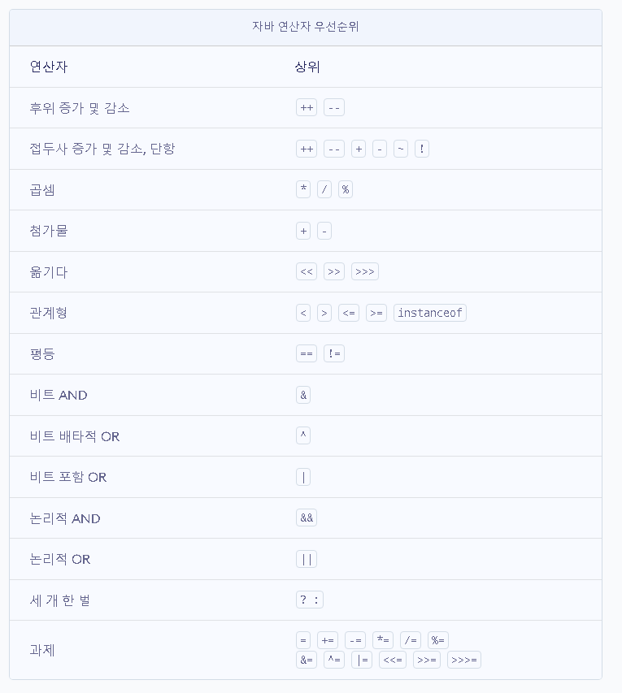
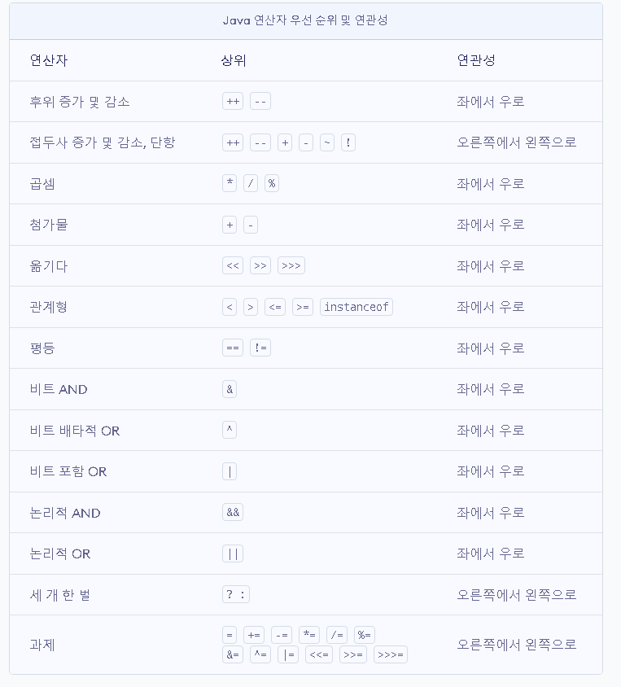

## 자바 연산자
- [산술 연산자](#1-산술-연산자)
- [비트 연산자](#2-비트-연산자)
- [관계 연산자](#3-관계-연산자)
- [논리 연산자](#4-논리-연산자)
- [instance of](#5-instance-of)
- [assignment(=)operator](#6-assignment(=)operator)
- [화살표(->)연산자](#7-화살표(->)-연산자)
- [3항 연산자](#8-3항-연산자)
- [연산자 우선순위](#9-연산자-우선-순위)
- [optional](#10-(optional)-Java-13.-switch-연산자)

## 1. 산술 연산자

### 정의
> 두 개의 피연산자를 사용하여 계산을 수행하는 수학 함수.
>
> 기본 산술 연산자는 다음과 같음.
```md
- 더하기(+) : A + B => A와 B를 더한 값
- 빼기(-) : A - B => A와 B를 뺀 값
- 곱셈(x) : A * B => A와 B를 곱한 값
- 나눗셈(/) : A / B => A와 B를 나눈 값 
- 나머지(%) : A % B => A와 B를 나눈 값의 나머지
```
### 산술연산자의 우선순위와 프로모션
> 산술 연산자의 우선순위는 일반 수학의 산술연산과 같음.
>
> 나머지를 구하는 % 연산자의 우선순위는 *,/ 연산자의 우선순위와 동일함.
>
>기본 연산을 수행하는 피연산자의 데이터 타입이 다르다면, 더 큰 범위를 갖는
피연산자의 데이터형으로 프로모션(업캐스팅)되어 연산된 결과가 반환됨.


### Java에서는?
```java
/* 숫자 연산 */
int a = 4;
int b = 2;
double c = 10;
int Result;
double divideResult;

Result = a + b;
System.out.println("a+b = " + Result); // 5

Result = a - b;
System.out.println("a-b = " + Result); // 1

Result = a * b;
System.out.println("a*b = " + Result); // 6

Result = a / b;
System.out.println("a/b = " + Result); // 1

divideResult = c / a;
System.out.println("a/c = " + divideResult); // 2.5

divideResult = (double)a / b;
System.out.println("a/b = " + divideResult); // 1.5

/* 
    char 타입 연산 
- 정수 타입이므로 산술 연산(유니코드 값을 이용한) 가능
- 산술 연산시 int 타입으로 변환
- 변수 자체에 산술 적용시 int 타입으로 산출되므로 컴파일 에러 발생, 
강제 타입 변환(캐스팅) 필요
    - ex) char result = (char) (char1+1);
- 연산 후의 산출값이 산출 타입으로 표현 가능해야함.
*/
char c1 = 'A' + 1;
char c2 = 'B';

//char c3 = C + 1;	// 컴파일 에러 발생
char c3 = (char)(c2+1);

System.out.println("c1 = " + c1); // c1 = B
System.out.println("c2 = " + c2); // c2 = B
System.out.println("c3 = " + c3); // c3 = C
```

[산술연산자](https://velog.io/@yu-jin-song/JAVA-%EC%82%B0%EC%88%A0-%EC%97%B0%EC%82%B0%EC%9E%90)


## 2. 비트 연산자
> 숫자의 개별 비트를 조작하는데 사용.
>
> 모든 정수 유형과 함께 사용 가능.
>
> 이진 인덱스 트리의 업데이트 및 쿼리 작업 수행 시 사용.

### 비트 OR(|)

> '|'로 표시되는 이항연산자. 입력 값의 비트별 OR을 반환함.
>
> 즉, 비트 중 하나가 1이면 1을 제공, 그렇지 않으면 0을 표시

```
a = 5 => 0101(바이너리)
b = 7 => 0111(바이너리)
    5와 7의 비트 OR 연산
     0101
    |0111
     0111 = 7(십진수)
```

### 비트 AND(&)

> '&'로 표시되는 이항 연산자. 입력 값의 비트 단위 AND를 반환함.
>
> 즉, 두 비트가 모두 1이면 1을 제공, 그렇지 않으면 0을 표시

```
a = 5 = 0101(바이너리)
b = 7 = 0111(바이너리)
    5와 7의 비트 AND 연산
     0101
    &0111
    0101 = 5(십진수)
```

### 비트 XOR(^)

> '^'로 표시되는 이항 연산자. 입력 값의 비트별 XOR을 반환
>
> 즉, 두 비트가 다르면 1을 제공, 그렇지 않으면 0을 표시

```
a = 5 = 0101(바이너리)
b = 7 = 0111(바이너리)
    5와 7의 비트 AND 연산
     0101
    &0111
     0010 = 2(십진수)
```

### 비트별 보수(~)

> '~`로 표시되는 단항 연산자. 입력 값의 1의 보수 표현을 반환.
>
> 즉, 모든 비트가 반전되어 모든 0을 1로 만들고 모든 1을 0으로 만듬.

```
a = 5 = 0101(바이너리)
5의 비트 보수 연산

~ 0101
  1010 = 10(십진수)
```

### for java
```java
// Initial values
int a = 5;
int b = 7;

// bitwise and
// 0101 & 0111=0101 = 5
System.out.println("a&b = " + (a & b));

// bitwise or
// 0101 | 0111=0111 = 7
System.out.println("a|b = " + (a | b));

// bitwise xor
// 0101 ^ 0111=0010 = 2
System.out.println("a^b = " + (a ^ b));

// bitwise not
// ~0101=1010
// will give 2's complement of 1010 = -6
System.out.println("~a = " + ~a);

// can also be combined with
// assignment operator to provide shorthand
// assignment
// a = a&b
a &= b;
System.out.println("a= " + a);
```

[비트연산자](https://www.geeksforgeeks.org/bitwise-operators-in-java/)

## 3. 관계 연산자

> Java관계 연산자는 같음, 보다 큼, 보다 작음 등을 포함하여 두 피연산자 간의
관계를 확인하는 데 사용되는 일련의 이진 연산자.
>
> 비교 후 bool 결과를 반환. 
>
> 조건문 뿐만 아니라 반복문에서도 광범위하게 사용.
> 
> 일반 형식 : 변수 1 / 관계 연산자 / 변수 2


### '같음' 연산자(==)

> 주어진 두 피연산자가 같은지 여부를 확인하는데 사용.
> 
> 좌변 피연산자가 우변과 같으면 `true` 반환 아니면 `false` 반환
>
> 형태 : var 1 == var 2

```java
int var 1 = 5, var 2 = 10, var 3 = 5;
System.out.println("var1 == var2 " + (var1 == var2)); // false
System.out.println("var1 == var3" + (var1 == var3)); // true
System.out.println("var2 == var3 " + (var2 == var3)); // false
```

### '같지않음' 연산자(!=)

> 이 연산자는 주어진 두 피연산자가 같은지 여부를 확인하는데 사용됨.
>
> 같음 연산자와 반대로 작동함. 
>
> 좌변의 피연산자가 > 우변과 같지 않으면 `true`반환, 그렇지 않으면 `false` 반환.
>
> 형태 : var 1 != var2

```java
int var 1 = 5, var 2 = 10, var 3 = 5;
System.out.println("var1 != var2 " + (var1 == var2)); // true     
System.out.println("var1 != var3" + (var1 == var3)); // false
System.out.println("var2 != var3 " + (var2 == var3)); // true
```

### '보다큼' 연산자(>)

> 첫 번째 피연산자가 두 번째 피연산자보다 큰지 여부를 확인함.
>
> 연산자는 좌변의 피연산자가 우변보다 크면 true를 반환함.
> 
> 형태 : var 1 > var 2

```java
int var1 = 30, var2 = 20, var3 = 5;
System.out.println("var1 > var2: " + (var1 > var2)); // true
System.out.println("var3 > var1: " + (var3 >= var1)); // false
```

### '보다작음' 연산자(<)

> 첫 번째 피연산자가 두 번째 피연산자보다 작은지 여부를 확인함.
>
> 연산자는 좌변의 피연산자가 우변보다 작으면 true를 반환함.
> 
> 형태 : var 1 > var 2

```java
int var1 = 30, var2 = 20, var3 = 5;
System.out.println("var1 < var2: " + (var1 < var2)); // false
System.out.println("var3 < var1: " + (var3 < var1)); // true
```

### '크거나 같음' 연산자(>=)

> 첫 번째 피연산자가 두 번째 피연산자보다 크거나 같은지 여부를 확인함. 
>
> 연산자는 좌변의 피연산자가 우변보다 크거나 같을 때 true를 반환함.
>
> 형태 : var1 >= var2

```java
int var1 = 20, var2 = 20, var3 = 10;
System.out.println("var1 >= var2: " + (var1 >= var2)); // true
System.out.println("var3 >= var1: " + (var3 >= var1)); // false
```

### '작거나 같음' 연산자(<=)

> 첫 번째 피연산자가 두 번째 피연산자보다 작거나 같은지 여부를 확인함 
>
> 연산자는 좌변의 피연산자가 우변보다 작거나 같을 때 true를 반환함
>
> 형태 : var1 <= var2

```java
int var1 = 10, var2 = 10, var3 = 9;
System.out.println("var1 <= var2: " + (var1 <= var2)); // true
System.out.println("var3 <= var1: " + (var3 <= var1)); // false
```

[관계 연산자](https://www.geeksforgeeks.org/java-relational-operators-with-examples/)

## 4. 논리 연산자
> 디지털 전자 장치의 AND 게이트 및 OR게이트와 유사한 기능을 수행하는데 사용.
>
> 두 개 이상의 조건/ 제약 조건을 결합하거나 특정 고려 사항에서 원래 조건의 평가를 보완하는데 사용됨. 
>
> 유의할 점은 첫 번째 조건이 거짓이면 두번째 조건이 평가되지 않는다는 것.


### 논리 'AND' 연산자(&&)
> 고려 중인 두 조건이 모두 충족되거나 참일 때 참을 반환함.
>
> 둘 중 하나라도 거짓이면 연산자는 거짓이 됨.
>
> 형태 : 조건 1 && 조건 2

```java
// initializing variables
int a = 10, b = 20, c = 20, d = 0;

// using logical AND to verify
// two constraints
if ((a < b) && (b == c)) { // true true => true  other => false
    d = a + b + c;
    System.out.println("The sum is: " + d);
}
else
    System.out.println("False conditions");
```

### 논리적 'OR' 연산자(||)

> 고려 중인 두 조건 중 하나가 충족되거나 참일 때 참을 반환함.
>
> 둘 중 하나라도 참이면 연산자는 참이 됨.
>
> 결과를 false로 만들려면 두 제약 조건이 모두 false를 반환해야 함.
>
> 형태 : 조건 1 || 조건 2

```java
// initializing variables
int a = 10, b = 1, c = 10, d = 30;

// Displaying a, b, c

// using logical OR to verify
// two constraints
if (a > b || c == d) // true true => true, false, false => false, true, false => true
    System.out.println("One or both"
                        + " the conditions are true");
else
    System.out.println("Both the" + " conditions are false");
```

### 논리적 'NOT' 연산자(!)
> 단항 연산자이며 고려중인 조건이 충족되지 않거나 
거짓 조건이면 true를 반환함.

```java
// initializing variables
int a = 10, b = 1;

// Using logical NOT operator
System.out.println("!(a < b) = " + !(a < b)); // true
System.out.println("!(a > b) = " + !(a > b)); // false
```

[논리 연산자](https://www.geeksforgeeks.org/java-logical-operators-with-examples/)

## 5. instance of

> 객체가 주어진 유형인지 테스트하는데 사용되는 이진 연산자.
>
> 작업 결과는 true 또는 false 
> 
> 형태 : (object) instance of (type)

```java
public class Round{ 
}

public class Ring extends Round{
}

public interface Shape {
    // implementation details
}

public class Circle extends Round implements Shape {
    // implementation details
}

@Test
public void givenWhenInstanceIsCorrect_thenReturnTrue() {
    Circle circle = new Circle();
    Assert.assertTrue(circle instanceof Circle); // true
    Assert.assertTrue(circle instanceof Round); // true
    Assert.assertTrue(circle instanceof Shape); // true
}

'''
    Java에서 모든 클래스는 암시적으로 Object 클래스에서 상속되므로 
    - 클래스를 Object유형과 함께 instanceof 연산자를 사용하면 항상 true로 평가됨.

    instanceof는 구체화된 유형에서만 사용이 가능하다.
    - int와 같은 Primitive type
    - String 또는 Random과 같은 Generic이 아닌 클래스 및 인터페이스
    - 모든 유형이 Set<?> 또는 Map<?.?> 와 같은 무제한 와일드카드인 제네릭 유형
    - List 또는 HashMap과 같은 원시 유형
    - String[], List[] 또는 Map<?,?>[]와 같은 다른 구체화 가능한 유형의 배열

'''

```
[instance of](https://www.baeldung.com/java-instanceof)

## 6. assignment(=)operator

> 변수에 값을 할당하는데 사용하는 연산자, 할당 연산자의 왼쪽 피연산자는 변수이고 할당 연산자의 오른쪽 연산자는 값임.
> 
> 오른쪽에 있는 값은 왼쪽에 있는 피연산자의 데이터 유형과 같아야 함.
>
> 그렇지 않으면 컴파일 과정에서 오류가 발생함. 
>
> 할당 연산자가 오른쪽에서 왼쪽으로의 연관성을 갖는다는 것을 의미함.
>
> 즉, 연산자의 오른쪽에 주어진 값은 왼쪽에 있는 변수에 할당됨.
>
> 형태 : 변수 <연산자> 값 ;
>
> 유형 : 단순 할당 연산자, 복합 할당 연산자

### (=) 연산자
> 형태 : 변수 = 값;

```java
int num;
String name;

// Assigning values
num = 10;
name = "GeeksforGeeks";

// Displaying the assigned values
System.out.println("num is assigned: " + num);
System.out.println("name is assigned: " + name);

```
### (+=) 연산자:

> '+'와 '='연산자의 합성어. 
>
> 왼쪽에 있는 변수의 현재 값을 오른쪽에 있는 값에 더한 다음 그 결과를 왼쪽에 있는 피연산자에 대입.
>
> 형태 : 변수 1 += 변수 2;

```java
 // Declaring variables
int num1 = 10, num2 = 20;

System.out.println("num1 = " + num1);
System.out.println("num2 = " + num2);

// Adding & Assigning values
num1 += num2;

// Displaying the assigned values
System.out.println("num1 = " + num1);

```

### (-=) 연산자:

> '-' 와 '=' 연산자의 합성어. 
>
> 왼쪽에 있는 변수의 현재 값에서 오른쪽에 있는 변수의 값을 뺀 다음 그 결과를 왼쪽에 있는 피 연산자에 대입하는 방식으로 작동.

> 형태 : 변수 1 -= 변수 2;

```java
// Declaring variables
int num1 = 10, num2 = 20;

System.out.println("num1 = " + num1);
System.out.println("num2 = " + num2);

// Subtracting & Assigning values
num1 -= num2;

// Displaying the assigned values
System.out.println("num1 = " + num1);
```

### (*=) 연산자

> '*'와 '='연산자의 합성어. 
>
> 왼쪽에 있는 변수의 현재 값을 오른쪽에 있는 값에 곱한 다음 그 결과를 왼쪽 피연산자에 대입하여 작동
> 
> 형태 : 변수 1 *= 변수 2;

```java
//Declaring variables
int num1 = 10, num2 = 20;

System.out.println("num1 = " + num1);
System.out.println("num2 = " + num2);

// Multiplying & Assigning values
num1 *= num2;

// Displaying the assigned values
System.out.println("num1 = " + num1);
```

### (/=) 연산자

> '/'와 '='연산자의 합성어임. 
>
> 왼쪽에 있는 변수의 현재 값을 오른쪽에 있는 값으로 나눈 다음 나머지를 왼쪽에 있는 피연산자에 대입하여 작동.
>
> 형태 : 변수 1 /= 변수 2;

```java
 // Declaring variables
int num1 = 5, num2 = 3;

System.out.println("num1 = " + num1);
System.out.println("num2 = " + num2);

// Moduling & Assigning values
num1 %= num2;

// Displaying the assigned values
System.out.println("num1 = " + num1);
```

### (%=) 연산자

> '%'와 '='연산자의 합성어임. 
>
> 왼쪽에 있는 변수의 현재 값을 오른쪽에 있는 값으로 나눈 다음 왼쪽에 있는 피연산자에 몫을 할당하여 작동.
>
> 변수 1 /= 변수 2;

```java
// Declaring variables
int num1 = 20, num2 = 10;

System.out.println("num1 = " + num1);
System.out.println("num2 = " + num2);

// Dividing & Assigning values
num1 /= num2;

// Displaying the assigned values
System.out.println("num1 = " + num1);
```

[assiginment 연산자](https://www.geeksforgeeks.org/java-assignment-operator-with-examples/)

## 7. 화살표(->) 연산자

> 매개변수를 받아 값을 반환하는 짧은 코드 블록.
>
> 람다 표현식은 메서드와 유사하지만 이름이 필요하지 않으며 메서드 본문에서 바로 구현이 가능함.
>
> 형태 : 
```
- parameter -> experession
- (parameter1, parameter2) -> experession
- (parameter1, parameter2) -> {code block}
```

```java
ArrayList<Integer> numbers = new ArrayList<Integer>();
numbers.add(5);
numbers.add(9);
numbers.add(8);
numbers.add(1);
numbers.forEach( (n) -> { System.out.println(n); } );
'''
    동일한 표현
    numbers.forEach(new Arr<Integer>(){
        @Override
        public void accept(Integer number){
            System.out.println(number);
        }
    })
'''
```
## 8. 3항 연산자
> 세 개의 피연산자를 사용하는 유일한 조건부 연산자
>
> 형태 : 변수 = 식1 ? 식2 : 식3

```java
int n1 = 5, n2 = 10, max;

System.out.println("First num: " + n1);
System.out.println("Second num: " + n2);

max = (n1 > n2) ? n1 : n2; 

System.out.println("Maximum is = " + max); //10
```

## 9. 연산자 우선 순위

### 우선순위


### 연관성


[연산자 우선 순위](https://www.programiz.com/java-programming/operator-precedence)

## 10. (optional) Java 13. switch 연산자

> 다중 분기문, 표현식의 값을 기반으로 코드의 다른 부분에 실행을 전달하는 쉬운 방법을 제공함.

```java
public enum Day { SUNDAY, MONDAY, TUESDAY,
    WEDNESDAY, THURSDAY, FRIDAY, SATURDAY; }

// ...

int numLetters = 0;
Day day = Day.WEDNESDAY;
switch (day) {
    case MONDAY:
    case FRIDAY:
    case SUNDAY:
        numLetters = 6;
        break;
    case TUESDAY:
        numLetters = 7;
        break;
    case THURSDAY:
    case SATURDAY:
        numLetters = 8;
        break;
    case WEDNESDAY:
        numLetters = 9;
        break;
    default:
        throw new IllegalStateException("Invalid day: " + day);
}
System.out.println(numLetters);

'''
JDK 13 버전 부터 switch문은 다음 화살표 구문을 지원하여 
break문을 사용하지 않고도 switch문의 기능을 수행하게 지원함.
'''

Day day = Day.WEDNESDAY;    
System.out.println(
    switch (day) {
        case MONDAY, FRIDAY, SUNDAY -> 6;
        case TUESDAY                -> 7;
        case THURSDAY, SATURDAY     -> 8;
        case WEDNESDAY              -> 9;
        default -> throw new IllegalStateException("Invalid day: " + day);
    }
); 
```
[JDK13 Switch](https://docs.oracle.com/en/java/javase/13/language/switch-expressions.html)