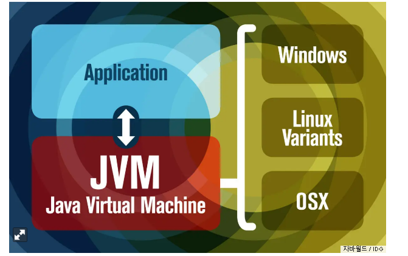
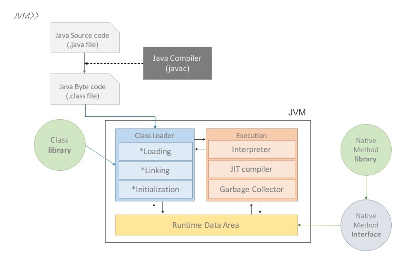
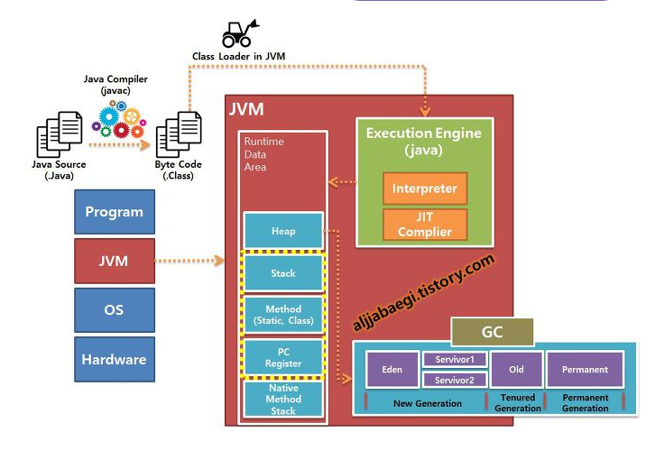
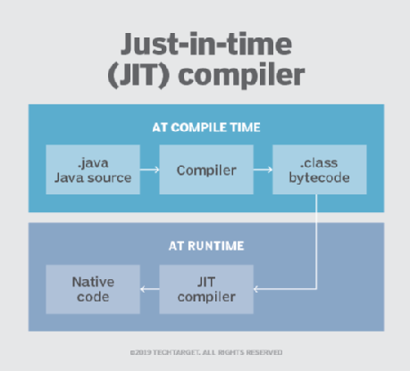
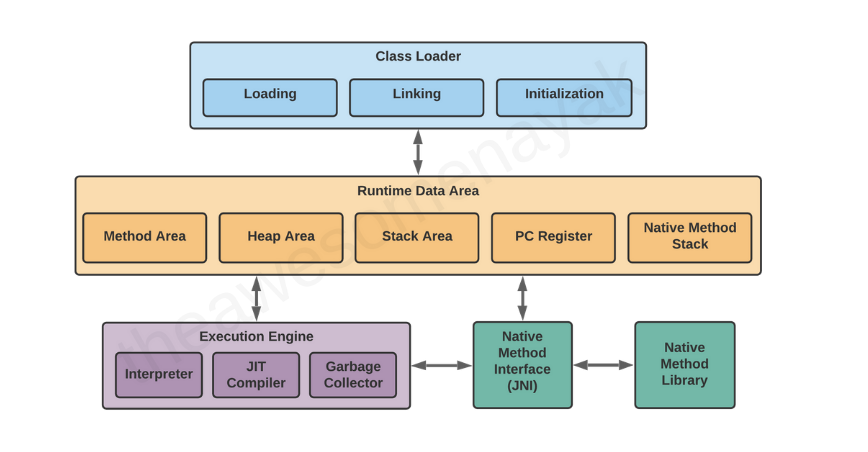
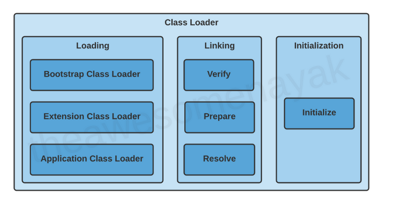
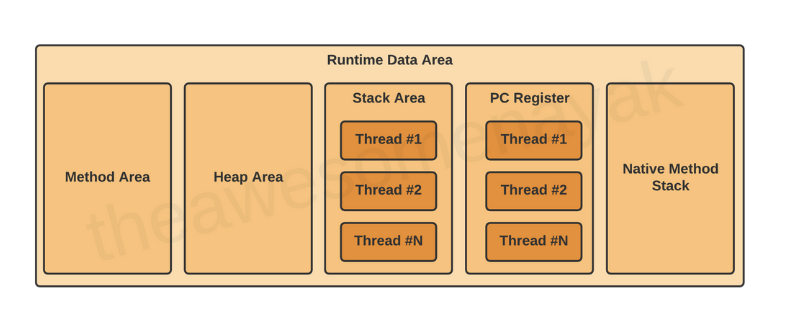
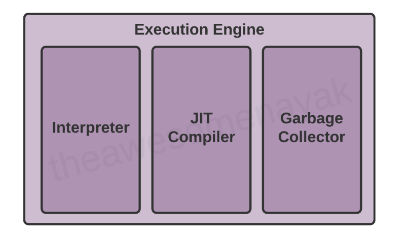
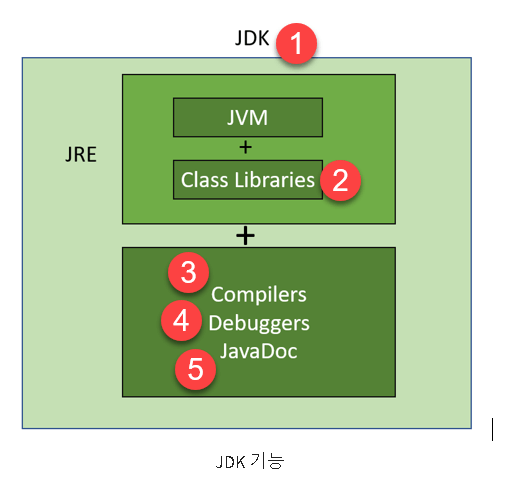
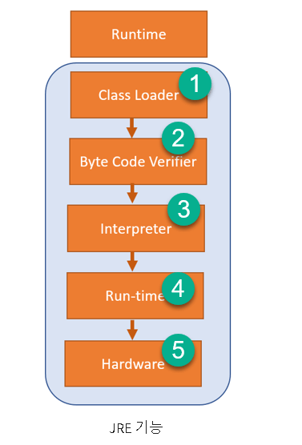

## JVM은 무엇인가?, 자바코드는 어떻게 실행하는 것인가?
- [JVM이란 무엇인가?](#1-JVM이란-무엇인가)
- [컴파일 하는 방법?](#2-컴파일-하는-방법)
- [실행하는 방법?](#3-실행하는-방법)
- [바이트코드란 무엇인가?](#4-바이트코드란-무엇인가)
- [JIT 컴파일러란 무엇이며 어떻게 동작하는가?](#5-JIT-컴파일러란-무엇이며-어떻게-동작하는가)
- [JVM 구성 요소](#6-JVM-구성-요소)
- [JDK와 JRE차이](#7-JDK와-JRE의-차이)

## 1. JVM이란 무엇인가

### 소개
> JVM은 시스템 메모리를 관리하고 Java 기반 애플리케이션을 위한 이식 가능한 실행 환경을 제공한다.



### 용도

> 두 가지 주요 기능이 존재함.
>
> 1. Java 프로그램이 모든 장치 또는 
   운영 체제에서 실행되도록 하는 것("한 번 작성, 어디서나 실행" 원칙) 
>
> 2. 프로그램 메모리를 관리하고 최적화 하는 것.

### 정의
> 1. 기술적 정의 : JVM은 코드를 실행하고 해당 코드에 대한 런타임 환경을 제공하는 소프트웨어 프로그램에 대한 사양
> 
> 2. 일상적인 정의 : JVM은 Java 프로그램을 실행하는 방법.
>
> JVM의 설정을 구성한 다음 실행 중에 프로그램 리소스를 관리하기 위해 이에 의존함.
>
> 3. JVM에 대해 이야기 할 때 일반적으로 Java 앱의 리소스 사용을 나타내고 제어하는 시스템, 특히 서버에서 실행되는 프로세스를 의미함.


### JVM의 메모리 관리

> 1. JVM과의 일반적인 상호 작용은 힙 및 스택의 메모리 사용량을 확인.
> 
> 2. JVM의 메모리 설정을 조정하는 것.
>
> 3. Garbage collection
```
- 자바 이전에는 모든 프로그램의 메모리를 개발자가 관리함.
- 자바부터 프로그램 메모리는 JVM으로 관리를 시작하게 됨.
- JVM은 Garbage collection이라고 불리는 프로세스로 메모리를 지속적으로 식별하고 사용하지 않는 메모리를 자바 프로그램에서 제거한다.
- Garbage collection은 실행되고 있는 JVM 내부에서 발생한다.
```

## JVM의 세가지 파트
> JVM은  사양, 구현, 그리고 인스턴스라는 세가지 측면이 존재함.

### JVM specification
> JVM은 소프트웨어 어플리케이션임. 
>
> 순환적인 방식으로 JVM 어플리케이션은 구현시 최대 창의성을  허용하기 위해 구현의 세부 사항이 사양 내에서 정의되어 있지 않음.
>
> JVM을 올바르게 구현하려면 class파일 형식을 읽고 거기에 지정된 작업을 올바르게 수행할 수 있으면 가능함.
>
> JVM은 Java 프로그램을 올바르게 실행하기만 하면 구현되어진 것임.
>
> Java 언어의 강력함과 유연성을 고려할 때 쉬운 얘기는 아님.
>
> 가상 머신이라는 것은 JVM이 프로그램이 실행되는 서버와 같은 실제 머신의 추상화라는 것을 의미.
>
> 실제로 존재하는 운영 체제나 하드웨어에 관계없이 JVM은 프로그램이 실행될 예측 가능한 환경을 만든다.
>
> 그러나 실제 가상 머신과 달리 JVM은 가상 운영 체제를 생성하지 않음.
>
> JVM은 관리되는 런타임 환경 또는 프로세스 가상 머신으로 설명하는 것이 바람직함.

### JVM implementation
```
JVM 사양을 구현하면 JVM 구현인 실제 소프트웨어 프로그램이 생성됨.
오픈 소스와 독점에 따른 많은 JVM 구현이 존재함.
OpenJDK의 HotSpot JVM은 참조 구현이며 세계에서 가장 철저하게 시도되고
테스트 된 코드베이스 중 하나임.

많은 라이선스가 부여된 JVM은 Oracle의 라이선스가 부여된 JDK를 포함하여
OpenJDK 및 HotSpot JVM에서 포크로 생성됨. OpenJDK에서 라이선스 포크를
생성하는 개발자는 종종 OS별 성능 향상을 추가하려는 욕구에 동기가 부여됨.
일반적으로 JVM을 JRE(Java Runtime Environment)의 번들 부분으로 다운로드하여 설치함.
```

### JVM Instance
```
JVM사양이 구현되어 소프트웨어 상품으로서 출시된 후 
프로그램으로 다운로드하거나 실행할 수 있음.
다운로드한 프로그램은 JVM의 인스턴스(또는 인스턴스 버전)이다.
예시 => John이 가지고 있는 서버의 JVM은 얼마나 많은 메모리를 사용하고 있는가? => 가능한 질문

소프트웨어 사양
    소프트웨어 시스템이 작동하는 방법을 설명하는 사람이 읽을 수 있는 디자인 문서.
```




### JVM에서 클래스 파일을 로드 및 실행

> Java Compiler가 변환한 Java Byte Code(.class file)
>
> JVM 내부의 class Loader가 클래스(.class file)를 로드.

```
JVM의 기능을 수행하는 방법
    자바 클래스 로더와 자바 실행 엔진에 의존.

JVM의 Java 클래스 로더
    Java의 모든 것은 클래스이며, 모든 Java 애플리케이션은 클래스에서 빌드됨.
    애플리케이션은 하나 또는 수천 개의 클래스로 구성될 수 있음.
    Java 애플리케이션을 실행하기 위해 JVM은 컴파일된 .class 파일을 액세스 할 수 있는 서버와 같은 컨텍스트로 로드해야함. JVM은 이 기능을 수행하기 위해 클래스 로더에 의존함.

    자바 클래스 로더는 클래스를 메모리에 로드하고 실행할 수 있도록 하는 JVM의 일부임. 클래스 로더는 지연 로딩 및 캐싱과 같은 기술을 사용하여 클래스 로딩을 최대한 효율적으로 만듬.

    모든 Java 가상 머신에는 클래스 로더가 포함되어 있음. JVM 사양은
    런타임에 클래스 로더를 쿼리하고 조작하기 위한 표준 방법을 설명,
    JVM 구현은 이러한 기능을 수행할 책임이 존재함. 개발자 관점에서
    기본 클래스로더 메커니즘은 블랙박스임.
```

### JVM의 실행 엔진
> 클래스로더가 로드한 클래스를 JVM에 전달.
>
> JVM 내부의 Execution Engine(실행 엔진)이 클래스를 실행시킴.

```
클래스 로더가 클래스를 로드하는 작업을 완료하면 JVM은 각
클래스의 코드를 실행하기 시작함.
실행 엔진은 이 기능을 처리하는 JVM의 성분.
실행 엔진은 실행 중인 JVM에 필수적임.
실제로 모든 실용적인 목적은 JVM 인스턴스임.

코드 실행에는 시스템 리소스에 대한 액세스 관리가 포함됨.
JVM 실행 엔진은 실행중인 프로그램과 이러한 리소스를 제공하는 
운영체제 사이에 존재함.

메모리 외에도 실행 엔진은 파일 시스템 액세스 및 네트워크 I/O를 위한
리소스를 관리함. JVM은 운영 체제 간에 상호 운용 가능하기 때문에 
해당 작업은 의미 있는 작업이 아님. 각 애플리케이션의 리소스 요구 사항 외에도 실행 엔진은 각 OS 환경에 응답해야 함. 
JVM이 in-the-wilde 요구를 처리할 수 있는 방법.
```

- [reference-실행엔진1](https://www.infoworld.com/article/3272244/what-is-the-jvm-introducing-the-java-virtual-machine.html)
- [reference-실행엔진2](https://asfirstalways.tistory.com/158)


## 2. 컴파일 하는 방법

### Intro
> 자바는 OS에 독립적인 특징을 가지고 있음.
>
> 가능한 이유는 JVM덕분이다.

### 자바 컴파일 순서

```
1. 개발자가 자바 소스 코드를 작성.

2. 자바 컴파일러가 자바 소스파일을 컴파일. 이때 나오는 파일은 자바 바이트 코드(.class)파일로 아직 컴퓨터가 읽을 수 없는 자바 가상 머신이 이해할 수 있는 코드임. 바이트 코드의 각 명령어는 1바이트 크기의 Opcode와 추가 피연산자로 이루어짐.

3. 컴파일된 바이트 코드를 JVM의 클래스로더에게 전달함.

4. 클래스 로더는 동적로딩을 통해 필요한 클래스들을 로딩 및 링크하여 런타임데이터 영역, 즉 JVM의 메모리에 올림.

    - 클래스 로더 세부 동작
    4-1. 로드 : 클래스 파일을 가져와서 JVM 메모리에 로드
    4-2. 검증 : 자바 언어 명세 및 JVM 명세에 명시된 대로 구성되어 있는지 검사.
    4-3. 준비 : 클래스가 필요로 하는 메모리를 할당.(필드, 메서드, 인터페이스 등등)
    4-4. 분석 : 클래스의 상수 풀 내 모든 심볼릭 레퍼런스를 다이렉트 레퍼런스로 변경함.
    4-5. 초기화 : 클래스 변수들을 적절한 값으로 초기화함. (static 필드)

5. 실행엔진(Excution Engine)은 JVM 메모리에 올라온 바이트 코드들을 명령어 단위로 하나씩 가져와서 실행함. 이때, 실행 엔진은 두가지 방식으로 변경.

    5-1 인터프리터 : 바이트 코드 명령어를 하나씩 읽어서 해석하고 실행함. 하나하나의 실행은 빠르나, 전체적인 실행속도가 느리다는 단점.

    5-2 JIT 컴파일러: 인터프리터의 단점을 보완하기 위해 도입된 방식으로 바이트 코드 전체를 컴파일하여 바이너리 코드로 변경. 이후에는 해당 메서드를 더이상 인터프리팅 하지 않고, 바이너리 코드로 직접 실행하는 방식. 하나씩 인터프리팅하여 실행하는 것이 아니라 바이트 코드 전체가 컴파일된 바이너리 코드를 실행하는 것이기 때문에 전체적인 실행속도는 인터프리팅 방식보다 빠름.
```

- [reference-컴파일순서](https://gyoogle.dev/blog/computer-language/Java/%EC%BB%B4%ED%8C%8C%EC%9D%BC%20%EA%B3%BC%EC%A0%95.html)

## 3. 실행하는 방법

## Path, CLASS PATH 설정
> Path 설정은 Java를 Compile하기 위해 하는 설정
>
> CLASS PATH 설정은 Java의 클래스를 찾기위해 사용하는 설정.
>
> CLASS를 로드하기 위해 CLASSPATH를 조사하는것은 Java CLASS Loader이다.

## 실행
1. Java File 생성
- Welcome.java

2. 샘플 자바 코드 작성
```java
class Welcome{
    public static void main(String [] args){
        System.out.println("Greetings!");
    }
}
```
3. 자바 클래스 컴파일
```
파일에 코드를 저장한 후 코드를 컴파일 해야함
컴파일은 차례로 파일을 생성할 (.class) 파일을 생성함.
파일을 컴파일하기 위해서 다음 명령어 사용가능
> javac file_name.java

예시
> javac Welcome.java
```

4. 컴파일된 코드 실행
```
java Welcome.java
```


- [reference-실행1](https://www.javacodegeeks.com/2018/04/jvm-architecture-execution-engine-in-jvm.html)
- [reference-실행2](https://javarevisited.blogspot.com/2011/01/how-classpath-work-in-java.html#axzz7Goim33tv)

## 4 바이트코드란 무엇인가
>  Java에서는 일반적으로 코드를 컴파일해서 나온 `java.class` 파일을 바이트 코드로 지칭함 
>
> 자바의 플랫폼(OS) 독립성을 위해 필수적인 코드임
>
> 컴파일 후 생성된 바이트 코드는 `Java Virtual Machine`에서 실행되므로, 코드를 실행하고자 하는 플랫폼에 `Java`가 설치되어 있다면
어느 곳에서든 실행 가능함.

```
프로그램된 코드를 컴파일에서 소스 코드 소프트웨어 용으로 설계된
낮은 수준의 코드로 통역한 코드를 말함.

가상 머신(JVM)에 의해 실행 되거나  프로세서에 의해 인식되는
기계 코드로 추가로 컴파일될 수 있음.

다른 유형의 바이트 코드는 해당 가상 머신에서 읽고 실행할 수 있는 
다른 구문을 사용함.

바이트 코드는 직접 작성이 가능하지만 Java와 같은 고급 언어로
코드를 작성하는 것보다 훨씬 어려움. 따라서 Java.CLASS 파일과
같은 바이트 코드 파일 은 javac와 같은 컴파일러를 사용하여
소스 코드에서 가장 자주 생성됨.

바이트 코드는 고급 언어가 아니라는 점에서 어셈블리 언어와 유사하지만
기계어와 달리 어느정도의 가독성이 존재함.
둘 다 소스 코드와 기계 코드 사이에 있는 "중간"언어로 간주됨.

둘의 주요한 차이점은 바이트 코드는 가상 머신(소프트웨어)에 의해 생성,
어셈블리 언어는 CPU(하드웨어)에 대해 생성됨.
```
- [reference-bytecode1](https://www.javatpoint.com/java-bytecode)
- [reference-bytecode2](https://techterms.com/definition/bytecode)

## 5 JIT 컴파일러란 무엇이며 어떻게 동작하는가

### 무엇인가?
- Just-In-Time 컴파일러는 해석된 프로그램의 성능을 향상시키는 방법.
- 실행하는 동안 프로그램은 성능을 향상시키기 위해 네이티브 코드로 컴파일 되어짐 => 동적 컴파일이라고도 함.
- 구성 요소
    1. 중간 코드 생성기 : 중간 코드 생성
    2. 코드 최적화 : 더 나은 성능을 위해 중간 코드 최적화
    3. 대상 코드 생성기 : 중간 코드를 기본 기계 코드로 변환
    4. 프로파일러 : 핫스팟(반복 실행 코드)을 찾음

### 어떻게 동작하는가?


- 동작하는 것을 알아보는 것에 앞서 컴파일 방식과 인터프리터 방식에 대한 이해가 필요함
    - 컴파일 방식: 소스코드를 한꺼번에 컴퓨터가 읽을 수 있는 native machine (기계)어로 변환
    - 인터프리터 방식 : 소스코드를 빌드시에 아무 동작을 하지 않다가, 런타임 시에 한줄 한줄 읽어가며 변환

- 자바는 컴파일와 인터프리터 방식을 모두 사용함.
- JIT 컴파일러는 한번 읽어서 기계어로 변경한 소스코드는 변경하지 않는다.

- 동작의 순서
    1. `.java source`를 컴파일한다.
    2. 컴파일의 결과물인 `.class bytecode`를 JIT 컴파일러로 보내진다.
    3. 바이트 코드를 기계어 코드로 컴파일한다.
    4. 컴파일 한 코드는 저장소에 저장한다.
    5. 코드명령이 수행되는 프로세서로 해당 코드를 보낸다.
    6. 이때 한번 읽어서 기계어로 변경한 소스코드는 다시 번역 하지 않는다!.(핵심)

- 인터프리터와 JIT 컴파일러의 차이
```C++
int sum =10;
for(int i = 0 ; i <= 10; i++) {
   sum += i;
}
System.out.println(sum);
'''
인터프리터는 sum 루프의 각 반복에 대해 메모리에서의 값을 가져와서
값을 추가하고 1을 메모리에 다시 씀. 루프에 들어갈 대마다 메모리에 액세스
하기 때문에 비용이 많이듬.

JIT 컴파일러는 해당 코드에 Hot Spot(반복되는 부분)이 있음을 인식하고
이에 대한 최적화를 수행함. sum 스레드의 PC 레지스터에 로컬 복사본을 저장(i)하고 루프에서 값을 계속 추가함.

JIT 컴파일러는 인터프리터가 코드를 한줄 씩 해석하는 것보다 코드를 컴파일
하는 데 더 많은 시간이 걸림 => 프로그램을 한번만 실행하려면 인터프리터를
사용하는 것이 좋음.
'''
```

- [reference-JIT1](https://www.theserverside.com/definition/just-in-time-compiler-JIT)
- [reference-JIT2](https://catch-me-java.tistory.com/11)

## 6 JVM 구성 요소


- 클래스 로더, 런타임 메모리/데이터 영역, 실행 엔진으로 구성됨.

1. 클래스 로더
- 클래스를 메모리에 로드하고 실행할 수 있도록 하는 JVM의 일부
- 바이트 코드를 주 메모리에 로드하여 사용할 수 있게 끔함



```
- `.java` 소스 파일을 컴파일하면 바이트 코드 파일로 변환된다. => `.class`
- 프로그램에서 해당 클래스를 사용하려고 할 때 클래스로더가 해당 클래스를 주 메모리에 로드함.
- 메모리에 로드되는 첫 번째 클래스는 일반적으로 `main()`메서드가 포함된 클래스임.

- 클래스 로딩 프로세스에는 로딩, 연결, 초기화의 세 단계가 존재함.
```

- 로딩 : 특정 이름을 가진 클래스 또는 인터페이스의 이진 표현(바이트코드)를 가져와서 원래 클래스 또는 인터페이스를 생성하는 작업이 포함됨.

    - JVM은 클래스를 메모리에 로드 하는 방법을 사용함 => 정규화된 이름을 기반으로 클래스를 로드함.

    - 상위 클래스 로더가 클래스를 찾을 수 없으면 작업을 하위 클래스 로더에 위임함. => 마지막 자식 클래스 로더가 클래스 로드 불가시 NoClassDefFoundError 또는 ClassNotFoundException.

- 연결 : 클래스는 메모리에 로드된 후 연결 프로세스를 거친다.<br> 클래스 또는 인터페이스를 연결하는 것은 프로그램의 서로 다른 요소와 종속성을 결합하는것을 포함함.<br>

    - 확인 : 이 단계에서는 제약 조건 또는 규칙 집합에 대해 파일을 확인하여 파일의 구조적 정확성을 확인함. 검증에 실패시 `Verify Exception.`

    - 준비 : 이 단계에서는 JVM은 클래스 또는 인터페이스의 정적 필드에 대한 메모리를 할당하고 기본값으로 초기화함.

    ```java
    private static final boolean enabled = true;
    ```
    해당 변수를 선언했다고 가정할 때 변수에 대한 메모리를 할당`enabled`하고 해당값을 부울의 기본값인 `false`로 초기화

    - 해결: 이 단계에서 기호 참조는 런타임 상수 풀에 있는 직접 참조로 대체 됨.<br> 다른 클래스에 대한 참조나 다른 클래스에 있는 상수 변수가 있는 경우 이 단계에서 해결되고 실제 참조로 대체된다.<br>

- 초기화 : 클래스 또는 인터페이스로의 초기화 메서드 실행이 포함됨.<br> 여기에는 클래스의 생성자 호출, 정적 블록 실행, 모든 정적 변수에 값 할당이 포함될 수 있음.<br> 이것은 클래스 로딩의 마지막 단계.

    - 예시로 다음 코드 선언시
    ```java
    private static final boolean enabled = true;
    ```
    변수 `enabled`는 `false`준비 단계에서 기본값으로 설정되었고, 초기화 단계에서 해당 변수에는 실제 값이 할당됨. `true`.

- 참고 : JVM은 다중 스레드로 이루어져 있고, 여러 스레드가 동시에 동일한 클래스를 초기화하려고 할 수 있음.<br> 이로 인한 동시성 문제가 발생할 수 있으므로 프로그램이 다중 스레드 환경에서 제대로 작동하려면 스레드 안전성을 처리해야함.<br>

2. 런타임 메모리/데이터 영역
- 세부정보를 사용할 수 있게끔 함.



- 방법 영역
```java
'''
런타임 상수 풀, 필드 및 메서드 데이터와 같은 모든 클래스 수준
데이터와 메서드 및 생성자에 대한 코드가 저장됨.

메소드 영역에서 사용 가능한 메모리가 프로그램 시작에 충분하지 않은 경우
JVM은 OutOfMemoryError.
'''
public class Employee {
    private String name;
    private int age;

    public Employee(String name, int age){
        this.name = name;
        this.age = age;
    }
}

'''
이 코드 예제에서 name 및 age및 생성자 세부 정보와 같은 필드 수준 데이터가 메서드 영역에 로드됨.

메서드 영역은 가상 머신 시작시 생성 JVM당 하나의 메소드 영역만 존재.
'''
```

- 힙 영역
```java
'''
모든 개체와 해당 인스턴스 변수가 여기에 저장됨.
모든 클래스 인스턴스 및 배열에 대한 메모리가 
할당되는 런타임 데이터 영역.
'''
Employee employee = new Employee();

'''
해당 코드 예제에서 인스턴스 Employee가 생성되어 힙 영역에 로드됨.
힙은 가상 머신 시작 시 생성되며 JVM당 하나의 힙 영역만 존재.

참고 : 메서드 및 힙 영역은 여러 스레드에 대해 동일 메모리를 공유하므로
여기에 저장된 데이터는 스레드로부터 안전하지 않음.
'''
```

- 스택 영역
```java
'''
JVM에 새로운 쓰레드가 생성될 때마다 별도의 런타임 스택도 동시에 생성됨.
모든 로컬 변수, 메서드 호출 및 부분 결과는 스택 영역에 저장.

스레드에서 처리 중인 처리에 사용 가능한 것보다 큰 스택 크기가 필요한 경우
JVM => StackOverflowError

스택 프레임은 세 개의 하위 부분으로 나뉨.
- 지역 변수
    각 프레임에는 지역 변수라고하는 변수 배열 포함
    모든 지역 변수와 그 값이 여기에 저장
- 피연산자 스택
    각 프레임에는 피연산자 스택이라고하는 LIFO 스택 포함
    이것은 중간 작업을 수행하기 위한 런타임 작업 공간 역할을 함.
- 프레임 데이터
    방법에 해당하는 모든 기호가 여기에 저장
    이것은 또한 예외의 경우에 catch 블록 정보 저장
'''
```

- PC 레지스터
```java
'''
    JVM은 다중 스레드를 지원함 => 각 스레드에는 현재 실행 중인 JVM 명령의 주소를 보유하는 자체 PC 레지스터가 존재.
    명령어가 실행되면 PC 레지스터는 다음 명령어로 업데이트 됨.
'''
```

- 네이티브 메소드 스택
```java
'''
    JVM에는 기본 메소드를 지원하는 스택이 포함되어 있음.
    이러한 메소드는 C 및 C++와 같은 Java 이외의 언어로 작성됨.
    모든 새 스레드에 대해 별도의 기본 메서드 스택도 할당됨.
'''
```

3. 실행 엔진
- 인터프리터, JIT 컴파일러, Garabage Collector로 이루어져 있음.



- 바이트 코드가 주 메모리에 로드되고 런타임 데이터 영역에서 세부 정보를
사용할 수 있게 되면 다음 단계는 프로그램을 실행하는 것.
- 실행 엔진은 각 클래스에 있는 코드를 실행하여 이를 처리.

- [reference-JVM](https://www.freecodecamp.org/news/jvm-tutorial-java-virtual-machine-architecture-explained-for-beginners/)

## 7 JDK와 JRE 차이



1. JDK란?
```java
'''
JDK는 애플릿과 자바 애플리케이션을 만드는데 사용되는 소프트웨어 개발환경
JDK의 전체 형태는 Java Development Kit임. Java 개발자는 Windows, macOS, Solaris 및 Linux에서 사용할 수 있음. JDK는 Java 프로그램을
코딩하고 실행하는데 도움이 됨.
'''
```



2. JRE란?
```java
'''
JRE는 다른 소프트웨어를 실행하도록 설계된 소프트웨어.
클래스 라이브러리, 로더 클래스 및 JVM이 포함됨.
Java 프로그램을 실행하기 위해서는 JRE가 필요함. 
모든 JDK 버전에는 JRE가 번들로 제공되므로 JRE를 PC에 별도로 
다운로드하여 설치할 필요가 없음.
'''
```

3. 그래서 차이점.
- JDK = JRE + Compilers, Debuggers, JavaDoc 즉 자바를 실행할 환경과 <br> 자바를 개발하는데 필요한 지원 패키지들을 포함함

- JRE = 자바를 실행하기 위한 환경임.(자바 프로그램을 실행만 할 것이라면 JDK는 필요치 않음.)

```java
'''
JDK는 소프트웨어 개발 키트이고 JRE는 Java 프로그램을 실행할 수 있는 
소프트웨어 번들이고, JVM은 바이트 코드를 실행하기 위한 환경.

JDK의 전체 형태는 Java Development Kit이고, JRE의 전체 형태는 
Java Runtime Environment임.

JDK에는 개발, 디버깅 등을 위한 도구가 포함되어 있음.
JRE에는 클래스 라이브러리 및 기타 지원 파일이 포함되어 있음.

JDK는 설치 프로그램과 함께 제공되지만 
JRE는 소스 코드를 실행하기 위한 환경만 포함됨.
'''
```

- [reference-JDK_diffrence_JRE](https://www.guru99.com/difference-between-jdk-jre-jvm.html)