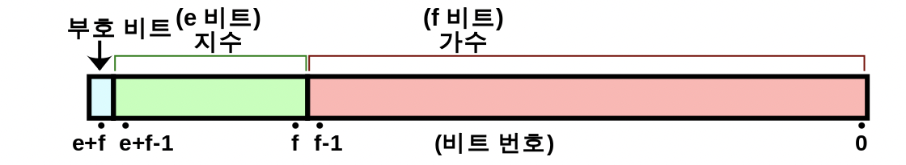

## 목차
1. [숫자](#숫자)
2. [IEEE754](#ieee-754의-부동소수점-방식)

## 숫자
> Javascript에서 숫자는 IEEE 754부동 소수점 방식(표쥰)을 이용한다.
>
> 사람이 생각하는 숫자(10진수)
>
> 컴퓨터는 (10진수가 아니다.)
>
> 컴퓨터가 숫자를 이해하기 위해서는 10진수를 2진수로 변환하는 정규화 과정이 필요하다.
>
> 부동 소수점방식은 10진수를 2진수로 근사해서 표현하는 방식중 하나이다.

- 이게 왜 틀릴까?..
```js
console.log(0.1 + 0.2 === 0.3 ) // False => 왜?...
```

## IEEE 754의 부동소수점(32bit 기준) 방식


> 부호부 (Sign): 1비트, 숫자의 부호를 나타내며, 양수일 때 0, 음수일 때 1이 됩니다.
> 
> 지수부 (Exponent) : 8비트, 지수를 나타냅니다.
>
> 가수부 (Mantissa) : 23비트, 가수 또는 유효숫자를 나타냅니다.

### 부동 소수점 변환 예시
1. ex) -314.625

2. 부호부 확인.(1bit)
> 부호가 음수이므로 32비트의 가장 앞자리는 1이 됨.

3. 가수부 확인(23bit)
> 숫자의 절대값을 2진수로 표현.
>
> => 0.625의 계산
>
> => 소수부에 2를 곱하는데 결과가 1로 떨어지거나 혹은 똑같은 소수점이 나올 떄까지 반복한다.
>
> 0.625 * 2 = `1`.250
>
> 0.250 * 2 = `0`.500
>
> 0.500 * 2 = `1`.000 => 계산 종료
> 314.625 => 2진수 100111010.101(2)
>
> 이 때 부동소수점은 정규화 방식을 거친다.
>
> => $1.00111010101_{2} * 2^{8}$
>
> => 여기서 8이 지수부 의 숫자이다.
>
> => 여기서 IEEE754(32bit)의 가수부 표현 방식은
>
> => 00111010101을 가수부의 앞자리로 가져오고
>
> => 가수부의 23비트의 나머지 부분을 0 으로 채운다.
>
> => 00111010101000000000000

4. 지수부 확인(8bit)
> $2 ^{8}$
> 
> 32비트 IEEE754 형식에서 Bias는 127이므로 8 + 127 = 135
> 
> => $10000111_{2}$

5. 314.625의 부동소수점 표기

> 부호 양수이므로 0
>
> 지수부 : $10000111_{2}$
>
> 가수부 : $00111010101000000000000_{2}$
>
> 전체 : $01000011100111010101000000000000_{2}$

### 0.1 의 계산
1. 정수 부분의 이진화
```
0 / 2 = 0(몫) + 0(나머지);
```

2. 정수 부분의 밑이 2인 표현을 구성 : $0_{2}$
3. 소수 부분을 2진법(2진수)로 변환: 0.1
```
곱하기 = 정수 + 소수부;
0.1 * 2 = 0 + 0.2; [0]
0.2 * 2 = 0 + 0.4; [0]
0.4 * 2 = 0 + 0.8; [0]
0.8 * 2 = 1 + 0.6; [1]
0.6 * 2 = 1 + 0.2; [1]
0.2 * 2 = 0 + 0.4; [0]
0.4 * 2 = 0 + 0.8; [0]
0.8 * 2 = 1 + 0.6; [1]

0001 이후 1001 반복
```

4. 숫자의 소수 부분에 대한 밑수 이진수 표현을 구성
> $0.0001 1001 1001 ..._{2}$


5. 정규화 전 양수
> $0.0001 1001 1001 ..._{2}$


6. 숫자의 이진 표현을 정규화
> - $0.0001 1001 1001 ..._{2} * 2^0$
> - $1.1001 1001 1001 ..._{2} * 2^{-4}$


7. 부호부, 지수부, 가수부
> 부호부(1bit) : 양수이므로 0
>
> 지수부(8bit) : -4 + bias(127) = 123
=> $1111011_{2}$
>
> 가수부(23bit) : $1001100 11001100 11001100_{2}$
> 
> 가수부는 여기서 계속 반복되는 1001 중에서 반올림을 수행하여 마지막 자리를 결정한다. 
>
> 0.1 의 경우는 $1001 1001 1001 1001 1001 100/1 1001_{2} $ 에서 23자리 이후의 값이 앞자리의 0.5(십진수 기준) 배수보다 크면 1, 같거나 작으면 0으로 반올림한다. 
>
> 여기서 24자리 부터의 $0.1은 1(0.5)1(0.25)001..._{2}$ 이므로 가수부는 $1001 1001 1001 1001 1001 101_{2}$ 로 정규화 된다.
>
> 전체 표현
>
> $00111101 11001100 11001100 11001101_{2}$
