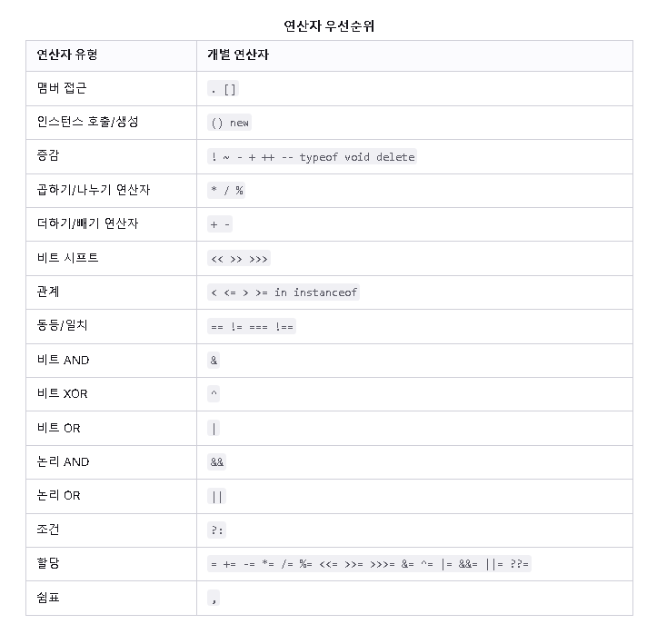

## 목차
1. [비교연산자](#비교-연산자)
2. [산술연산자](#산술-연산자)
3. [비트연산자](#비트-연산자)
4. [논리연산자](#논리-연산자)
5. [문자열연산자](#문자열-연산자)
6. [삼항조건연산자](#조건-삼항-연산자)
7. [단항연산자](#단항-연산자)
8. [관계연산자](#관계-연산자)
9. [연산자우선순위](#연산자-우선순위)
10. [표현식](#표현식)
11. [참조](#reference)


## 연산자(Operator)

### 비교 연산자
> `True` 또는 `False`를 반환한다.
>
> `===` 서로 같은지 엄격하게 검사
>
> `!==` 서로 다른지 엄격하게 검사
>
> `==` 서로 같은지 느슨하게 검사(형변환 유발)
>
> `!=` 서로 다른지 느슨하게 검사(형변환 유발)
> 
> `>` 왼쪽 피연산자가 오른쪽 피연산자보다 큰지 여부를 확인한다.
>
> `>=` 왼쪽 피연산자가 오른쪽 피연산자보다 크거나 같은지 여부를 확인한다.
>
> `<` 오른쪽쪽 피연산자가 왼쪽 피연산자보다 큰지 여부를 확인한다.
>
> `<=` 오른쪽 피연산자가 왼쪽 피연산자보다 크거나 같은지 여부를 확인한다.

### 산술 연산자
> `%` 나머지 연산자. 
>
> `++` 증가 연산자. 피 연산자에 1을 더한다.
>
> `--` 감소 연산자. 피 연산자에 1을 뺀다.
>
> `-` 단항 부정 연산자. 피 연산자의 부호를 반대로 바꾼 값을 반환한다.
>
> `+` 피 연산자가 숫자 타입이 아니면 숫자로 변환을 시도한다. => +"3" => 3 // +true => 1
>
> `**` 거듭제곱 연산자

### 비트 연산자
> `a & b` and 연산자
>
> `a | b` or 연산자
>
> `a ^ b` XOR 연산자
>
> `~ a` not 연산자
>
> `a << b` left shift 연산자, a의 이진 표현을 b만큼 왼쪽으로 이동하고, 오른쪽은 0으로 채운다.
=> ex) 1011 << 2 => 101100
>
> `a >> b` right shift 연산자, a의 이진 표현을 b만큼 오른쪽 으로 이동하고, 1미만 이동 비트는 버린다.
=> ex) 101 >> 2 => 1

### 논리 연산자
> `True` 또는 `False`를 반환한다.
>
> `expr1 && expr2 ` 논리 AND 연산자
>
> `expr1 || expr2 ` 논리 OR 연산자
>
> `!expr` 논리 NOT 연산자

### 문자열 연산자
```js
console.log('mine' +' ' + 'string'); // mine string
```

### 조건 (삼항) 연산자
```js
condition ? val1 : val2

var status = (age >= 18) ? "adult" : "child";
// age>= 18이 true이면 "adult" 아니면 "child" 반환
```

### 단항 연산자
> 오직 하나의 피연산자만 사용하는 연산
> 
> `delete` 연산자가 속성을 성공적으로 삭제한 이후 해당 속성을 접근하려고 하면 `undefined`가 반환된다.
>
> `typeof` 연산자는 피연산자의 타입을 나타내는 문자열을 반환한다.
>
> `void` 연산자는 표현식을 평가할 때 값을 반환하지 않도록 지정한다.

```js
delete Math.PI;     // false 반환 (설정 불가한 속성 삭제 불가)

var myobj = {h: 4};
delete myobj.h;     // true 반환 (사용자 정의 속성 삭제 가능)

/* */
var myFun = new Function("5 + 2");
var shape = "round";
var size = 1;
var foo = ['Apple', 'Mango', 'Orange'];
var today = new Date()

typeof myFun;     // "function" 반환
typeof shape;     // "string" 반환
typeof size;      // "number" 반환
typeof foo;       // "object" 반환
typeof today;     // "object" 반환
typeof dontExist; // "undefined" 반환

void (expression)
void expression
```

### 관계 연산자
> 피연산자를 서로 비교하고 비교 결과가 참인지에 따라 boolean 값을 반환
>
> `in` 연산자는 지정한 속성이 지정한 객체에 존재할 경우 `true`를 반환한다.
>
> `instanceof` 연산자는 지정한 객체가 지정한 객체 타입에 속하면 `true`를 반환한다.

```js
var trees = ["redwood", "bay", "cedar", "oak", "maple"];
0 in trees;        // true 반환
3 in trees;        // true 반환
6 in trees;        // false 반환

var theDay = new Date(1995, 12, 17);
if (theDay instanceof Date) // theDay 변수는 Date 객체인가?.
    { 
        console.log("그런 것 같아요"); // TRUE
    }
else
    {
        console.log("아닌 것 같아요."); // False
    }
```
### 연산자 우선순위


## 표현식
> 표현식이란 값으로 이행하는 임의의 유효한 코드 단위를 말한다.
>
> `JavaScript`의 표현식은 다음과 같은 범주로 구분할 수 있습니다.
>
> `산수` : 숫자, 예컨대 3.14159로 평가됩니다. 보통 산술 연산자를 사용합니다.
> 
> `문자열` : 문자열, 예컨대 "프레디", "234" 등으로  평가됩니다. 보통 문자열 연산자를 사용합니다.
>
> `논리`: 참이나 거짓으로 평가됩니다. 대개 논리 연산자를 포함합니다.
>
>`일차 표현식`: JavaScript의 키워드와 일반 표현식입니다.
>
>`좌변 표현식`: 좌변 값은 할당의 목적지입니다.

### 일차 표현식
> `Javascript`의 키워드와 일반 표현식
>
> `this` : 현재 객체를 참조하려면 this 키워드를 사용.
> 
> `그룹 연산자 ()` : 표현식 평가의 우선순위 조절
```js
var a = 1;
var b = 2;
var c = 3;

// 우선순위 재정의
// 곱하기보다 더하기를 먼저 수행
a + b * c; // 7
(a + b) * c;   // 9
```

### 좌변 표현식
> 좌변 값은 할당의 목적지
>
> `new` : 사용자 정의 객체 타입이나 내장 객체 타입의 인스턴스를 생성 가능.
> 
> `super` : 객체의 부모가 가진 함수를 호출할 때 사용.(클래스에서 부모의 생성자를 호출)
```js
var objectName = new objectType([param1, param2, ..., paramN]);

super([arguments]); // 부모 생성자 호출
super.functionOnParent([arguments]);
```

## Reference
[MDN-Operator]https://developer.mozilla.org/ko/docs/Web/JavaScript/Guide/Expressions_and_Operators