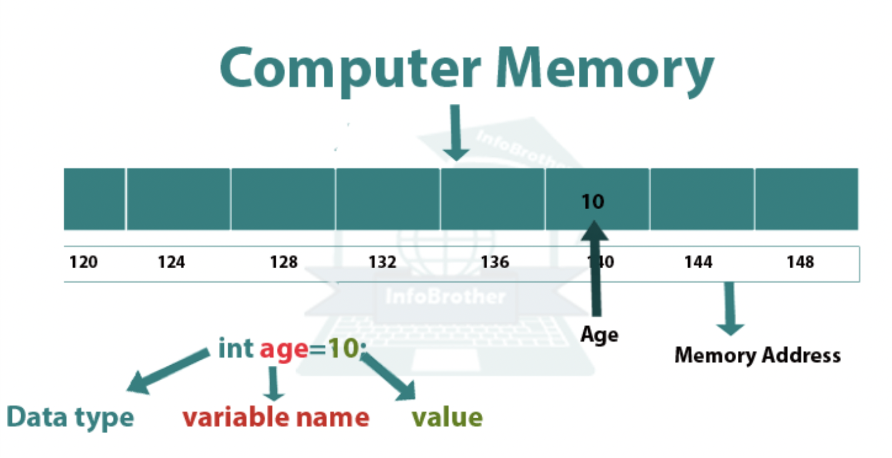

## 값(Value)
> 더 이상 나눌 수 없는 값
```
더 이상 평가될 수 없는 하나의 식으로
자료형을 간단히 이루는 값
```

## 변수 (Variable)
> 다양한 값을 담을 수 있는 박스와 같은 컨테이너
>
> 값이 저장된 메모리 주소와 이름을 연결(그 주소의 별칭)



```js
const word = 'JavaScript'
```

## 식 (Expression)
> 값을 만들어내는 표현식
>
> 값 자체도 식으로 인정하는 값 식, 연산자를 포함하는 연산식

## 연산자 (Operator)
> 값의 연산을 위해 사용되는 부호
>
> 연산의 `대상`이 되는 피연산자, 연산을 `부호`로 표현하는 연산자
>
> 할당 연산자 (=)
>
> 비교 연산자 (==)
>
> 산술 연산자 (+)
>
> 비트 연산자 (&)
>
> 논리 연산자 (&&)

## 문 (Statement)
> 특정 작업을 위한 명령으로 프로그래밍의 흐름을 제어

### 조건문 
```
if(식) {
    문
}

if(식) {
    참일때 실행
} else {
    거짓일때 실행
}
```

### 반복문
```
for(식; 식; 식){
    두번째 식의 결과가 참일때 실행
}

while(식) {
    참일때만 실행
}
```

## 함수 (Function)
> 특정 일을 처리하는 코드 묶음

```
function <함수명>(input){
    <로직>
    return <반환>
}
```

```js
function func(input){
    // logic ...
    return output
}

const func_value = func(input)
```
