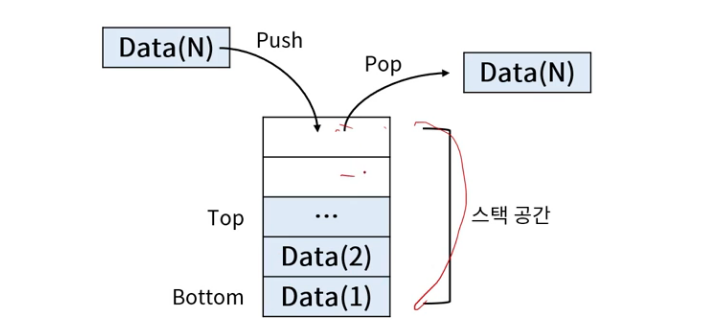
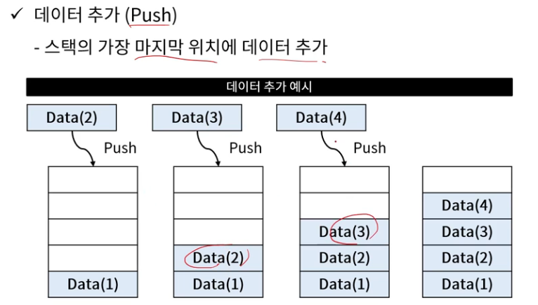
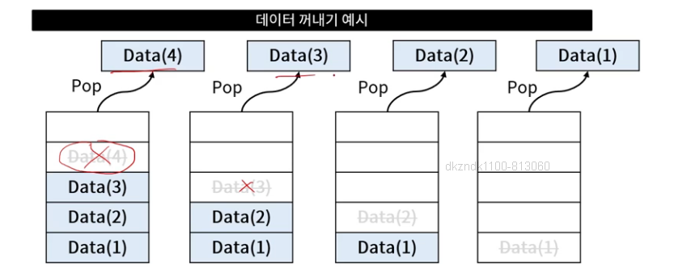
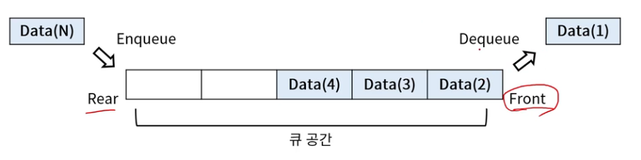
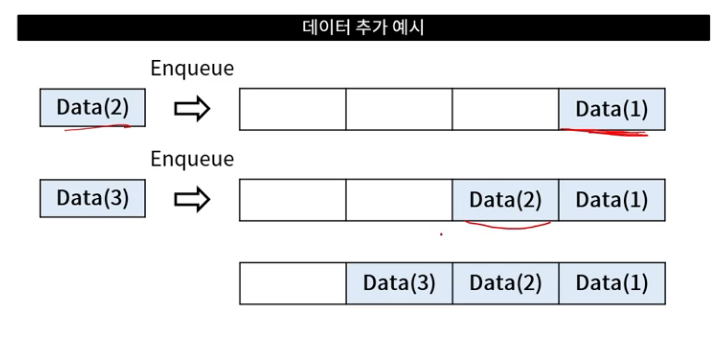
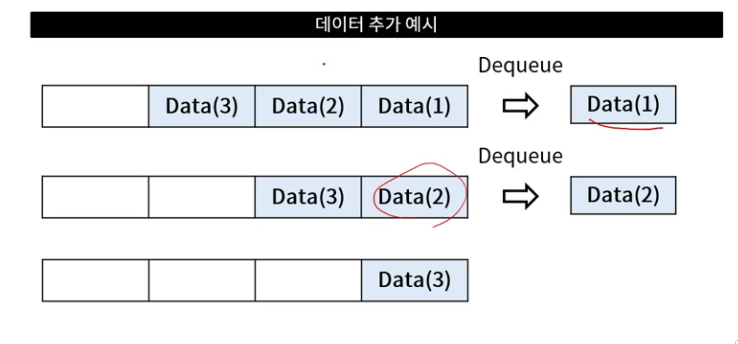
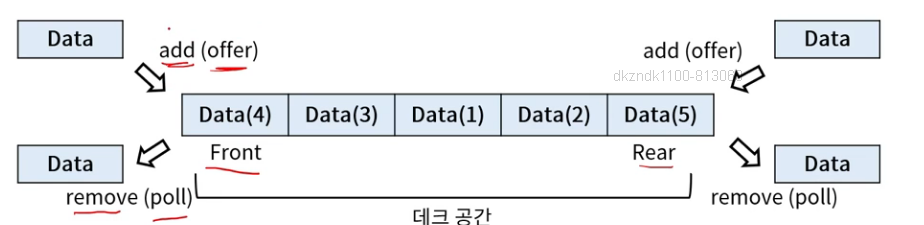
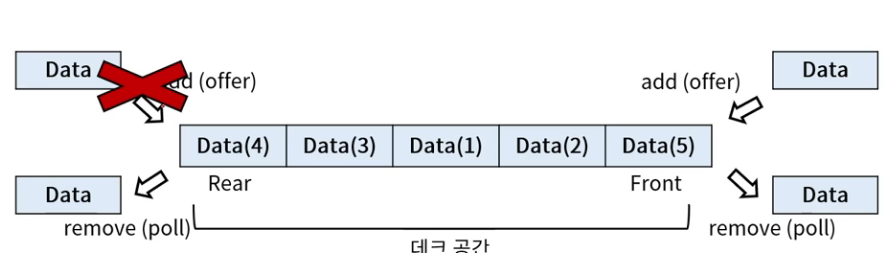

## 스택 (Stack)
- 후입선출 (Last In First Out; LIFO) 자료구조
    - 마지막에 들어온 데이터가 먼저 나가는 구조
- 데이터가 입력된 순서의 역순으로 처리되어야 할 때 사용
    - ex) 함수 콜 스택, 수식 계산, 인터럽트 처리 등

## 스택 기본 구조
- 후입 선출 구조
- 기본적으로 데이터 추가, 꺼내기, 스택 공간 확인 동작으로 이루어짐

## 스택 기본 연산
- 데이터 추가 (Push)
    - 스택의 가장 마지막 위치에 데이터 추가

- 데이터 꺼내기 (Pop)
    - 스택의 가장 마지막 위치에서 데이터 꺼냄

## 큐 (Queue)
- 선입선출 (First In First Out; FIFO) 자료구조
    - 먼저 들어온 데이터가 먼저 나가는 구조

- 입력 순서대로 데이터 처리가 필요할 때 사용
    - 프린터 출력 대기열, BFS(Breath-First Search)등

## 큐 기본 구조
- 선입선출 구조를 따름
- 기본적으로 데이터 추가, 꺼내기, 큐 공간 확인 동작으로 이루어짐

## 큐 기본 연산
- 데이터 추가 (Enqueue)
    - 큐에 데이터 추가

- 데이터 꺼내기 (Dequeue)
    - 큐에서 데이터 꺼내기

## 데크 (Deque)
- 양쪽에서 삽입과 삭제가 모두 가능한 자료구조
    - Deque : Doubly-ended Queue
    - Stack과 Queue를 합친 형태

## 데크 기본 구조
- 데크의 기본 구조는 양방향에서 삽입 삭제 가능한 구조
- 일부 기능을 제한하여 용도에 맞게 변형 가능

## 입력제한 데크 (Scroll)
- 한 쪽의 입력을 제한한 데크

## 출력제한 데크 (Shelf)
- 한 쪽의 출력을 제한한 데크

