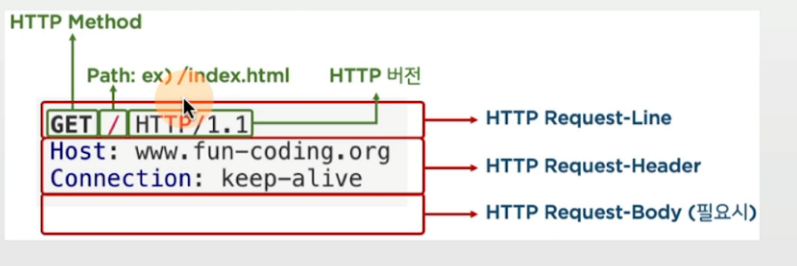
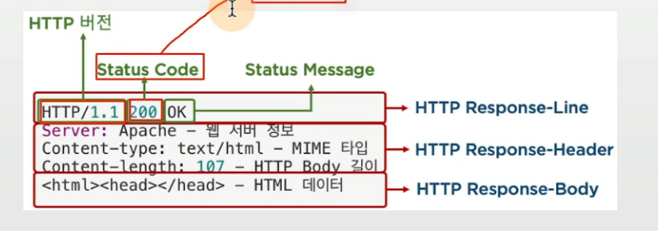
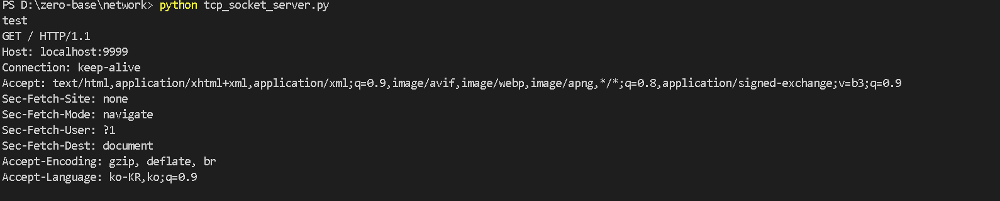
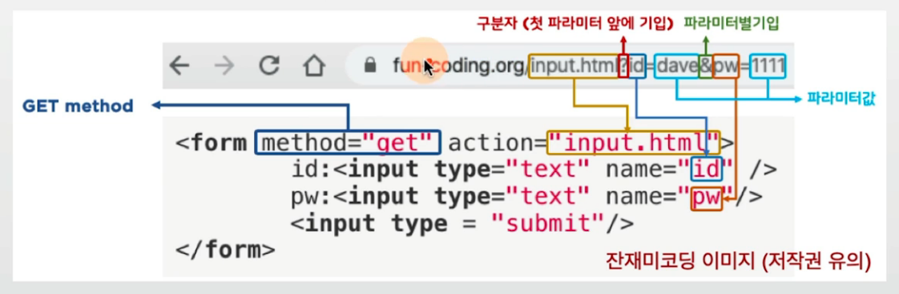
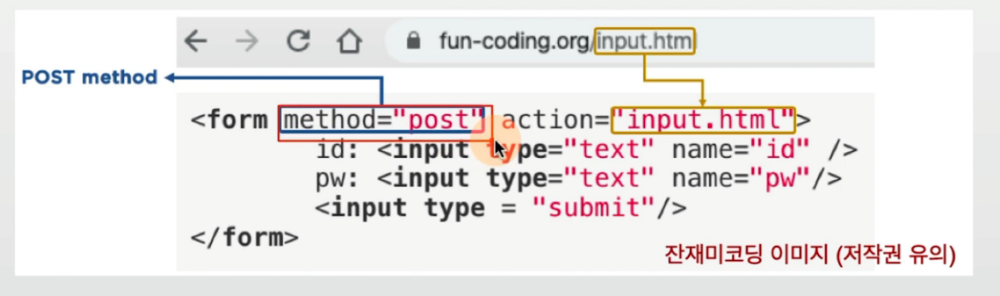
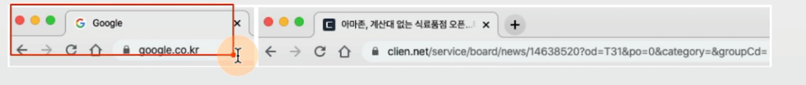
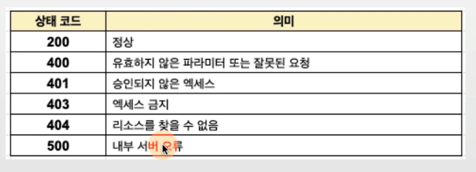
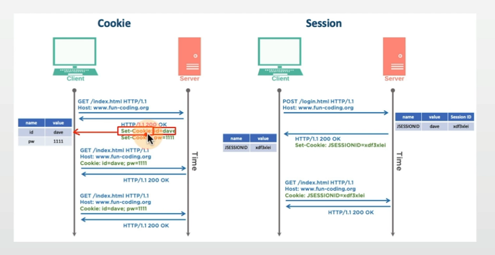

## 목차
- [목표](#본-챕터-목표)
- [HTTP](#http)
- [Request/Response](#http-requestresponse)
- [쿠키/세션](#쿠키cookie와-세션session)

## 본 챕터 목표

1. HTTP와 HTTPS의 차이점에 대해 간략히 설명
2. 쿠키와 세션의 차이점에 대해 간략히 설명
3. HTTP GET, POST 방식에 대해 간략히 설명
4. 웹 브라우저를 실행시켜서 주소창에 특정 URL 값을 입력시킨 후, 엔터를 눌렀을 때, 페이지가 렌더링되는 과정을 웹통신 흐름에 중점을 두어 가능한 구체적으로 설명.

### 다양한 응용 계층 프로토콜
- HTTP/HTTPS (HyperText Transfer Protocol): 웹사이트 접속
- FTP (File Transfer Protocol): 파일 송수신
- SMTP/POP3 (Simple Mail Transfer Protocol): 메일 송신/수신
- DNS(Domain Name System): 이름 해석

## HTTP (HyperText Transfer Protocol)
- 인터넷(WWW)상에서 정보를 주고받는 프로토콜
- HTTP method: GET, POST, PUT, DELETE
- Server/Client 모델로 Request/Response 사용
    - Client에서 요청(Request)를 보내면, Server에서 응답(Response)을 준다.
    - HTTP는 Connectionless 한 프로토콜임 - 1회성 Request 및 Response!
    - TCP/IP socket을 이용해서 연결됨


### WWW이란?
- WWW 이란?
    - W3 또는 웹(Web)
    - 주요 요소 : HTML, URL, HTTP
- HTML : markup 언어, hypertext 와 hyperlink(또는 링크)로 구성

### HTTP 1.1
- HTTP는 Connectionless 방식
- HTTP 1.1은 keepalive 기능을 통해, 서버에서 설정된 keepalive timeout 까지는 연결과정 없이 데이터 송수신 가능 
    - 내부적으로 결국 매번 TCP 3-way handshake 과정을 거칠 필요가 없어짐


### 일반적인 HTTP(HyperText Transfer Protocol) 송수신


## HTTP Request/Response

> HTTP 헤더는 읽을 수 있음(1.1 버전 기준)

- Request
```
GET / HTTP/1.1
Host: www.fun-coding.org
Connection: keep-alive
```



- Response
```
HTTP/1.1 200 OK
Server: Apache - 웹 서버 정보
Content-type: text/html - MIME 타입
Content-length: 107 - HTTP Body 길이
<html><head></head> - HTML 데이터
```



- HTTP 통신의 하단에는 TCP/IP 통신으로 이루어져 있다.


### 주요 Request Method
- GET : 정보 읽기(SELECT)
    - 전달이 필요한 파라미터들은 URL을 통해 전달




- POST : 정보 입력하기(INSERT)
    - 전달이 필요한 파라미터들은 HTTP body에 포함되어 전달되므로, 사용자는 직접적인 확인 불가




- PUT : 정보 수정하기(UPDATE)

- DELETE : 정보 삭제하기(DELETE)

- 웹사이트 접속시는 일반적으로 GET을 통해 HTML을 가져옴


- 주요 HTTP 응답 코드


## 쿠키(Cookie)와 세션(Session)
- HTTP는 Stateless: 통신이 끝나면 상태를 유지하지 않음
- 이를 보완하기 위한 기법이 쿠키와 세션



### 쿠키(Cookie)와 세션(Session)
- 쿠키/세션 유효기간
    - expires 설정이 있으면, 로컬 디스크에 저장 및 유효기간 경과시 삭제
    - expires 설정이 없으면 메모리에 저장 및 브라우저 종료시 삭제