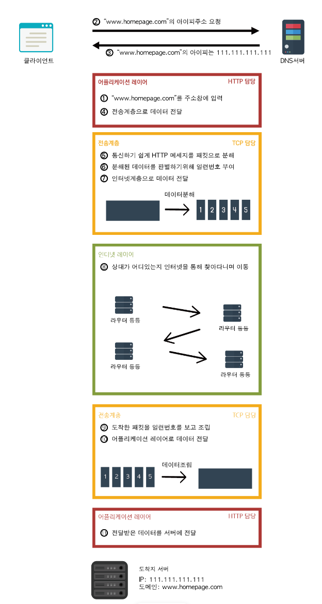
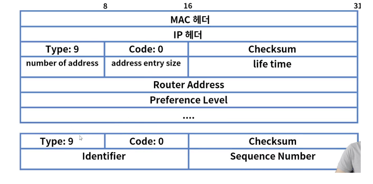
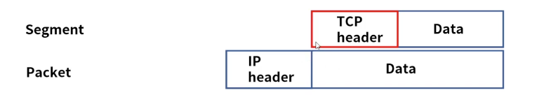

## 네트워크 예상질문

## 2. 네트워크의 구조

1. 스타형(Star)
> 일반적인 사무실이나 학교에 존재하는 형태로 Hub(ex. 공유기)에 여러 장치를 일대일로 연결하여 사용하는 형태이다. 허브를 중심으로 컴퓨터 배치 모양이 별과 같다 하여 스타 토폴로지라 불린다.

2. 버스형(Bus)
> 여기서 말하는 버스형은 일반적으로 말하는 버스와 다르다. 케이블 하나를 여러 개의 시스템들이 연결되어 있는 형태로 컴퓨터 구조에서 볼 수 있는 어드레스 버스가 이와 같은 형태이다.

3. 링형(Ring)
> 장치와 링크들이 링의 형태로 구성되어 있는 구조이다.  

4. 그물형(Mesh)
> 여러 개의 장치들이 서로 상관성 없이 연결되어 있는 구조이다.

5. 트리형(Tree)
> 스타형 접속 형태의 변형, 백본(Backbone)에 여러개의 집중화 장비가 계층적으로 연결되어 있는 구조로서 계층형이라고도 하며 기업의 조직 구조와 같은 형태, 트리형 네트워크 구조는 구성은 복잡하지만 트래픽 처리 능력과 신뢰성이 우수하다.

## 3. OSI 7 Layer

## 물리계층(Physical Layer)
- 7계층 중 최하위 계층.
- 주로 전기적, 기계적, 기능적인 특성을 이용해 데이터를 전송.
데이터는 0과 1의 비트열, 즉 On, Off의 전기적 신호 상태로 이루어져 해당 계층은 단지 데이터를 전달.
- 단지 데이터 전달의 역할을 할 뿐이라 알고리즘, 오류제어 기능이 없음
- 장비로는 케이블, 리피터, 허브가 있음
- 프레임을 신호로 인코딩하여 네트워크 장치로 전송

### 데이터링크 계층(Data-Link Layer)
- 물리적인 연결을 통하여 인접한 두 장치 간의 신뢰성 있는 정보 전송을 담당(Point-To-Point 전송)
- 안전한 정보의 전달이라는 것은 오류나 재전송하는 기능이 존재
- 물리계층에서 발생하는 오류를 감지하고 수정한다.
- MAC 주소를 통해서 통신
- 데이터 링크 계층에서 데이터 단위는 프레임(Frame)
- 장비로는 브리지, 스위치가 있음
- 이더넷.

### 네트워크 계층(Network Layer)
- 중계 노드를 통하여 전송하는 경우 어떻게 중계할 것인가를 규정
라우팅 기능을 맡고 있는 계층으로 목적지까지 가장 안전하고 빠르게 데이터를 보내는 기능을 가지고 있음(최적의 경로를 설정가능)
- 컴퓨터에게 데이터를 전송할지 주소를 갖고 있어서 통신가능(=우리가 자주 듣는 IP 주소가 바로 네트워크 계층 헤더에 속함)
- 네트워크 계층에서 데이터 단위는 패킷(P
acket)
- 장비로는 라우터, L3 스위치가 있음
- 다른 네트워크로 데이터를 전송하는 것을 관리하며 IP 주소로 통신

### 전송 계층(Transport Layer)
- 종단 간 신뢰성 있고 정확한 데이터 전송을 담당
- 송신자와 수신자 간의 신뢰성있고 효율적인 데이터를 전송하기 위하여 오류검출 및 복구, 흐름제어와 중복검사 등을 수행
- 데이터 전송을 위해서 Port 번호를 사용함.(대표적인 프로토콜로 TCP와 UDP가 있음)
- 전송 계층에서 데이터 단위는 세그먼트(Segment)

### 세션 계층(Session Layer)
- 통신 장치 간 상호작용 및 동기화를 제공
연결 세션에서 데이터 교환과 에러 발생 시의 복구를 관리
표현 계층(Presentation Layer)
- 데이터를 어떻게 표현할지 정하는 역할을 하는 계층
- 표현 계층은 세가지의 기능을 갖고 있습니다.
- 송신자에서 온 데이터를 해석하기 위한 응용계층 데이터 부호화, 변화
- 수신자에서 데이터의 압축을 풀수 있는 방식으로 된 데이터 압축
데이터의 암호화와 복호화
(MIME 인코딩이나 암호화 등의 동작이 표현계층에서 이루어짐. EBCDIC로 인코딩된 파일을 ASCII 로 인코딩된 파일로 바꿔주는 것이 한가지 예임)
- TCP/IP 연결 수립, 유지, 중단

### 응용 계층(Application Layer)
- 사용자와 가장 밀접한 계층으로 인터페이스 역할
응용 프로세스 간의 정보 교환을 담당
ex) 전자메일, 인터넷, 동영상 플레이어 등

## 4. Network Layer에 대한 설명.

### 네트워크 계층(Network Layer)
- 중계 노드를 통하여 전송하는 경우 어떻게 중계할 것인가를 규정
라우팅 기능을 맡고 있는 계층으로 목적지까지 가장 안전하고 빠르게 데이터를 보내는 기능을 가지고 있음(최적의 경로를 설정가능)
- 컴퓨터에게 데이터를 전송할지 주소를 갖고 있어서 통신가능(=우리가 자주 듣는 IP 주소가 바로 네트워크 계층 헤더에 속함)
- 네트워크 계층에서 데이터 단위는 패킷(Packet)
- 장비로는 라우터, L3 스위치가 있음
- 다른 네트워크로 데이터를 전송하는 것을 관리하며 IP 주소로 통신
- 출발지의 IP부터 목적지의 IP까지 통신 시 중간에서 라우팅을 담당 및 처리
- 데이터가 큰 경우 분할 및 전송 후 재조립하여 메세지 구현

## 5. TCP/IP 모델

### TCP/IP 4계층 모델
- 범용적으로 사용하는 TCP 프로토콜과 IP 프로토콜을 OSI 7계층 형식에 맞추어 더 추상화(혹은 간략화) 시킨 모델

- 응용 계층 (Application)
- 전송 계층 (Transport)
- 인터넷 계층 
- 네트워크 액세스 (Network)




## 6. 물리 계층

- OSI7 Layer의 1계층으로 하드웨어로 표현
- 상위 계층인 데이터 링크 계층의 프레임을 신호로 인코딩하여 네트워크 장치로 전송
- 통신 장치와 커넥터, 인코딩(Bit -> Signal), 송수신을 담당하는 회로등의 요소가 있다

### 전송방식
- 물리계층은 bit를 인코딩하여 2계층(Data link)과 통신한다.


### 장비
- 허브
    - 허브는 전기신호를 증폭하여 포트에 연결된 PC들끼리 통신이 가능하게 한다
- 리피터
    - 리피터는 현재 거의 쓰이지 않는 장비로 신호의 세기를 증폭하여 좀 더 먼거리까지 통신 가능.

### 동작방식
- 단순 중계기의 역할로 허브에 연결된 PC1이 다른 PC2에게 데이터를 보내려하면 허브에 연결된 모든 PC들에게 그 데이터를 전달하게 된다.


- CSMA/CD(Carrier Sense Multiple Access/Collision Detection)
송신노드는 데이터를 전송하고, 다음 채널에서 다른 노드의 데이터 충돌 발생을 계속 감지 충돌 발생기에는 모든 노드에게 충돌 발생을 통지하고 재전송을 시도
- Carrier Sensing: 데이터를 보내기 전에 다른 노드에서 데이터를 보내는 중인지 확인
- Multiple Access: 데이터를 보내는 곳이 없다면 전송 시작
- Collision Detection: 동 시간대에 데이터를 보내게 되면 충돌이 일어나고 정지
- 그 이후 특정 시간이 지나면 다시 첫번째 단계로 반복

### 전송방식
1. Simplex: 단반향 통신으로 수신측은 송신측에 응답불가
2. Half Duplex: 반이중 전송방식으로 양방향 통신이나 송수신 시간은 정해짐, 무전기
3. Full Duplex: 전이중 전송방식으로 동시 양방향 통신이 가능, 전화기

### 케이블과 커넥터
- 종류
- 전송 장치에 신호를 전달하는 통로, 주요 케이블로 TP, 동축(Coaxial), Fiber등이 있다

1. TP
- 총 8가닥의 선으로 구성.
- 선 꼬은 이유는 자기장 간섭 최소화 하여 성능(속도와 거리)을 향상.
- STP가 더 좋지만 비용문제.

2. 동축(Coaxial)
- 선 중앙에 심선 있으며 그 주위를 절연물과 외부 도체로 감싸고 있다.
- 전화 또는 회선망 등 광범위하게 사용

3. 광(Fiber)
- 전기신호의 자기장이 없는 빛으로 통신하기 때문에 장거리 고속 통신이 가능
- 2개의 모드(Single, Multi)와 주요 커넥터 타입(LC, SC)이 있다.

4. 광 트랜시버
- 광통신에 사용되는 네트워크 인터페이스 모듈 커넥터로 SFP, GBIC이 있다.
- SFP(Small Form-factor Pluggable transceiver), GBIC(Gigabit Interface Connector)

### 단위와 성능
- bit & Byte
- Bandwidth(대역폭)
    - 주어진 시간대에 네트워크를 통해 이동할 수 있는 정보의 양
- Throughput(처리량)
    - 단위 시간당 디지털 데이터 전송으로 처리하는 양

> 대역폭이 8차선 도로라면 처리량은 그 도로를 달리는 자동차의 숫자(양)와 같다

- BackPlane
    - 네트워크 장비가 최대로 처리할 수 있는 데이터 용량
- CPS(Connections Per Second): 초당 커넥션 연결수, L4
- CC(Concurrent Connections): 최대 수용가능한 커넥션
- TPS(Transactions Per Seconds): 초당 트랜잭션 연결수, L7, 주로 HTTP 성능

### UTP 케이블
- Unshielded Twisted Pair, 주로 근거리 통신망(LAN)에서 사용되는 케이블
- 이더넷 망 구성시 가장 많이 보게되는 케이블

## 코드 배열
- 8P8C
    - 8개의 선 배열에 따라 다이렉트 또는 크로스 케이블로 구성한다


- Direct Cable(568B-568B): PC to Hub -> DTE to DCE
- Cross Cable(568A-568B): PC to PC -> DTE to DTE, DCE to 
DCE

> DTE(Data Terminal Equipment)
DCE(DAta Communication Equipment)

- Auto MDI-X(Automatic Medium Dependent Intercface Crossover): 케이블 타입에 관계없이 노드 상호간 자동으로 통신이 가능하게 하는 기술

> 어떤 노드의 연결인지에 따라서 다이렉트와 크로스 케이블을 선택 -> 불편
>
> MDI 포트 -> DTE & MDIX포트 -> DCE, 송신과 수신의 관계


### UTP 카테고리
- UTP케이블의 전송 가능한 대여폭을 기준으로 분류


### Wi-Fi
- 비영리 기구인 Wi-Fi Alliance의 상표

- 구성
    - 무선랜 구성시 WIPS(보안), AP(무선 Hub)가 필요
    - IPS 침입 방지 시스템


## 7. 물리계층의 장비들에 대한 설명

1. 물리계층의 대표적 장비로는 허브와 리피터가 있다
2. 허브는 브로드캐스팅 통신과 CSMA/CD 방식을 사용하며 Half Duplex 모드이다.
- 허브는 가까운 거리에 있는 장비들을 케이블을 사용하여 연결하는 장치
3. 주로 사용되는 케이블의 종류는 Coaxial, TP, Fiber
4. 데이터 단위는 bit & Byte 가 있으며 Kilo, Mega, Giga, Tera로 표현
5. 장비의 Capacity(용량)은 Bandwidth, Throughput, Backplane으로 설명

## 8. 다음 중 Wi-Fi 규격
- 802.11b (Wi-Fi 1*)
- 802.11a (Wi-Fi 2*)
- 802.11g (Wi-Fi 3*)
- 802.11n (Wi-Fi 4)
- 802.11ac (Wi-Fi 5)
- 802.11ax (Wi-Fi 6), (Wi-Fi 6E)
- 802.11be (Wi-Fi 7)
- 802.11mc (Wi-Fi Location)

## 9. 데이터 링크 계층

1. 동일 네트워크내 에서 데이터 전송, 링크를 통해서 연결을 설정하고 관리한다.
    - 인접한 두 계층간 신뢰성 있는 데이터를 전송한다.
    - 송수신 하는 데이터를 안전하게 전달하도록 서비스한다.
    - 물리계층에서 발생할 수 있는 오류를 감지하고 수정한다.

2. 데이터링크 계층은 2개의 부계층으로 구성된다.
    - MAC (Media Access Control) : 주소를 이용해서 데이터를 해당 장비로 보낸다.
        - 48bit(6byte)로 6자리로 구성, 각 16진수로 표현한다.
    - LLC (Logical Link Control) : 각 장비를 논리적으로 연결하고 유지하는 역할을 한다.

### 주요 프로토콜
- Ethernet
- 무선LAN

### Ethernet의 통신방식
1. CSMA/CD (Carrier Sensing Multiple Access Collison Detection) : 유선 LAN의 Ethernet에서 네트워크를 사용할 때  상호간에 충돌을 방지하기 위한 메체 엑세스 제어방식

2. 반이중 전송방식 (Half Duplex)
    - Carrier Sensing : 데이터를 보내기 전에 다른 노드에서 데이터를 보내는 중인지 확인
    - Multiple Access : 데이터를 보내는 곳이 없다면 전송시작
    - Collison Detection : 동 시간대에 데이터를 보내게 되면 충돌이 일어나고 정지한다.
    그 이후 특정시간이 지나면 다시 첫번째 단계로 반복한다.

### 무선LAN의 통신방식
1. CSMA/CA (Carrier Sense Multiple Access with Collision Avoidance)
: 무선 LAN 에서는 공기 중 전송매체이어서 충돌 감지가 거의 불가능하기 때문에 전송 전에 캐리어 감지를 해 보고 일정 시간 기다리며 사전에 가능한 한 충돌을 회피(Collision Avoidance,CA)하는 무선전송 다원접속 방식

### 주요기능
1. Framing
: 데이터그램을 캡슐화하여 프레임 단위로 만들고 Header와 Trailer를 추가

*헤더는 목적지, 출발지주소 그리고 데이터의 내용을 정의, 트레일러는 비트에러를 감지
*데이터그램(Datagram) : 인터넷을 통해 전달되는 정보의 기본단위 (IP계층의 가변길이 패킷)

2. 회선제어 : 신호간의 충돌이 발생하지 않도록 제어
    - 회선제어 방식
        - ENQ/ACK : 전용 전송링크 1:1
        - Polling : 1:N
        - Select : 송신자가 나머지 수신자들을 선택하여 전송
        - Poll : 수신자에게 데이터 수신여부를 확인하여 응답을 확인하고 전송
3. 흐름제어 : 송신자와 수신자의 데이터를 처리하는 속도의 차이를 해결하기 위한 제어방법
    - 흐름제어 방식
        - Stop & Wait
    - Sliding Window : ACK응답 없이 여러개의 프레임이 연속으로 전송 가능


4. 오류제어
: 전송중에 오류나 손실 발생 시 수신측은 에러를 탐지 및 재전송

- 오류제어 방식
    - Stop & Wait ARQ : 전송측에서 NAK을 수신하면 재전송 and 주어진 시간에 ACK이 안오면 재전송
    - Go Back n ARQ :
    - Selective Repeat ARQ : 손상된 Frame만 선별해서 재전송
    - *ARQ(Automatic Repeat Request) : 프레임 손상 시 재전송이 수행되는 과정
이러한 오류제어 방식은 루핑의 원인이 되기도 한다.

> 물리계층 => 프레임을 신호로 인코딩하여 네트워크 장치로 전송

### 10. 이더넷 프레임 구조


- Preamble
    - 호스트간의 비트 동기화를 위한 것
    - 수신 시스템에 이더넷 프레임이 시작 중임을 알리고 동기화를 활성화합니다.
    - Preamble은 이더넷 프레임의 시작과 동기화됩니다.

- SFD(Start of Frame Delimiter)
    - 프레임의 시작을 알리는 필드. SFD는 수신자에게 데이터가 이어진다는 것을 알리기 위해 사용.

- Destination Address
    - 물리적 주소 - 어떤 이더넷이든 한 노드의 유일한 주소로 이론적으로 이 필드가 두세배가 넘는 고유주소를 제공하므로 어떤 Ethernet에 있는 어떤 노드도 자기만의 유일한 주소를 가질수 있다.
    - Destination Address는 목적지의 MAC 주소를 포함하고 있습니다.

- Source Address
    - 전송하는 노드의 물리적 주소를 나타낸다.

- EtherType
    - Ethernet에서 전송되는 메시지 트래픽에는 다른 네트워크 구조와 상위 계층 프로토콜을 사용하는 노드들의 패킷들도 있을 수 있다. 이때 Ethertype필드는 상위 계층의 네트워크 프로토콜들이 도착한 데이터의 형식을 확인하고 패킷을 어떻게 처리할 것인지를 결정하는데 사용된다.

- Data
    - 40 ~ 1500byte로 구성된 데이터 패킷

- FCS(Frame Check Sequence)
    - 전송시 에러를 체크한다.

## 11. 스위치의 동작 방식


### 스위치
- 정의 : 2계층의 대표적인 장비 MAC주소 기반의 통신

1. 허브의 단점을 보완
- Half duplex -> Full duplex(상대방과 전화통화하듯이 쌍방 통신이 가능)

2. Collision Domain -> 포트별 Collision Domain(포트별로 나눠서 도메인에 대해서만 통신하고 불필요한 패킷에는 보내지 않게되는)

3. 라우팅 기능이 있는 스위치를 L3 스위치라고도 부른다.(스위치를 보통 스위치라고 안하고 L2, L3 이런식으로 부름)

### 1. Learning(학습한다)

- 출발지 주소가 MAC 주소 테이블에 없으면 주소를 저장하고 자신의 스위치에 연결되어있는 서버나 컴퓨터의 정보를 수집하는것

1. 4개의 PC는 스위치의 각 포트에 연결되고 프레임이 스위치에 전달
2. 스위치는 해당 포트로 유입된 프레임을 보고 MAC 주소를 테이블에 저장


### 2. Flooding - Broadcasting

- 목적지 주소가 MAC 주소 테이블에 없으면 전체 포트로 전달
1. PC1은 목적지 aa:bb:cc:dd:ee:05 주소로 프레임 전달
2. 스위치는 해당 주소가 MAC Table에 없어서 전체 포트로 전달


### 3. Forwarding
- 목적지 주소가 MAC주소 테이블에 있으면 해당 포트로 전달
1. PC1은 목적지 aa:bb:cc:dd:ee:05 주소로 프레임 전달
2. 스위치는 해당 주소가 MAC Table에 존재하므로 해당 프레임을 PC5로 전달


### 4. Filtering - Collision Domain

- 출발지와 목적지가 같은 네트워크 영역이면 다른 네트워크로 전달하지 않음
1. PC1은 목적지 aa:bb:cc:dd:ee:02 주소로 프레임 전달
2. 스위치는 해당 주소가 동일 네트워크 영역임을 확인하여 다른 포트로 전달하지 않음
3. 필터링은 각 포트별 Collision Domain을 나누어 효율적 통신이 가능하다

### 5. Aging

- MAC 주소 테이블의 각 주소는 일정 시간 이후에 삭제
1. 스위치의 MAC주소 테이블은 시간이 지나면 삭제
2. 삭제되는 이유는 테이블 저장 공간을 효율적으로 사용
3. 해당 포트에 연결된 PC가 다른 포트에 옮겨진 경우도 발생
4. 기본 300초(Cisco 기준) 저장, 다시 프레임이 발생되면 다시 카운트 

### 정리
1. 스위치에 프레임이 유입이 됩니다.
2. 신규인가 아닌가에 대해 고민해보아야 합니다

신규라면 배워서(Learning) MAC테이블에 저장을 해야합니다

기존의 것이라면 Aging타이머를 재시작해서 100초남았다면`L`다시 300초가 남게 Refresh를 해줘야합니다

3. 세가지 경우가 있겠죠.
- 1) 목적지를 모르는 경우면 Flooding해줘서 다시 Learning을 해줘야되겠죠
- 2) 목적지가 MAC테이블에 존재 1:1 유니케스팅 Forwarding을 하게 됩니다.
- 3) 목적지가 출발지와 같은 포트에 존재하면 Filtering을 해줘야합니다.

## 12. ARP 동작과정

### ARP
- 역할 : ARP(Address Resolution Protocol)
- IP주소를 통해서 MAC주소를 알려주는 프로토콜

1. 컴퓨터 A가 컴퓨터 B에게 IP통신을 시도하고 통신을 수행하기 위해 목적지 MAC주소를 알아야 한다
2. 목적지 IP에 해당되는 MAC주소를 알려주는 역할을 ARP가 해준다


### ARP 동작 과정
1. PC1은 동일 네트워크 대역인 목적지 IP 172.20.10.9로 패킷 전송을 시도하기 위해 목적지 MAC 주소를 알기 위해서 우선 자신의 ARP Cache Table을 확인

2. ARP Cache Table에 있으면 패킷 전송, 없으면 ARP Request 전송 - Broadcasting

3. IP 172.20.10.9에서 목적지 MAC 주소를 ARP Reply로 전달

4. 목적지 MAC주소는 ARP Cache Table에 저장되고 패킷 전송


## 13. VLAN
- 물리적 구성이 아닌 논리적인 가상의 LAN을 구성하는 기술
- 불필요한 데이터 차단 : 브로드캐스트 도메인 별로 나누어 관리
- 관리의 용이성과 보안 : 호스트의 물리적 이동 없이 LAN 그룹 변경이 가능
- 비용 절감 : 새로운 LAN 추가시 물리적 스위치 구매 필요 없음

### VLAN의 종류
1. Port 기반 VLAN

> 여러개의 VLAN을 설정하고 각각의 LAN에 물리적인 포트를 지정
>
> VLAN 변경이 필요한 호스트는 물리적인 포트 또는 스위치의 VLAN 설정을 변경

- VLAN 100(총무팀) : fe0 ~ fe4
- VLAN 200(인사팀) : fe5 ~ fe7
- VLAN 300(영업팀) : fe8 ~ fe9

## 14. 네트워크 계층
- 네트워크 계층이란?
- 역할 : 

1. OSI 7 Layer의 3계층으로 패킷 포워딩과 네트워크간 라우터를 통한 라우팅 수행
2. IP(Internet Protocol)주소를 사용하여 통신, 계층적 구조
3. 대표적인 장비는 라우터, 또는 L3라고 부른다

## 15. IPv4 헤더 구조
- IPv4 헤더 구조
    - 최소 20바이트(옵션 미 지정시)
    - 한줄이 4바이트(32비트)

    

- IPv4 헤더 구조 - 상세
    

- Version: IP버전, IPv4
- Header Length(HLEN) : 헤더의 길이, 4바이트 단위 최소 5(20 바이트) ~ 15(한 줄을 1로 보기때문에 5면 20바이트 라는것)
- Type of Service : 서비스 품질
- Total Packet Length : IP 패킷 전체의 길이 - 바이트 단위 - 최대 65,535
- Identifier, Flags, Offset : IP Fragment 필드로 단편화와 재조합, 큰 패킷이 작은 패킷으로 전송되는 경우
- Time to Live : IP 패킷 수명
- Protocol ID : 데이터에 포함되어 있는 상위 계층의 프로토콜 정보, TCP6, UDP17
- Header Checksum : 오류 검출
- Source, Destination IP Address : 출발지 & 목적지 IP 주소
- IP Header Options & Padding : 옵션, 거의 사용되지 않음 시험/디버깅 용도, 통신에는 미관여

## 16. IP주소와 IP 주소 클래스

### IP 주소 클래스
- IP 주소 구성
- IP주소는 2진수 32비트로 구성


### 네트워크와 호스트
- IP주소는 네트워크 부분과 호스트 부분으로 나뉜다
- 네트워크는 브로드캐스트 영역, 호스트는 개별 단말기


- IP주소는 네트워크의 크기에 따라 5개의 클래스(A, B, C, D, E)로 구분
    - A 클래스 : 0.0.0.0 ~ 127.255.255.255, 호스트는 2의 24승, 처음이 0으로 시작하면 A클래스로 봐도된다
    

    - B 클래스 : 128.0.0.0 ~ 191.255.255.255, 호스트는 2의 16승
    

    - C 클래스 : 192.0.0.0 ~ 223.255.255.255, 호스트는 2의 8승 = 256개
    

    - D & E 클래스 : 멀티캐스트용(224.0.0.0 ~239.255.255.255)과 연구용(240.0.0.0 ~ 255.255.255.254)

## 17. 서브넷 네트워크

### 서브넷 마스크
1. 개념
- 서브넷 : 부분망, IP주소는 네트워크와 호스트로 구분 할당된 네트워크 영역을 좀 더 효율적으로 사용하기 위해 서브넷으로 쪼개어 구성

- 서브넷 마스크 : 네트워크를 여러개의 작은 네트워크 서브넷으로 구분하는것
(마스킹을 많이 할수록 호스트는 작아지는 것)


### 서브넷 마스크 상세
- 디폴트 게이트웨이 : 다른 네트워크로 패킷 전송시 거쳐야 하는 거점
- Prefix 표기법 : 서브넷 마스크 표기를 간단히 표현, 네트워크 영역의 비트 "1"의 개수를 의미

```
A 클래스 : 255.0.0.0 = /8
B 클래스 : 255.255.0.0 = /16
C 클래스 : 255.255.255.0 = /24
```

### 서브넷 마스크 계산법
- 서브넷 마스크는 2진수로 "1"인 부분은 네트워크, "0"인 부분은 호스트가 된다
- 1 AND 1 = 1의 공식으로 네트워크 주소를 차단한다


## 18. ICMP 타입

###  ICMP의 정의
- ICMP(Internet Control Message Protocol)
- 인터넷 제어 메시지 프로토콜

1. IP통신은 목적지에 패킷을 정상적으로 전달하는 방법은 있지만 에러 발생 시 처리 불가

2. ICMP는 IP통신의 에러 상황을 출발지에 전달 & 메시지 제어 역할

3. RFC 792, 1981년 소개됨

4. ICMP는 IPv4 패킷으로 캡슐화

5. Protocol ID = 1

6. Ping & Traceroute 명령어를 사용 

### ICMP 타입
- 0 ~ 245 까지 정의

- 주로 쓰이는 타입은 아래와 같으며 오류 보고 & 정보성으로 나눈다


### Type 8 & 0 Echo Request & Reply

- 네트워크 문제 진단시 사용
- 출발지에서 목적지 IP로 ICMP Echo Request 메시지를 보내면 목적지는 Echo Reply로 응답
- 목적지 도달 여부, RTT(Round-Trip delay Time), hop count 확인


### Type 9 & 10 라우터 광고 & 정보 요청

- 자신이 라우터임을 응답 & 네트워크 진입 시 라우터 정보 요청


### Type 3 Destination Unreachable
- 라우터가 IP 패킷을 라우팅 하지 못하는 경우에 발생
 
```
0 = net unreachable (네트워크에 도달하지 않았다)
1 = host unreachable (호스트에 도달하지 않았다)
2 = protocol unreachable (프로토콜에 문제가 있다)
3 = port unreachable (물리적인 포트에 문제가 있다)
4 = fragmentation needed and DF set (fragmentation에 문제가 있다)
5 = source route failed (소스에 문제가 있다)
```


### Type 5 Redirect 
- 로컬 네트워크에 2개 이상의 경로가 있을 때 더 좋은 경로를 알려줌
- 근데 아래와 같이 뜨는건 대부분 비정상임. 왜냐하면 이렇게 뜨면 뭔가 라우터와 라우터간에 문제가 있는것이다는 뜻이고(퉁친다),
- 이런 부분이 발생했을때는 기존 오리지널 IP와 새로운 IP Address에 들어가서 (그게 이제 라우터가 되겠죠) 그 라우터 설정을 제대로 하고 다시 세팅을 해줘야 합니다. 


### Type 11 Time Exceeded 

- 시간초과, TTL 값이 "0"이 되면 출발지에게 응답

```
0 = Time to Live Exceeded (IP가 라우터를 통과할때마다 TTL이 하나씩 깎이는데, TTL이 0이되면 폐기가 됩니다 그럴때 나오는것)
1 = Fragment Reassembly Time Exceeded(IP 통신은 IP Fragment가 되는데 만약 1504바이트를 fragment해서 500바이트를 나눴을 때
1000바이트는 받았고, 500바이트는 못받은 상황 그 사이에 TTL값이 0이 되어버리는 것)
 
Case : 1504바이트를 fragment해서 500바이트를 나눴을 때
1000바이트는 받았고, 500바이트는 못받은 상황 그 사이에 TTL값이 0이 되어버리는 것

1. 본인이 목적지를 잘못 썼다.
2. 어떤 라우터 경로에 문제가 있다.
3. 기존에 잘되던 거였으면 그쪽의 기존 라우터에서 경로를 제대로 처리하지 못함.
```


### Type 12 Parameter Problem
- IP옵션을 잘못 사용하여 라우터에 패킷 폐기

## 19. DHCP

### DHCP의 정의
- DHCP(Dynamic Host Control Protocol)

> 동적 호스트 구성 프로토콜
DHCP서버를 사용하여 클라이언트인 네트워크 장치에 IP주소를 자동으로 할당
> 
> 1984년 RARP(Reverse Address Resolution Protocol) 도입 - RFC 903
>
> 1985년 BOOTP(Bootstrap Protocol) - RFC 931
>
> 1993년 DHCP - RFC 1541 -> RFC 2131

- 요청에 의한 IP 할당으로 효율성 극대화
 
- 잘못된 IP 설정으로 인한 장애 예방
- IP변경이 잦은 호스트의 관리

### DHCP 메시지 포맷


### DHCP 메시지 포맷 설명
```
OpCode : 1 Request(Client -> Server), 2 Reply(Server -> Client)
Hardware Type : 1, Ethernet
Hardware address length : 6, MAC address
Hop count : 0에서 시작, 네트워크 망 이동시 증가
Transaction ID : 클라이언트가 선택하는 랜덤 수, 요청과 응답 매칭
Seconds : IP 할당 후 경과한 초의 수
Flags : 서버 응답에 대해서 0 unicast 또는 1 broadcst 응답 구분 값
Client IP : 최초 0.0.0.0, Your IP : 할당 될 IP, Options : DHCP 메시지 타입 포함
```

### DHCP 메시지 타입


###  DHCP 동작 과정

- IP 할당 : 기본 네트워크 구성, Gateway - Switch - DHCP Server - PC
    1. DHCPDISCOVER : PC는 DHCP Server를 발견
    2. DHCPOFFER : DHCP Server는 PC에게 IP제안
    3. DHCPREQUEST : PC는 제안받은 IP 할당을 요청
    4. DHCPACK : DHCP Server는 요청 수락

- IP 갱신 : 지정된 IP 갱신 타임이 도래하면 갱신을 요청
    1. DHCPREQUEST : PC는 기존 IP 재 할당을 요청
    2. DHCPACK : DHCP Server는 IP 확인 후 요청 수락

- IP 해제 : 사용중인 PC가 전원 off되는 경우
    1. DHCPRELEASE : PC는 더이상 IP 할당이 필요 없음을 알림

## 20. 동적 라우팅

### 라우팅 알고리즘
- 역할 : 목적지까지의 최적 경로를 계산하고 라우팅 테이블에 업데이트

1. 동적으로 라우팅 테이블을 유지 및 관리하는 알고리즘
2. Distance Vector & Link State routing으로 구분한다

### Distance Vector
- 분산 업데이트, 각 라우터들에 의해 최소 비용 경로 계산 -> 인접 노드와 교환
- 소규모 네트워크, 주기적이며 비동기 방식

### Link State
- 중앙 집중형 업데이트, 네트워크 전체 정보를 통해서 최소 비용 경로 계산
대규모 네트워크에 적합, 이벤트 기반의 라우팅 테이블 관리

### Bellman-Ford 알고리즘
- 최단 경로 `L`문제를 풀어주는 알고리즘
```
예시)
노드 : 5개(q,w,e,r,t), 간선 : 10개(양방향 포함)
최단 경로 : dq(e) = q에서 e까지 총 경로 (dq(e)의 d는 distance를 의미합니다)
비용 : c(q,w) = 인접 노드간의 비용 (c : cost, q와 w 사이의 비용)
```

###  주기적 업데이트
- 연결 링크의 비용 변경
- 최단 거리의 변경

### Dijkstra's 알고리즘
- 주어진 출발지와 목적지 사이의 최단 경로 문제를 푸는 알고리즘

## 21. BGP FSM

### 동적 라우팅 구분
- 동적 라우팅 프로토콜은 AS(Autonomous System)에 따라 구분된다
- IGP(Interior Gateway Protocol) : AS 내에서 동작하는 라우팅 프로토콜
- EGP(Exterior Gateway Protocol) : AS와 AS간의 라우팅 프로토콜

- AS(Autonomous System)
    - 하나의 회사 또는 단체 안에서 동일한 정책으로 관리되는 라우터들의 집단

- EGP(Exterior Gateway Protocol)
- BGP(Border Gateway Protocol)

### BGP 구성


- eBGP : 서로 다른 AS간의 연결 및 라우팅 정보 교환 - external
- iBGP : 동일 AS 내에서 BGP 라우팅 정보 교환 - internal

### BGP FSM(Finite State Machine)
- 피어 라우터와의 동작을 결정하기 위해 6가지 유한 상태 머신 사용
1. Idle : 모든 자원을 초기화하고 피어 연결 준비 상태
2. Connect : 연결이 완료되기를 기다리는 상태
3. Active : 연결 실패 이후 다시 연결을 시도하는 상태
4. Open Sent : OPEN메시지를 보내는 상태
5. Open Confirm : OPEN메시지를 받은 상태
6. Established : KEEPALIVE 메시지를 보냈을때 제대로 수신이되고 확인이 된 상태

## 22. OSPF

### OSPF(Open Shortest Path First)

- 정의 : 링크 스테이트 라우팅 알고리즘을 사용하는 IGP용 라우팅 프로토콜

```
1. 1998년 RFC 2338 OSPFv2
2. 2008년 RFC 5340 OSPFv3 for IPv6
3. RIPv1의 단점을 보완
- 홉 카운트의 제한이 없음
- VLSM(Variable-Length Subnet Mask) 사용하여 효율적 IP 관리
- 변경된 정보만 전파, 적은량의 라우팅 트래픽 유발
- 단순 라우터의 홉이 아닌 링크의 상태로 경로 설정
- Convergence 타임이 빠름
```

## 23. Transport 계층
- Transport 계층
- 역할 : End to End 서비스, 커넥션(연결)을 관리
1. Connection-oriented, Reliability, Flow control, Multiplexing
2. TCP & UDP, 소켓을 통한 프로세스별 통신
3. 5 tuple = source IP, Source Port, Dest IP, Dest Port, Protocol

## 24. TCP/UDP

### TCP(Transmission Control Protocol)

- 정의 : 전송 제어 프로토콜, 인터넷을 구성하는 핵심 프로토콜 1981년 RFC 793 릴리즈
- 신뢰성을 기반으로 데이터를 에러없이 전송, 1 : 1 통신
- 연결 지향, Connection-oriented, 패킷의 상태 정보를 확인하고 유지
- 에러 발생시 재전송을 요청하고 에러를 복구한다



### UDP

1. 정의 :User Datagram Protocol
2. 신뢰성은 낮으나 데이터 전송이 빠르다, 1980년 RFC 768 릴리즈
3. 송신측은 일반적으로 데이터를 보내고 확인 안함, 1:n 통신 가능
4. Connectionless, 재전송 불가, 실시간 데이터 전송에 적합
5. 스트리밍 서비스의 경우 전송 문제가 발생해도 재전송 보다는 실시간 데이터 전송이 중요

## 25. TCP 통신

### 3 way handshake
- TCP는 연결지향 프로토콜로 두 호스트가 통신하기 전에 연결을 위한 관계를 수립


### 4 way handshake


### 마무리
1. TCP는 초기연결은 3 way handshake로 정상적인 연결 종료는 4way handshake을 사용한다

2. TCP 타이머는 Retransmission, Persistence, Time waited, Keepalive가 있다

3. Flow Control은 송신과 수신측의 데이터 처리 속도 차이를 해결하는 방법

4. Congestion Control은 수신측으로 유입되는 트래픽의 양이 정해진 대역폭을 넘어가지 않도록 제어

## 26. NAT

### 공인 IP & 사설 IP

- 공인 IP

- ICANN(Internet Corporation for Assigned Names and Numbers)
- 공인기관에서 인정하는 IP주소이며 인터넷을 통한 외부망에서 식별되고 통신 가능한 IP

- 사설 IP
- 내부망에서 사용 및 식별 가능한 IP, IPv4 개수의 한계
- 10.0.0.0/8, 172.16.0.0/12, 192.168.0.0/16

- WAN에서 사용하는것은 공인ip
- LAN안에서 사용하는것 사설ip

### NAT 개요

- NAT(Network Address Translation)
- 네트워크 주소 변환

1. 사설 IP 네트워크를 인터넷으로 연결 -> 라우팅 가능한 공인 IP로 변환

2. 보안 : IP주소를 외부에 공개하지 않음

3. 유연성 :  공인 IP 대역은 영향을 주지않고 내부 네트워크 구성 변경이 가능, 기존 사용하던 외부에 공개된 IP 주소는 변경되지 않으나 내부 IP만 변경 

4. 비용 : 공인 IP 할당 비용 감소

5. L3 이상의 장비 또는 방화벽에서 NAT 가능

## 27. Static NAT
- 1:1 NAT, 정적 NAT


## 28. TELNET

### TELNET

- 역할 : 원격지 호스트 컴퓨터에 접속하기 위해 사용되는 프로토콜

1. RFC 854, TCP 23번 사용, Terminal 애뮬레이터
2. 장비 관리 또는 서버 접속 시 사용 - Shell - Command Line Interface
3. 클라이언트 소프트웨어인 경우, 포트 테스트 용도로 많이 사용 

## 29. SSH
 

### SSH의 역할
```
Secure Shell
TELNET을 대체하기 위해 1995년 개발
원격지에 있는 컴퓨터를 명령어를 통해서 제어
강력한 인증 방법 및 암호화 통신을 제공, TCP 22
Open SSH - 1999년 OpenBSD 팀에서 개발 - GNU Public License
SSHv1, SSHv2
```

## 30. Application 계층
- 역할 : TCP/IP 모델에서 최상위 계층으로 사용자와 가장 가까운 소프트웨어
- 여러 프로토콜 개체들의 서비스에 대한 사용자 인터페이스 제공
- 주요 프로토콜로는 HTTP, DNS, SMTP, SSH, BGP, DHCP 등이 이 범주에 속함

 
### 정리
1. 애플리케이션 계층은 TCP/IP 모델에서 최상위 계층으로 사용자와 가장 가까운 인터페이스를 제공

2. DNS(Domain Name Service)는 도메인 주소를 IP 주소로 변환해주는 서비스이며 계층적 구조

3. Recusive Query는 Local DNS 서버가 재귀적으로 여러 서버에게 질의하여 응답을 받는 과정

4. DNS서버의 정보 타입으로 총 4가지 A, NS, CNAME, MX가 있다.

5. DNS 메시지는 쿼리와 응답으로 구분되며 쿼리 전에 host.txt & DNS 캐시 테이블을 참조

## 31. DNS
### DNS(Domain Name Service)

- 호스트(도메인) 이름을 IP 주소로 변환 - Port 53
- 웹사이트 접속 또는 이메일 전송 시 *.google.com 등의 도메인 이름으로 접속
- 사람이 좀 더 기억하기 쉬운 문자 형태의 도메인 개발 - 컴퓨터는 IP로 통신 - 변환 필요
- 스탠포드 연구소에서 hosts.txt(Host:IP) 파일 관리로 시작 - DNS 표준으로 개발