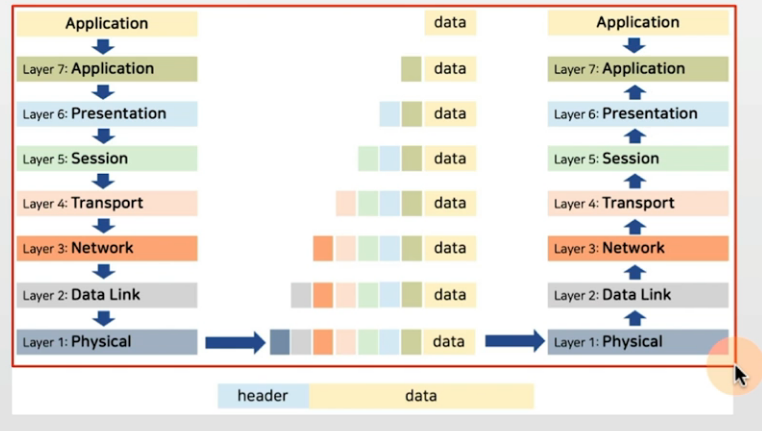
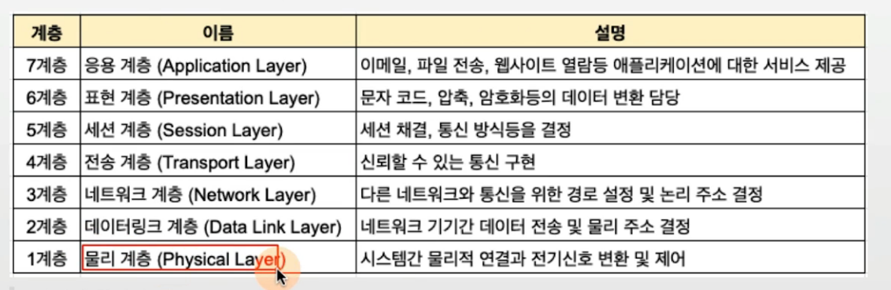
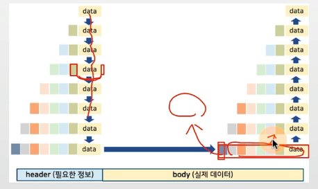
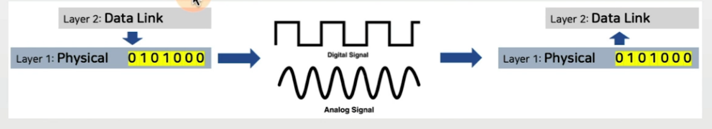
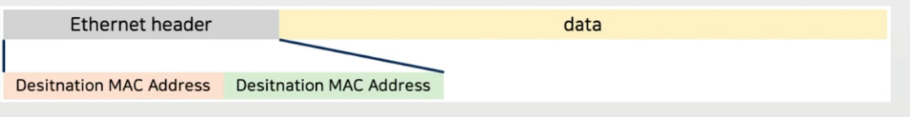
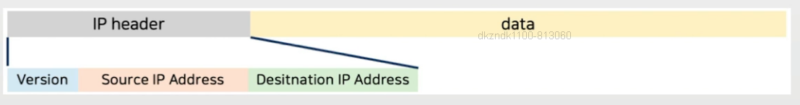
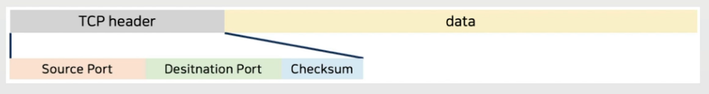
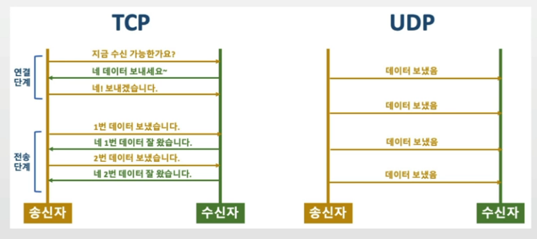
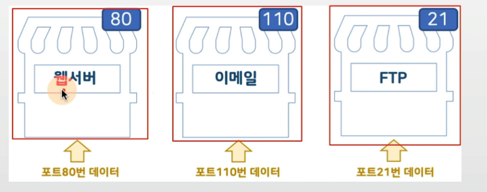

## 목차
- [OSI7Layer](#osi-7-layer)

## OSI 7 Layer
- ISO (국제표준화기구)에서 OSI 모델 제정
    - 다양한 컴퓨터간 데이터 전송을 지원할 수 있는 추상 모델을 표준화한 것임
    - OSI 7 layer 또는 OSI 7 계층 으로 불리움

> 아파서 탈났다 픽!
>
> A: 아, P : 파, S : 서, T: 탈, N : 났, D : 다, PHY : 픽

### 캡슐화와 역캡슐화
- 송신측 : 캡슐화(Encapsulation), 수신측 : 역캡슐화(Decapsulation)
- 헤더(header) : 데이터 송신시, 필요한 정보를 데이터에 추가
- 바디(body): 실제 데이터

### 물리 계층(Physical Layer)
- 데이터를 전기 신호로 변환하여 송수신

### 데이터링크 계층(Data Link Layer)
- 물리적 네트워크 사이의 데이터 송수신 담당
- 대표적인 프로토콜: Eternet(이더넷) 프로토콜

### 이더넷 프로토콜
- Preamble
    - 호스트간의 비트 동기화를 위한 것
    - 수신 시스템에 이더넷 프레임이 시작 중임을 알리고 동기화를 활성화합니다.
    - Preamble은 이더넷 프레임의 시작과 동기화됩니다.

- SFD(Start of Frame Delimiter)
    - 프레임의 시작을 알리는 필드. SFD는 수신자에게 데이터가 이어진다는 것을 알리기 위해 사용.

- Destination Address
    - 물리적 주소 - 어떤 이더넷이든 한 노드의 유일한 주소로 이론적으로 이 필드가 두 세배가 넘는 고유주소를 제공하므로 어떤 Ethernet에 있는 어떤 노드도 자기만의 유일한 주소를 가질수 있다.
    - Destination Address는 목적지의 MAC 주소를 포함하고 있습니다.

- Source Address
    - 전송하는 노드의 물리적 주소를 나타낸다.

- EtherType
    - Ethernet에서 전송되는 메시지 트래픽에는 다른 네트워크 구조와 상위 계층 프로토콜을 사용하는 노드들의 패킷들도 있을 수 있다. 이때 Ethertype필드는 상위 계층의 네트워크 프로토콜들이 도착한 데이터의 형식을 확인하고 패킷을 어떻게 처리할 것인지를 결정하는데 사용된다.

- Data
    - 40 ~ 1500byte로 구성된 데이터 패킷

- FCS(Frame Check Sequence)
    - 전송시 에러를 체크한다.

### 네트워크 계층(Network Layer)
- 다양하고 방대한 네트워크 상에서, 컴퓨터간 논리적 연결을 위해 네트워크 계층이 필요함
- 대표적인 프로토콜 : IP 프로토콜
    - IP 프로토콜 버전 : IPv4 (43억개의 주소), IPv6(340조 * 1조 * 1조 개의 주소)

### 용어 정리
- 패킷(packet): 네트워크 계층에서 정의되는 데이터 단위
- 프레임 : 데이터 링크 계층에서 정의되는 데이터 단위

> 데이터를 일정 크기로 나누어 송수신

### 전송 계층(Transport Layer)
1. 목적지에 신뢰할 수 있는 데이터 전달 담당
    - 데이터 전송중 손상/유실 확인을 위한 오류 점검 기능 (체크섬)
2. 목적지의 어떤 응용프로그램에 데이터를 전달해야 하는지를 식별하는 기능 (포트)
- 대표적인 프로토콜 : TCP, UDP 프로토콜

### TCP vs UDP 프로토콜
- TCP : 연결형 프로토콜, 데이터의 전송 순서 보장, 데이터 신뢰성 보장
- UDP : 비연결형 프로토콜, TCP보다 전송속도 빠름, 주로 스트리밍/브로드캐스팅 서비스
    - UDP 데이터는 데이터그램 이라고 부름(패킷으로 부르지 않음)

### 포트(port) 번호
- 목적지의 어떤 응용프로그램에 데이터를 전달해야 하는지를 식별하는 기능
- 포트 번호는 0 - 65535

### 세션 계층(Session Layer)
- 세션 또는 대화(Dialogue) 연결, 관리 담당
- 예 : FTP로 여러 파일을 각각 다운로드 받을 때, 각 다운로드 연결/관리 처리

### 표현 계층(Presentation Layer)
- 응용 계층으로 부터 전달받거나, 전달하는 데이터의 암호화 담당

### 응용 계층(Application Layer)
- 대표적인 응용 프로그램을 위한 인터페이스 제공
- 대표적인 프로토콜 : HTTP

> 위 3가지는 다음 TCP/IP 모델에서는 응용 계층 하나에서 다뤄짐.