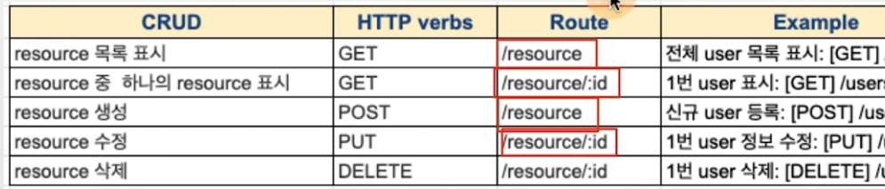

## REST
- REST(REpresentational State Transfer)
    - 자원(resource)의 표현(representation)에 의한 상태 전달
    - HTTP URI를 통해 자원을 명시하고, HTTP Method를 통해 자원에 대한 CRUD Operation 적용
        - CRUD Operation와 HTTP Method
            - Create: 생성 (POST)
            - Read: 조회 (GET)
            - Update: 수정 (PUT)
            - Delete: 삭제 (DELETE)

### REST API
- REST 기반으로 서비스 API를 구현한 것
- 마이크로 서비스, OpenAPI(누구나 사용하도록 공개된 API) 등에서 많이 사용됨

### 참고: Restful
- 개발자들 사이에서 비공식적으로 가이드한 REST 구현 가이드
- 기능에 적합한 URL Method 사용
- 정의된 상태 코드에 맞게 상태 전송
- URL Rules
    - 마지막에 / 포함하지 않는다.
    - _(underbar) 대신 -(dash)를 사용한다.
    - 소문자를 사용한다.
    - 행위(method)는 URL에 포함하지 않는다.
        - /users/insert/1 --> [POST] /users/1

