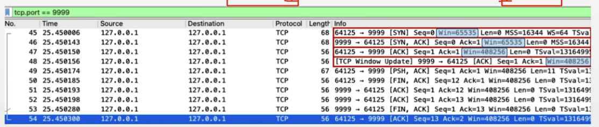

## 목차
- [TCP/IP](#tcpip-모델)
- [TCP 프로토콜](#tcp-프로토콜)
- [TCP 제어](#tcp-제어)

## 챕터 목표
1. TCP의 3-way-handshake와 4-way-handshake 방식의 차이점에 대해 간략히 설명
2. TCP와 UDP의 차이점과 장단점에 대해서 설명.

## TCP/IP 모델
- 인터넷 통신을 위한 모델
- OSI 7 Layer는 표준 모델, 현실에서 인터넷을 위해 사용하는 모델은 TCP/IP 모델
- TCP/IP 모델의 응용 계층은 OSI 모델의 세션 + 표현 + 응용 계층 통합


### TCP vs UDP 프로토콜
- TCP : 연결형 프로토콜, 데이터의 전송 순서 보장, 데이터 신뢰성 보장 
- UDP : 비연결형 프로토콜, TCP보다 전송속도 빠름, 주로 스트리밍/브로드캐스팅 서비스


### IP
- Internet Protocol version4
    - 32bit로 구성 ($2^{32}$개 IP 주소): 0.0.0.0 ~ 255.255.255.255
    - 비트로 표시하면 : 8bit.8bit.8bit.8bit
    - 5개의 클래스로 분리, 이중 상위 3개 클래스가 주로 사용
        - A(0~127.255.255.255)
        - B(128~191.255.255.255)
        - C(192~223.255.255.255)
        - D(224~239.255.255.255)
        - E(240~255.255.255.255)
    - 자기 PC의 IP 주소 : 127.0.0.1 (DNS로는 localhost)

> 도메인주소로 IP 주소 알아내기: ping daum.net

### IPv4, IPv6
- Internet Protocol version 6
    - 128 bit로 구성 ($2^{128}$개의 IP 주소)
    - 16bit:16bit:16bit:16bit:16bit:16bit:16bit:16bit


## TCP 프로토콜


- Source Port : 송신측 포트
- Destination Port : 수신측 포트
- Sequence Number : 송신된 데이터의 순서 번호
- Ack Number : 수신된 데이터 순서번호 + 1(그 다음 데이터를 보내달라는 의미)

- Code Bits
    - URG : 긴급 데이터
    - ACK : Ack Number 용 데이터
    - PSH : 수신측 버퍼가 다 찰때까지 기다리지 않고, 바로 전달 요청
    - RST : 접속 리셋 요청시 사용
    - SYN : 연결 요청시 사용
    - FIN : 연결 종료시 사용


### TCP 연결 방식
- 3-way 핸드쉐이크(handshake): TCP 통신을 위한 연결 설정 과정


1. SYN Number를 on 해서 보낸다.(Client -> Server)
2. ACK Nubmer, SYN Number를 on 해서 보낸다.(Server -> Client)
3. ACK Number를 on 해서 보낸다. (Client -> Server)

### 패킷 분석 프로그램(wireshark)


- 참고 wireshark(pcap도 함께 설치)
    - 패킷 분석 프로그램 
    - 윈도우는 pcap와 함께 설치, 맥은 wireshark만 설치 가능
        - Loopback: lo0 선택 후, tcp.port == 9999

- [serverSocket테스트](tcp_socket_server.py)
- [clientSocket테스트](tcp_socket_client.py)


- WireShark localhost에서 확인하려면 Adapter for loopback traffic capture로 들어간 뒤 `tcp.port == 9999` 이용해서 포트 정보 확인

- 3-way handshake
1. Seq Num = 0, SYN(1) (60451(client) = 운영체제 빈 포트 할당 -> 9999(목적지 PORT - server)) 
    - 전송해도 되는지 송신
2. Seq Num = 0, Ack Num = (SeqNum + 1) SYN(1), ACK(1) (Server -> Clielnt)
    - 수신 받은 뒤 데이터 전송 가능하면 해도 된다고 송신.
3. Seq Num = 1, Ack Num = 1, ACK(1) (Client -> Server)
    - 가능하다는 사인을 수신한 뒤 데이터 전송 하겠다고 송신

### TCP 연결 해제

- 4-way handshake : TCP 연결 해제 과정


> 최근에는 FIN/ACK 를 동시에 보냄


1. (Server -> Client) FIN(1), ACK(1) ,Seq Num = n
2. (Client -> Server), ACK(1), Seq Num = 1, Ack Num = n + 1
3. (Client -> Server), ACK(1), FIN(1), Seq Num = 1, Ack Num = n + 1
4. (Server -> Client), ACK(1), Seq Num = n + 1

### TCP 전송
- Sequence Number
    - 일정 단위로 데이터를 분할해서 전송
    - 송신측에서 수신측에 데이터가 몇 번째 데이터인지를 알려줌
- ACK Number
    - 다음 번호의 데이터를 알려줌 (어디까지 수신했는지 확인 가능)


> 101(금번 패킷의 첫 번째 데이터 번호) + 20(데이터 길이) = 121
>
> 만약 ACK가 안오거나, 101로 온다면, 101번 데이터부터 재전송

## TCP 제어
> 네트워크 트래픽에 따른 효율적/신뢰적 송신을 위한 제어 알고리즘 적용

- 흐름 제어(Flow Control) : Sliding Window
- 혼잡 제어(Congestion Control)


### 흐름 제어 : 슬라이딩 윈도우 (Sliding Window)
- 매번 ACK를 기다리지 않고, 여러 패킷을 연속해서 송신하기 위해,
- 각 컴퓨터의 윈도우 사이즈를 확인하고, 윈도우 사이즈만큼 ACK 없이 연속해서 송신


### 참고 : TCP 윈도우 사이즈 설정



- 송신측과 수신측 모두 자신의 윈도우 사이즈(버퍼 크기)를 65535로 설정
- 하지만, RTT 값을 기반으로 바로 윈도우 사이즈 재설정
    - SYN과 SYN/ACK 사이의 시간 RTT(Round Trip Time)을 측정하여, 이를 기반으로 윈도우 사이즈 재설정

> 실제 TCP는 기본 알고리즘 이외에 보다 복잡한 기능이 들어가 있음

### 혼잡 제어: Congestion Window
- 송신 제어를 위한 윈도우는 2개
    - Receiver Window (RWND): 흐름 제어(Sliding Window)에서 활요
    - Congestion Windo (CWND): 네트워크 혼잡 제어 활용
- 송신측 최종 윈도우 크기 = min(RWND, CWND)

### 참고
- Congestion Window 초기값: 1 MSS
```
MSS = MTU - (IP헤더길이) - (TCP헤더길이)
```
- MTU(Maximum Transmission Unit): 한번 전송때 보낼 수 있는 최대 단위
- 보통 1500 - 20 - 20 = 1460bytes
> ifconfig 또는 ipconfig으로 확인

### 혼잡 제어 : AIMD
> 수십년동안 꾸준한 개선, 그 중 가장 기본이 되는 알고리즘만 이해
- AIMD (Additive Increase/Multicative Decrease)
    - 처음에는, CWND = 1
    - ACK가 도착하면 (패킷 전송 성공시) -> CWND = CWND + 1
    - ACK가 일정 시간동안 도착하지 않음 (패킷 전송 실패) -> CWND = CWND / 2

### 혼잡 제어 : Slow Start 및 혼잡 회피 (Congestion Avoidance)
> AIMD의 느린 초기 송신을 빠르게 하기 위한 기술
- 느린 시작 (Slow Start)
    - 일반적으로 처음에는, CWND = 1
    - ACK가 도착하면 (패킷 전송 성공시) -> CWND = CWND의 2배
    - ACK가 일정 시간동안 도착하지 않음 (패킷 전송 실패) - CWND = 1 (초기값)
- 혼잡 회피 (Congestion Avoidance)
    - CWND가 일정 크기에 도달하면,
        - ACK가 도착시 (패킷 전송 성공시) -> CWND = CWND + 1


### 질문 정리
1. TCP의 3-way-handshake와 4-way-handshake 방식의 차이점(간단하게)
```
3-way-handshake는 TCP의 연결 설정
클라이언트와 서버간 데이터가 송수신이 가능한지를 확인하는 절차
1. 클라이언트가 서버에 데이터 송신이 가능한지를 확인
2. 서버가 클라이언트에 데이터 수신이 가능한경우 응답
3. 클라이언트는 응답을 받고 데이터를 수신할 데이터 번호를 보낸다.

4-way-handshake는 TCP의 연결 해제 설정
1. 서버가 클라이언트에 데이터 수신을 종료할 것이라고 알림.
2. 클라이언트는 서버에게 수신 데이터 번호(다음 실행 번호)를 보낸다.
3. 클라이언트는 서버에게 데이터 수신을 종료해도 괜찮다는 확인을 보낸다.
4. 서버는 확인을 받고 클라이언트에게 송신 데이터 번호를 보낸 뒤 종료한다.
```

2. TCP와 UDP의 차이점과 장단점
```
- TCP : 연결형 프로토콜, 데이터의 전송 순서 보장, 데이터 신뢰성 보장 
- UDP : 비연결형 프로토콜, TCP보다 전송속도 빠름, 주로 스트리밍/브로드캐스팅 서비스

- UDP는 TCP의 3-way-handshake나 4-way-handshake 같이 데이터의 신뢰성을 보장하는 절차 없이 바로 데이터를 전송한다.(데이터 전송의 효율성이 높다)
- TCP는 3-way-handshake나 4-way-handshake와 같이 데이터의 신뢰성을 보장하는 절차가 있기 때문에 데이터의 전송 순서와 신뢰성이 보장된다.
```

