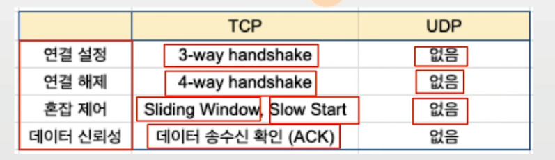
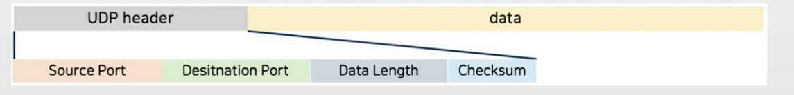
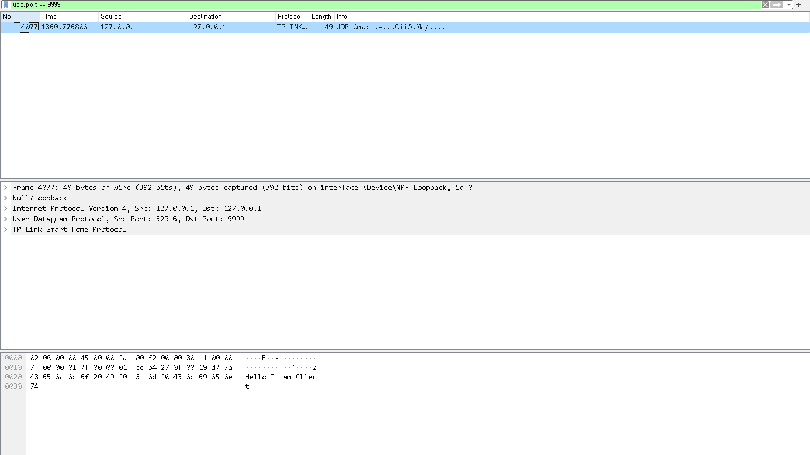

## 목차
- [UDP](#udp)

## UDP
- 사용자 데이터 그램 프로토콜(User Datagram Protocol)
- UDP와 TCP 비교

- UDP는 데이터 효율성 중시
    - 일반적으로 TCP보다 빠를 수 있음
- UDP 헤더도 단순함

### UDP 장점
- 동영상 스트리밍등의 서비스에서 많이 사용됨
    - 데이터 유실이 일부 있어도 문제 없고, 빠른 전송이 필요한 서비스
- TCP와 달리 브로드캐스팅 지원
    - 브로드캐스팅: 동일 네트워크에 연결된 모든 컴퓨터에 데이터 송신 가능

