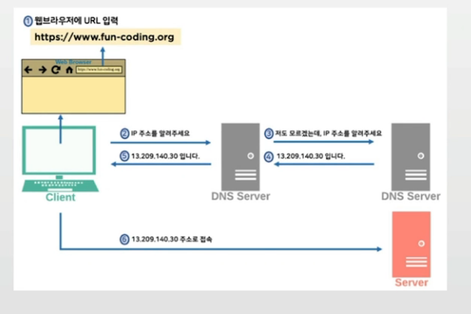
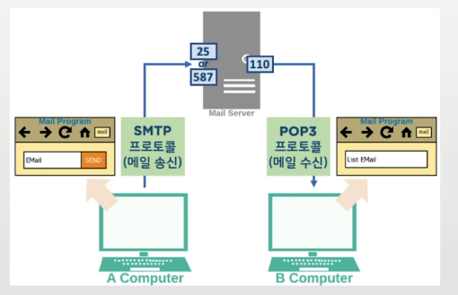
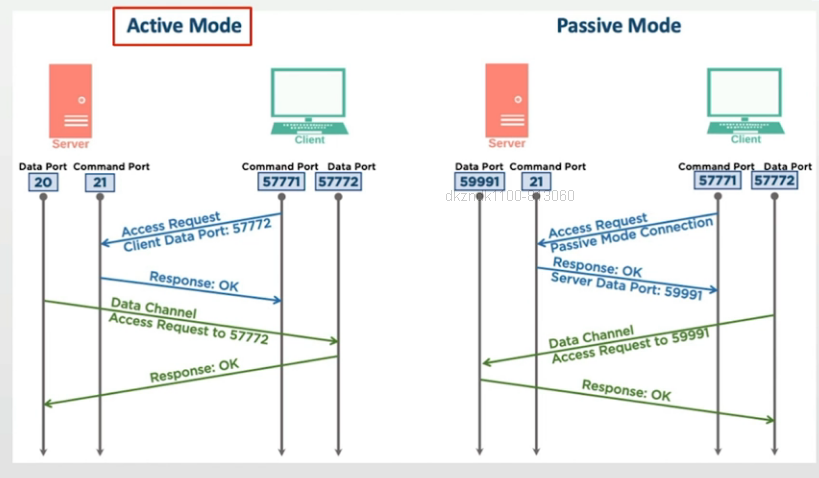
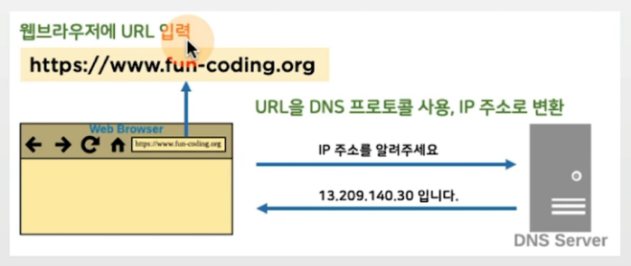
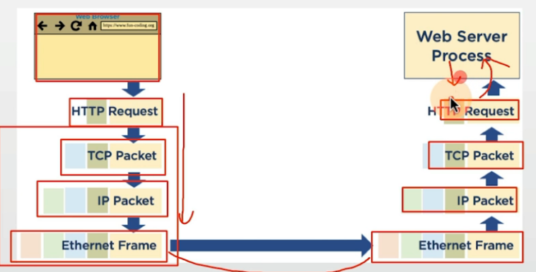
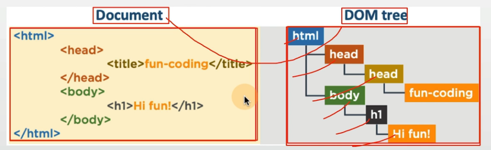
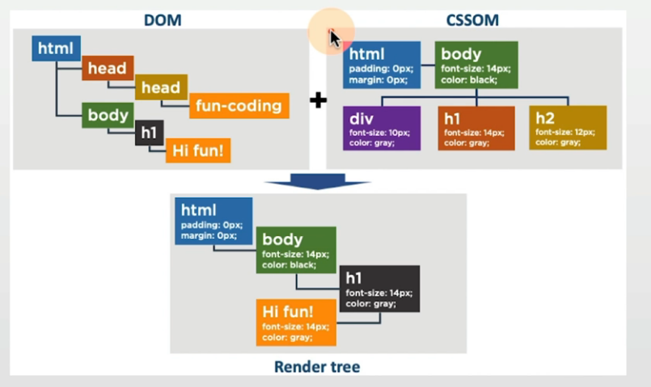
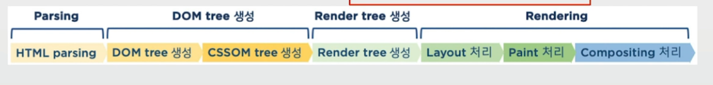
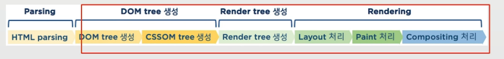

## 목차
- [프로토콜](#프로토콜네트워크-핵심-용어)
- [URL/HTTPS](#url-https)
- [응용계층 프로토콜](#응용계층-프로토콜)

## 프로토콜(네트워크 핵심 용어)
- 컴퓨터간 통신을 하기 위한 규칙
    - 독립적인 여러 규칙이 필요함


## URL HTTPS

### URL
- Uniform Resource Locator
- 인터넷 상의 자원 위치 표기를 위한 규약
- WWW의 주요 요소 중 하나 : HTML, URL, HTTP

### 참고: URL vs URI
- URI(Uniform Resource Identifier): 통합 자원 식별자
- URI의 하위 개념이 URL
- https://www.fun-coding.org
    - https://www.fun-coding.org 라는 서버를 나타내는 URL이면서 URI
- https://www.fun-coding.org/input.html?id=dave&pw=1111 주소
    - https://www.fun-coding.org/input.html 은 URL
        - https://www.fun-coding.org/input.html?id=dave&pw=1111은 URI
        - 내가 원하는 정보를 얻기 위해서는 ?id=dave&pw=1111라는 식별자가 필요하기 때문

> 두 용어는 혼용하고 있으므로, 참고로만 이해

### HTTPS
- HyperText Transfer Protocol over Secure Socket Layer
- HTTP 통신시 사용하는 TCP/IP 소켓 통신에서, 일반 텍스트 대신, SSL 또는 TLS 프로토콜을 통해 데이터 암호화하여 송수신
- HTTPS 기본 포트는 443
- http:// 대신 https:// 로 시작

### 참고: SSL 또는 TLS
```
SSL 프로토콜은 넷스케이프사에서 개발
이를 국제 표준화하는 과정에서 SSL이 모기업 상용제품 이름과 동일하여, TLS로 이름을 변경
따라서, SSL = TLS
```

### 네트워크 보안
- 대칭키(비밀키)
    - 암/복호화키가 동일
    - 대표 암호 알고리즘 : DES, 3DES, TDES, AES, SEED, ARIA 등

- 비대칭키(공개키, 개인키)
    - 암/복호화키가 상이
    - 대표 암호알고리즘 : RSA, ECC 등
    
> public key(공개키)는 오픈하고, private key(개인키)는 자신만 가지고 있음

## 응용계층 프로토콜

### DNS(Domain Name System)
- 도메인 이름을 ip 주소로 변환, 또는 그 반대를 수행하기 위해 개발
    - 전세계 흩어진 DNS 서버를 통해, 도메인 이름: IP 주소 정보 확인 가능
    - DNS는 Network Protocol로 UDP 사용


### 메일 서버(SMTP와 POP3 프로토콜)
- SMTP(Simple Mail Trnasfer Protocol): 메일 송신
- POP3(Post Office Protocol): 메일 수신



### 참고: POP3와 IMAP
- 둘다 메일 수신 프로토콜
    - IMAP (143포트): 중앙 서버에서 메일 동기화
        - 모든 장치에서 동일한 이메일 폴더 확인 가능
        - 중앙 서버 메일 용량에 따라, 메일 수신 불가 가능
    - POP3 (110 포트): 중앙 서버에서 로컬 장치로 이메일을 내려 받음
        - 내려받은 이메일은 중앙 서버에서 지우는 것이 디폴트 동작

### 참고: MIME 프로토콜
- MIME(Multi-purpose Internet Mail Extensions)
    - SMTP 프로토콜은 텍스트(ASCII코드)만 전송 가능
    - SMTP 본문 내용에 MIME 헤더와 함께, 다양한 포멧의 데이터(첨부파일등)를 ASCII 코드로 변환해서 전송
    - 클라이언트에서 SMTP 본문 데이터를 MIME 헤더를 확인해서 디코딩하면 됨!
- MIME 실제 예
```
MIME-Version: 1.0
From: Dave Lee <jhleeroot@gmail.com>
Date: Thu, 24 Nov 2016 19:35:27 +0900
Subject: =?UTF-8?B?7J207KSA7Z2sIOyeheuLiOuLpC4gKOydvOyghOyXkCDtl
Content-Type: multipart/alternative; boundary=001a113944905f64d405420990f
```

### FTP
- FTP(File Transfer Protocol): 서버와 클라이언트 사이의 파일 전달을 위한 프로토콜
- 일반 서비스와 달리 2개 포트 사용
    - 21번: 접속/제어를 위한 포트
    - 보통 20번: 데이터 전송을 위한 포트

### 참고: Passive Mode vs Active Mode
- TCP/IP 모델: 클라이언트가 서버 접속
    - Active Mode는 서버가 클라이언트에 접속하므로, 클라이언트 방화벽에 따라 에러 발생 가능


### 웹브라우저 동작 과정1
- 웹브라우저에 입력된 URL은 DNS 프로토콜을 사용, IP 주소로 변환


### 웹브라우저 동작 과정2
- HTTP Request는 운영체제 네트워크 스택을 따라
    - HTTP -> TCP -> IP -> Ethernet 을 전기신호로 변환, 전송


> 웹서버에서 HTTP Response를 작성, 브라우저로 송신

### 참고: DOM(Document Object Model)
- Document: 구조화된 데이터
- DOM: 구조화된 문서를 객체로 표현하는 형식



### 웹브라우저 동작 과정 3
- HTML 파일 파싱하여 DOM tree 생성, CSS 정보를 파싱하여 CSSOM tree 생성
- DOM/CSSOM tree 기반 Render tree 생성



### 웹브라우저 동작 과정 4
- Render tree 기반, Rendering


### 참고: DOM과 Virtual DOM
- javascript등으로 웹페이지 변경시, 매번 DOM tree 변경 - Rendering
- DOM의 가벼운 형태(json)를 메모리에 올려놓고, 필요한 부분만 변경 후, 한번에 변경된 부분만 DOM에 반영하여 조정
    - React, Vue.js 등 프론트엔드 기술에서 활용 중

