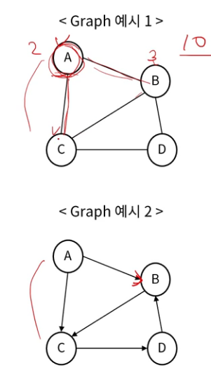
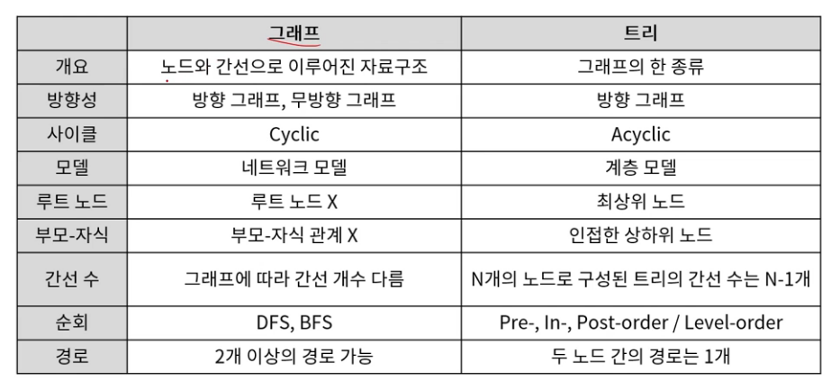
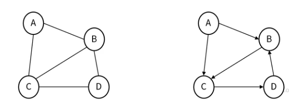
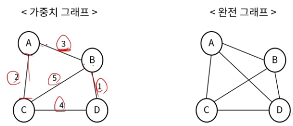
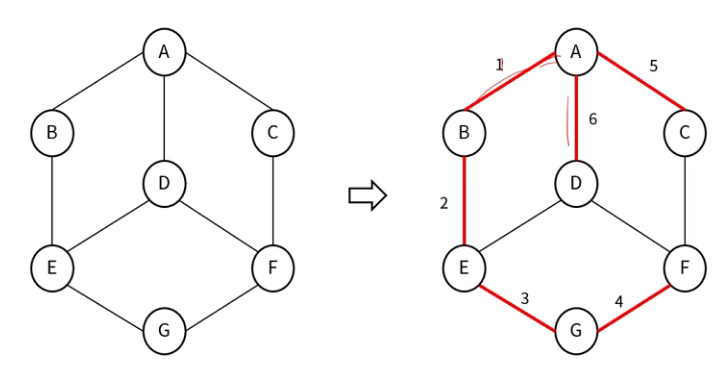
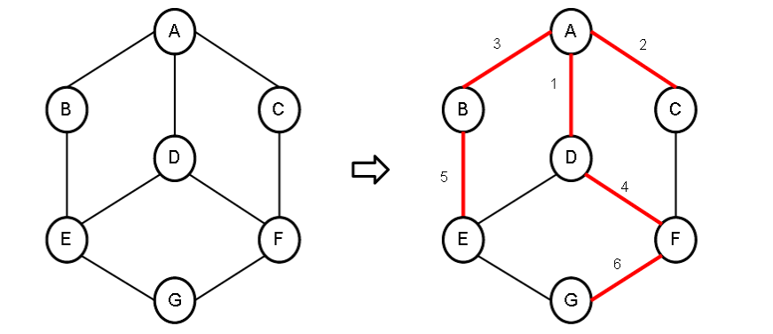
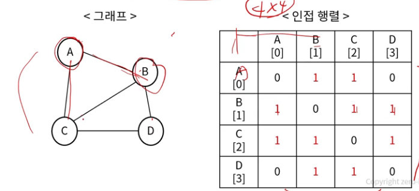
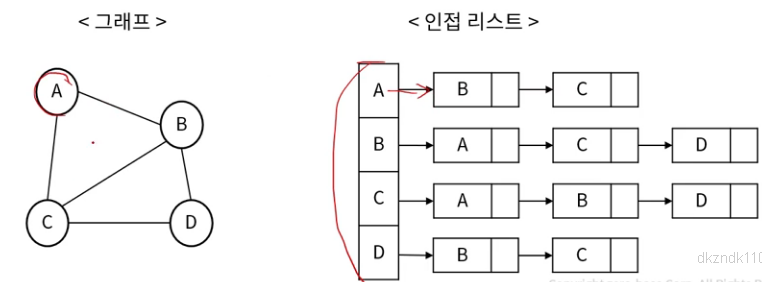
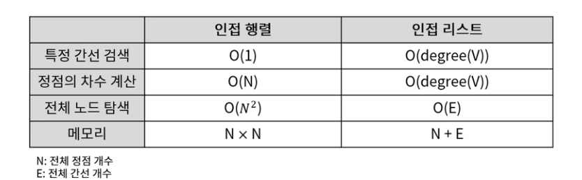

## 그래프 (Graph)
- 정점과 간선으로 이루어진 자료구조(Cyclic)
    - 연결된 정점간의 관계를 표현할 수 있는 자료구조
- 그래프의 용도
    - 지하철 노선도, 통신 네트워크

### 그래프 구조

- 정점(Vertex): 각 노드
- 간선(Edge): 노드와 노드를 연결하는 선 (link, branch)
- 인접 정점(Adjacent vertex): 간선 하나를 두고 바로 연결된 정점
- 정점의 차수(Degree):
    - 무방향 그래프에서 하나의 정점에 인접한 정점의 수
    - 무방향 그래프 모든 정점 차수의 합 = 그래프 간선의 수 2배

- 진입 차수(In-degree): 방향 그래프에서 외부에서 오는 간선의 수
- 진출 차수(Out-degree): 방향 그래프에서 외부로 나가는 간선의 수
- 경로 길이(Path length): 경로를 구성하는데 사용된 간선의 수
- 단순 경로(Simple path): 경로 중에서 반복되는 정점이 없는 경우
- 사이클(Cycle): 단순 경로의 시작 정점과 끝 정점이 동일한 경우

### 그래프의 특징과 트리와의 차이

### 그래프의 종류 (1)

- 무방향 그래프
    - 간선에 방향이 없는 그래프 (양방향 이동 가능)
    - 정점 A - B 간선의 표현:(A,B) = (B,A)

- 방향 그래프
    - 간선에 방향이 있는 그래프 (해당 방향으로만 이동 가능)
    - 정점 A -> B 간선의 표현: <A, B> != <B, A>

### 그래프의 종류 (2)

- 가중치 그래프
    - 간선에 값이 있는 그래프 (이동 비용)

- 완전 그래프
    - 모든 정점이 서로 연결되어 있는 그래프
    - 정점이 N개일 경우, 간선의 수는 n(n-1)/2개

## 그래프 탐색 - DFS
> 깊이 우선 탐색 (Depth First Search)

- 각 노드에 방문했는지 여부를 체크할 배열과 스택 이용하여 구현

## 그래프 탐색 - BFS
> 너비 우선 탐색 (Breath Frist Search)
- 각 노드에 방문했는지 여부를 체크할 배열과 큐 이용하여 구현 

### 그래프의 구현 (1)
- 인접 행렬 (Adjacency Matrix)
    - 2차원 배열 이용
- 인접 행렬의 장단점
    - 간선 정보의 확인과 업데이트가 빠름 O(1)
    - 인접 행렬을 위한 메모리 공간 차지

### 그래프의 구현 (2)
- 인접 리스트 (Adjacency List)
    - 연결리스트 이용

- 인접 행렬의 장단점
    - 메모리 사용량이 상대적으로 적고, 노드의 추가 삭제 빠름
    - 간선 정보 확인이 상대적으로 오래 걸림

### 인접 행렬 vs 인접 리스트
- 인접 행렬
    - 노드의 개수가 적고 간선의 수가 많을 때 유리
    - 밀짚 그래프(Dense Graph)
- 인접 리스트
    - 노드의 개수가 많고 간선의 수가 적을 때 유리
    - 희소 그래프(Sparse Graph)

