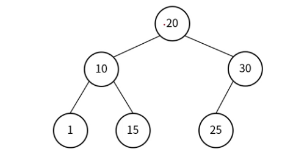
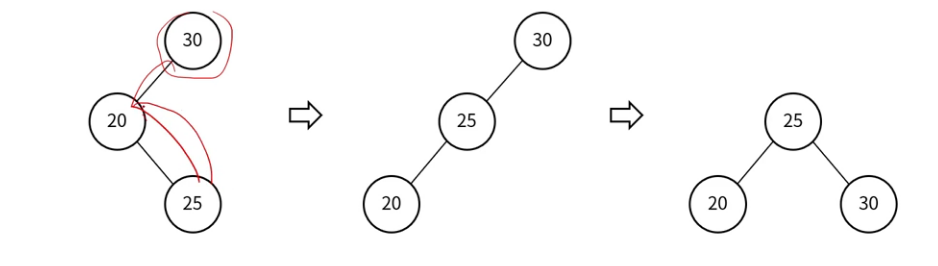

## 이진 탐색 트리 (Binary Search Tree)
> 아래의 규칙으로 구성된 이진 트리

- 왼쪽 자식 노드의 키는 부모 노드의 키보다 작음
- 오른쪽 자식 노드의 키는 부모 노드의 키보다 큼
- 각각의 서브 트리도 이진 탐색 트리를 유지
- 중복된 키를 허용하지 않음.
- 중위 순회로 이진 탐색 트리를 순회하면 오름차순 정렬이 됨

### 이진 탐색 트리의 특징
- 이진 탐색 트리 규칙에 의해 데이터가 정렬됨.
- 이진 트리에 비해 탐색 빠름(균형 유지 필요)
    - 균형 상태 : O(logN)
    - 불균형 상태: O(N)

### 이진 탐색 트리 - 탐색
- 찾고자 하는 데이터를 루트 노드부터 비교 시작
- 대소 비교를 하여 찾는 데이터가 작으면 왼쪽, 크면 오른쪽 노드로 이동
- 찾는 데이터가 없으면 null 반환
- 어떤 데이터를 찾더라도 최대 트리 높이 만큼의 탐색이 이루어짐.

### 이진 탐색 트리 - 삽입
- Root 부터 비교 시작 (중복 키 발견 시 노드 추가하지 않고 종료)
- 삽입할 키가 현재 노드의 키보다 작으면 왼쪽으로 이동
- 삽입할 키가 현재 노드의 키보다 크면 오른쪽으로 이동
- Leaf 노드에 도달 후 키 비교하여 작으면 왼쪽, 크면 오른쪽에 삽입

### 이진 탐색 트리 - 삭제(1)
- 삭제 대상 노드가 Leaf 노드인 경우
    - 삭제 대상 노드 삭제
    - 부모 노드의 해당 자식 링크 null로 변경

### 이진 탐색 트리 - 삭제(2)
- 삭제 대상 노드에 자식 노드가 하나 있는 경우
    - 자식 노드를 삭제 대상 노드의 부모 노드에 연결
    - 삭제 대상 노드 삭제

### 이진 탐색 트리 - 삭제(3)
- 삭제 대상 노드에 자식 노드가 둘인 경우
    - 1. 삭제 대상 노드의 왼쪽 서브 트리에서 가장 큰 노드 선택
    - 2. 삭제 대상 노드의 오른쪽 서브 트리에서 가장 작은 노드 선택
    - 3. 1번 또는 2번에서 선택한 노드를 삭제 대상 노드 위치로 올림
    - 4. 위로 올리는 과정에서 다른 자식 노드들의 링크 연결 작업 진행
    - 5. 삭제 대상 노드 삭제

## 균형 이진 탐색 트리

### 균형 이진 트리
- 모든 노드의 좌우 서브 트리 높이가 1 이상 차이 나지 않는 트리

### 이진 탐색 트리의 편향 발생
- Case 1) 이진 탐색 트리에 삽입되는 순서: 20 -> 10 -> 30 -> 5
- Case 2) 이진 탐색 트리에 삽입되는 순서: 5 -> 10 -> 20 -> 30

### 균형 이진 탐색 트리
- Balanced Binaryh Search Tree
- 노드의 삽입과 삭제가 일어날 때 균형을 유지하도록 하는 트리
- AVL 트리, Red-Black 트리

### AVL 트리
- 노드가 삽입, 삭제될 때 트리의 균형을 체크하고 유지하는 트리
- 각 노드의 BF를 [-1, 0, 1]만 가지게 하여 균형을 유지
- BF (Balance Factor)
    - 왼쪽 서브 트리 높이 - 오른쪽 서브 트리 높이

### AVL 트리 - 리밸런싱
- 균형이 깨진 경우
    - BF가 `+`이면 왼쪽 서브트리에 이상이 있음
    - BF가 `-`이면 오른쪽 서브 트리에 이상이 있음
- 회전 연산
    - 단순 회전 - LL, RR
    - 이중 회전 - LR, RL

### AVL 트리 - LL
- LL(Left-Left)
    - 회전 1회
    - 오른쪽 방향으로 회전

### AVL 트리 - RR
- RR(Right-Right)
    - 회전 1회
    - 왼쪽 방향으로 회전

### AVL 트리 - LR
- LR(Left-Right)
    - 회전 2회
    - RR 회전 후 LL 회전

### AVL 트리 - RL
- RL(Right-Left)
    - 회전 2회
    - LL 회전 후 RR 회전

## Red-Black 트리
- 조건
    - root 노드와 leaf 노드의 색은 black
    - red 색 노드의 자식은 black (double red 불가)
    - 모든 leaf 노드에서 root 노드가지 가는 경로의 black 노드 수는 같음
- 조건이 깨지는 상황에서 Rebalancing

- NIL: RB Tree의 leaf node (규칙을 위한 노드, Null Node라고 이해)

### Red-Black 트리 - 삽입 (1)
- 노드 삽입 후 double red 발생 case 1
    - 부모 노드의 형제 노드가 red일 때

- Recoloring 진행
    - 삽입한 노드의 부모와 부모의 형제 노드를 black으로 변경
    - 부모의 부모 노드를 red로 변경
    - 부모의 부모 노드가 root인지 double red인지에 따라 조정 진행

### Red-Black 트리 - 삽입(2)
- 노드 삽입 후 double red 발생 casae2
    - 부모 노드의 형제 노드가 black이거나 없을 때

- Restructuring 진행
    - 조정 대상: 삽입한 노드, 부모 노드, 부모의 부모 노드
    - 조정 대상 노드들을 오름차순 정렬
    - 가운데 노드를 부모 노드로 선정하고 black으로 변경
    - 나머지 두 노드를 자식 노드로 두고 red로 변경

### Red-Black 트리 - 삭제 (기본)
- 삭제 대상 노드가 black이고 그 자리에 오는 노드가 red인 경우
    - 해당 자리로 오는 red 노드를 black으로 변경

### Red-Black 트리 - 삭제 (이중 흑색1)
- 삭제 대상 노드가 black, 그 자리에 오는 노드가 black인 경우
- 이중 흑색 노드의 형제 노드가 black 이고,형제의 양쪽 자식 모두 black 인 경우
    - 형제 노드를 red로 변경
    - 이중 흑색 노드의 검은색 1개를 부모 노드로 전달
    - 부모가 root가 아닌 이중 흑색 노드가 되면 해당 case 반복 진행

### Red-Black 트리 - 삭제 (이중 흑색2)
- Double Black Case 2
- 이중 흑색 노드의 형제 노드가 red인 경우
    - 형제 노드를 black으로 변경
    - 부모 노드를 red로 변경
    - 부모 노드를 기준으로 왼쪽으로 회전
    - 그 다음 이중 흑색 case에 따라 반복 진행

### Red-Black 트리 - 삭제 (이중 흑색 3-1)
- Double Black Case 3-1
- 이중 흑색 노드의 형제 노드가 black 이고 오른쪽 자식이 red인 경우
    - 부모 노드와 형제 노드의 오른쪽 자식 노드를 검은색으로 변경
    - 부모 노드를 기준으로 왼쪽으로 회전

### Red-Black 트리 - 삭제 (이중 흑색 3-2)
- Double Black Case 3-2
- 이중 흑색 노드의 형제 노드가 black 이고, 왼쪽 자식이 red인 경우
    - 형제 노드를 red로 변경
    - 형제 노드의 왼쪽 자식 노드를 black 으로 변경
    - 형제 노드를 기준으로 오른쪽으로 회전
    - 이중 흑색 3-1 case 진행

### Red-Black 트리 vs. AVL 트리
- 알고리즘 시간 복잡도
    - 둘 다 O(logN)

- 균형 수준
    - AVL 트리가 Red-Black 트리보다 좀 더 엄격하게 균형 잡음
    - Red-Black 트리는 색으로 구분하는 경우로 인해 회전 수가 감소

- 실 사용 시,
    - Tree 체계가 잡힌 후, 탐색이 많은 경우에는 AVL 트리가 유리
    - 삽입, 삭제가 빈번한 경우에는 Red-Black 트리가 유리
