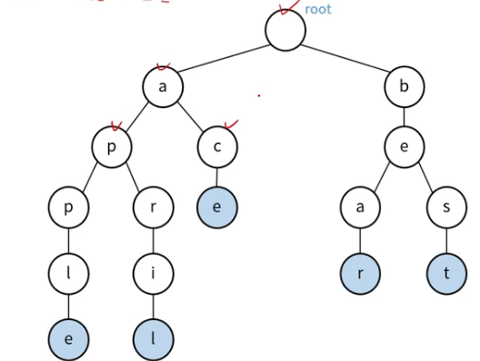

## 트라이(Trie)
- 문자열을 저장하고 빠르게 탐색하기 위한 트리 형태의 자료구조
- 정렬된 트리 구조
- 문자열 저장을 위한 메모리가 필요하지만 탐색이 빠름, 길이가 N인 문자열 탐색의 시간 복잡도: O(N)

### 트라이 형태
> 문자열 구성

- apple, april, ace, bear, best



### 트라이 - 삽입 (1)
> 삽입 문자열: apple


### 트라이 - 삽입 (2)
> 삽입 문자열: april


### 트라이 - 삽입 (3)
> 삽입 문자열: app


### 트라이 - 삭제(1)
> 삭제 문자열: apple


### 트라이 - 삭제 (2)
> 삭제 문자열: app


### 트라이 구현
> Key, Value로 이루어진 노드로 구성

- Key: 알파벳
- Value: 자식 노드

```java
class Node{
    HashMap<Charcter, Node> child;
    boolean is Terminal;
}
```


```java
import java.util.HashMap;

class Node {
    HashMap<Character, Node> child;
    boolean isTerminal;

    public Node() {
        this.child = new HashMap<>();
        this.isTerminal = false;
    }
}

class Trie {
    Node root;

    public Trie() {
        this.root = new Node();
    }

    public void insert(String str){
        Node cur = this.root;

        for (int i = 0; i < str.length(); i++) {
            char c = str.charAt(i);

            // 현재 해당 문자로 시작하는 노드가 cur 기준으로
            // 데이터 c가 없으면 넣어주고
            // 있으면 넘어간다.
            cur.child.putIfAbsent(c, new Node());
            cur = cur.child.get(c);

            if(i == str.length() - 1){
                cur.isTerminal = true;
                return;
            }
        }
    }

    public boolean search(String str){
        Node cur = this.root;

        for (int i = 0; i < str.length(); i++) {
            char c = str.charAt(i);

            if(cur.child.containsKey(c)){
                // c문자로 시작하는 key가 있다면?
                cur = cur.child.get(c);
            }else{
                // 없다면 false;
                return false;
            }

            if(i == str.length() - 1){
                // 끝에 도달했을 때?
                if(!cur.isTerminal){
                    // trie의 마지막 글자임을 나타내는
                    // isTerminal이 false이면 return false;
                    return false;
                }
            }

        }

        // 이상 없으면
        return true;
    }

    public void delete(String str){
        boolean ret = this.delete(this.root, str, 0);
        if(ret){
            System.out.println(str + " 삭제 완료");
        } else{
            System.out.println(str + " 단어가 없습니다. ");
        }

    }

    private boolean delete(Node node, String str, int idx){
        char c = str.charAt(idx);

        if(!node.child.containsKey(c)){
            // 현재 child가 가지고 있는 key값에 문자 c가 없다면?
            // => child의 HashMap이 가지고 있는 문자중에 c가 없다면?
            // 해당 문자를 찾을 수 없으므로
            return false;
       }

        // 있다면? => c를 가져온다.
        Node cur = node.child.get(c);
        idx++;

        if(idx == str.length()){
            //문자열 끝에 도달했을 때?
            if(!cur.isTerminal){
                // 해당 문자열의 끝표시가 되어있지 않다면?
                // 해당 문자열은 trie에 기록된 것이 아니므로
                return false;
            }

            // 해당 문자열의 표시가 끝표시가 되어 있다면?
            // 해당 문자열의 end 표시를 지워준다.
            cur.isTerminal = false;

            // 만약 해당 끝문자 이후에 문자가 없다면?
            if(cur.child.isEmpty()){
                // 해당 문자에서 파생되는 새로운 문자가 없으므로
                // 해당 문자를 지워준다.
                node.child.remove(c);
            }

        } else {
            if(!this.delete(cur, str, idx)){
                // 재귀 호출 후 false 받아오면 return false;
                return false;
            }

            if(!cur.isTerminal && cur.child.isEmpty()){
                // 끝 문자열를 삭제한 뒤 다음 삭제 문자들 중에
                // 파생 문자열이 없다면? => 해당 문자를 지워준다.
                // 끝문자 표시(x) && 문자의 자식 문자(x) 인 경우
                node.child.remove(c);
            }

        }

        return false;
    }

}
```