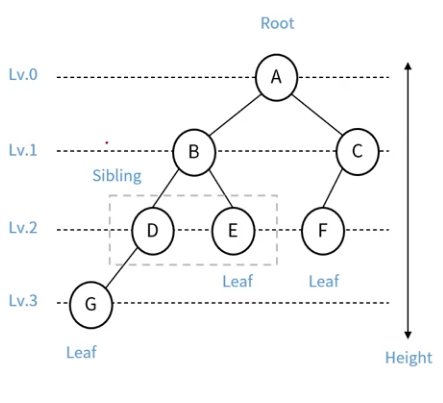
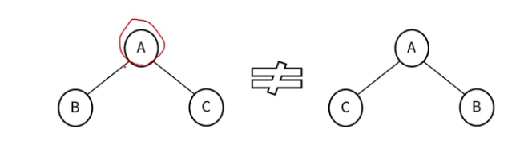
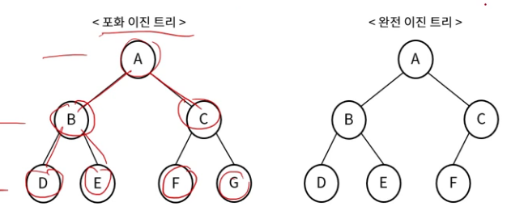
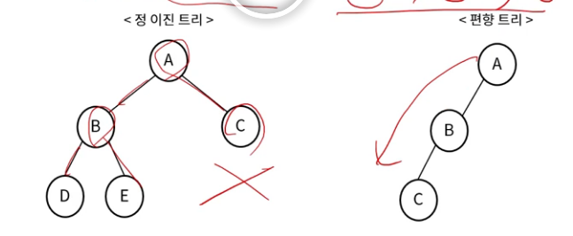
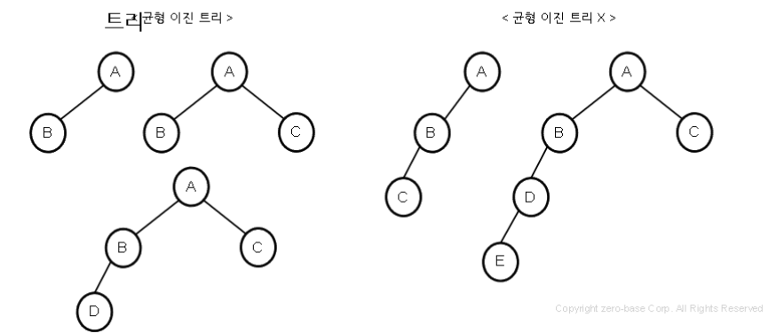
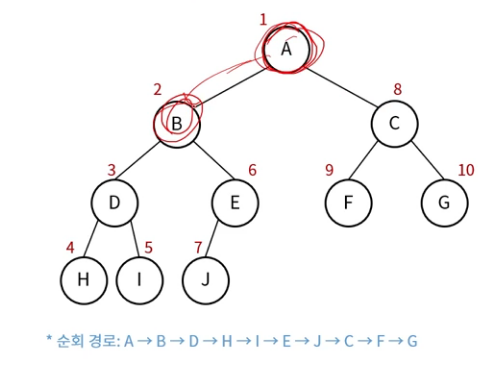
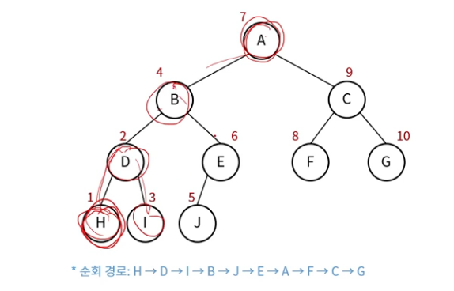
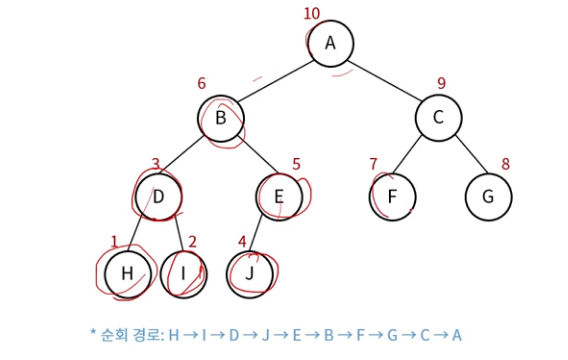
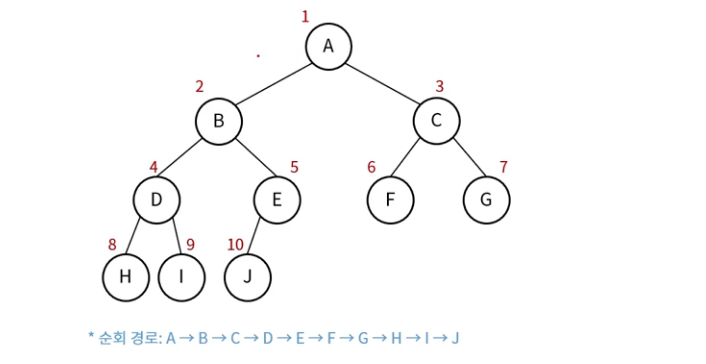
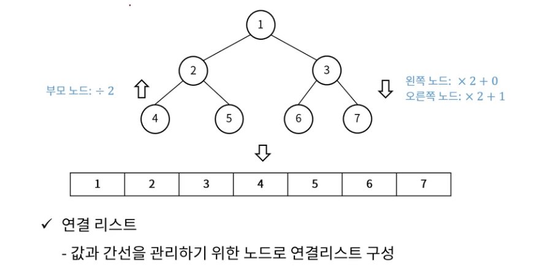

## 트리 (Tree)
- 노드와 링크로 구성된 자료구조 (그래프의 일종, Cycle 없음)
- 계층적 구조를 나타낼 때 사용
    - 폴더 구조(디렉토리, 서브 디렉토리)
    - 조직도, 가계도, ...

### 트리의 구조

- 노드(Node): 트리 구조의 자료 값을 담고 있는 단위
- 에지(Edge): 노드 간의 연결선(=link, branch)
- 루트 노드(Root): 부모가 없는 노드, 가장 위의 노드
- 잎새 노드(Leaf): 자식이 없는 노드 (=단말)
- 내부 노드(Internal): 잎새 노드를 제외한 모든 노드
- 부모(Parent): 연결된 두 노드 중 상위의 노드
- 자식(Child): 연결된 두 노드 중 하위의 노드
- 형제(Slibling): 같은 부모를 가지는 노드
- 깊이(Depth): 루트에서 어떤 노드까지의 간선의 수
- 레벨(Level): 트리의 특정 깊이를 가지는 노드 집합
- 높이(Height): 트리에서 가장 큰 레벨 값
- 크기(Size): 자신을 포함한 자식 노드의 개수
- 차수(Degree): 각노드가 지닌 가지의 수
- 트리의 차수: 트리의 최대 차수

### 트리의 특징
- 하나의 노드에서 다른 노드로 이동하는 경로는 유일
- 노드가 N개인 트리의 Edge의 수는 N-1 개
- Acyclic (Cycle이 존재하지 않음)
- 모든 노드는 서로 연결되어 있음
- 하나의 Edge를 끊으면 2개의 Sub-Tree로 분리됨

### 이진 트리 (Binary Tree)
- 각 노드는 최대 2개의 자식을 가질 수 있음
- 자식 노드는 좌우를 구분함
    - 왼쪽 자식: 부모 노드의 왼쪽 아래
    - 오른쪽 자식: 부모 노드의 오른쪽 아래

### 이진 트리 종류 (1)
- 포화 이진 트리 (Perfect binary tree)
    - 모든 레벨에서 노드들이 꽉 채워져 있는 트리
- 완전 이진 트리 (Complete Binary tree)
    - 마지막 레벨을 제외하고 노드들이 모두 채워져 있는 트리
    - 마지막 레벨은 꽉 차 있지 않아도 되지만, 노드가 왼쪽에서 오른쪽으로 채워져야 함.
    - 마지막 레벨 h에서 1 ~ 2h - 1개의 노드를 가질 수 있음.

### 이진 트리 종류 (2)
- 정 이진 트리 (Full binary tree)
    - 모든 노드가 0개 또는 2개의 자식 노드를 갖는 트리
- 편향 트리 (Skewed Binary Tree) = 사향 트리
    - 한쪽으로 기울어진 트리

### 이진 트리 종류 (3)
- 균형 이진 트리 (Balanced binary tree)
    - 모든 노드의 좌우 서브 트리 높이가 1이상 차이 나지 않는 트리

### 이진 트리 특징
- 포화 이진 트리의 높이가 h일 때, 노드의 수는 $2^{h+1} - 1$개
- 포화(or완전) 이진 트리의 노드가 N개 일 때, 높이는 logN
- 이진 트리의 노드가 N개 일 때, 최대 가능 높이는 N

### 이진 트리의 순회 (Traversal)
- 모든 노드를 빠뜨리거나 중복하지 않고 방문하는 연산
- 순회 종류는 4가지
    - 전위 순회, 중위 순회, 후위 순회
    - 레벨 순회

### 이진 트리의 순회 - 전위 순회
- Preorder Traversal
- 방문 순서: 현재 노드 -> 왼쪽 노드 -> 오른쪽 노드

### 이진 트리의 순회 - 중위 순회
- Inorder Traversal
- 방문 순서: 왼쪽 노드 -> 현재 노드 -> 오른쪽 노드

### 이진 트리의 순회 - 후위 순회
- Postorder Traversal
- 방문 순서: 왼쪽 노드 -> 오른쪽 노드 -> 현재 노드

### 이진 트리의 순회 - 레벨 순회
- Levelorder Traversal
- 방문 순서: 위쪽 레벨 부터 왼쪽 노드 -> 오른쪽 노드

### 이진 트리 구현
- 배열
    - 레벨 순회 순으로 배열에 구성

- 연결 리스트
    - 값과 간선을 관리하기 위한 노드로 연결리스트 구성

