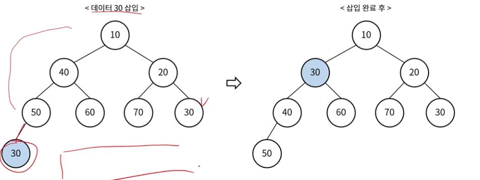
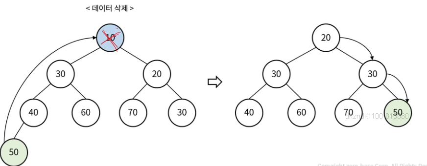
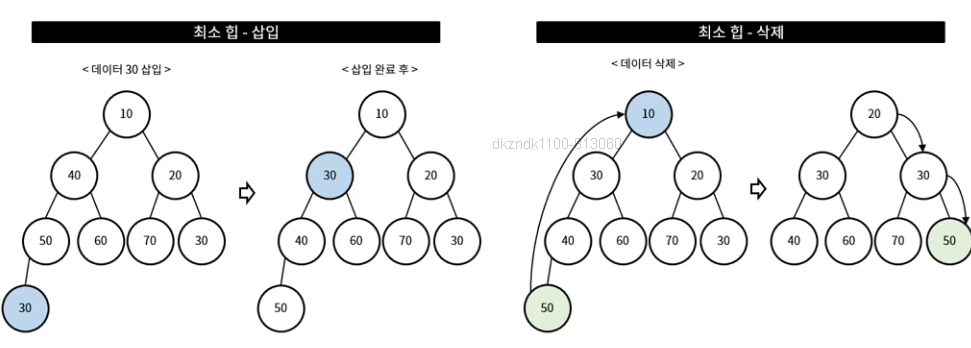
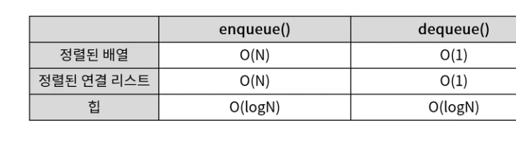

## 힙(Heap)

- 완전 이진 트리 형태
    - 중복 값 허용
    - 반 정렬 상태
- 최소값 또는 최대값을 빠르게 찾아내는데 유용한 자료구조
    - 최소 힙, 최대 힙

### 최소 힙 (Min Heap)
- 부모 노드의 키가 자식 노드의 키보다 작거나 같은 형태

### 최소 힙 - 삽입
- 트리의 가장 끝 위치에 데이터 삽입
- 부모 노드와 키 비교한 후 작을 경우 부모 자리와 교체 (반복)

### 최소 힙 - 삭제

- 최상위 노드 반환 및 삭제
- 가장 마지막 위치의 노드를 최상위 노드로 위치 시킴
- 자식 노드 중 작은 값과 비교 후 부모 노드가 더 크면 자리 교체(반복)

## 우선순위 큐

### 우선순위 큐(Priority Queue)
- 우선순위가 높은 데이터가 먼저 나옴 (!= FIFO)
    - 모든 데이터에 우선순위가 있음
    - Dequeue 시, 우선순위가 높은 순으로 나감
    - 우선 순위가 같은 경우는 FIFO

### 우선순위 큐 - enqueue, dequeue
- 최소 힙 및 최대 힙의 삽입 삭제와 같음

### 우선순위 큐 - 구현
- 배열
- 연결 리스트
- 힙

