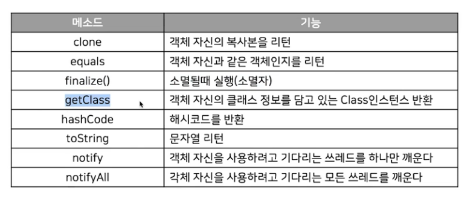
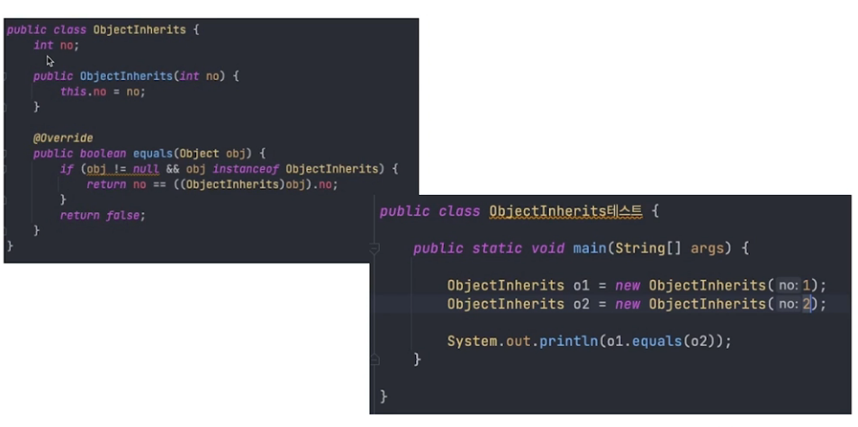
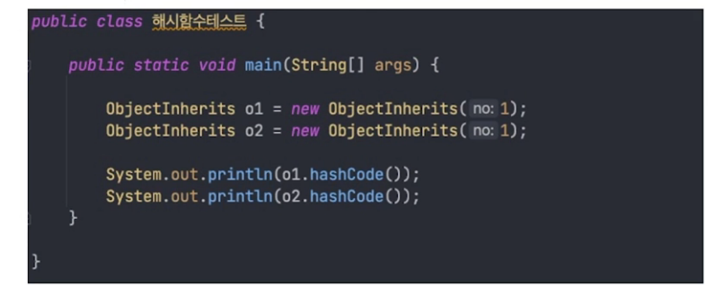
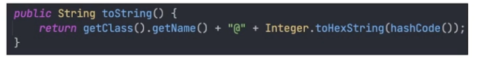
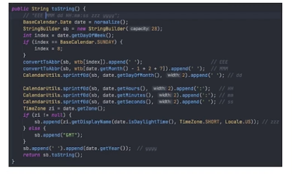
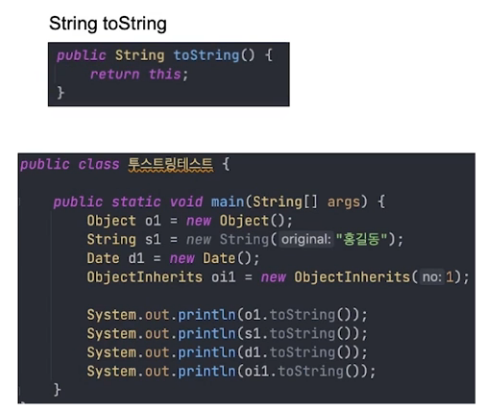

## 목차
1. [Object](#object)
2. [String](#string)

## Object 

### java.lang 패키지
- 자바 프로그램의 가장 기본이 되는 클래스들을 포함
- import문 없이 사용
- 대표적인 String, System 클래스를 import문 없이 사용할 수 있었던 이유

### Object 클래스
- 모든 클래스의 조상 클래스 -> 따라서 Object 클래스의 멤버들은 상속이 가능하다면 다른 클래스에서 사용 가능

### equals
- Object의 equals 메소드는 두 값을 비교(참조변수 이기 때문에 참조되는 주소값이 같은지 비교)
- 결국, 두 값이 가르키고 있는 메모리가 같은지 확인
- String 이나 Date 다른 참조 클래스는 오버라이딩을 통해서 equals 메소드를 재정의

[Equals](object/exam01/EqualSample.java)

### hashCode()
- 데이터관리기법인 해시기법에 사용되는 해시함수를 구현
- 클래스의 인스턴스변수 값으로 객체의 같고 다름을 판단해야 하는 경우 equals메소드와 hashCode메소드를 같이 이용해서 비교

[HashCode](object/exam01/HashSample.java)

### toString()
- 사용자 정의 클래스는 보통 오버라이딩 이후 적절한 내용으로 수정함

- Object to String

- Date to String

- String to String

[ToString](object/exam01/ToStringSample.java)

## String

> String 클래스
>
> 자바에서 문자열을 처리하는 클래스

### 메서드
> 많다..

- length
- charAt
- toCharArray
- contains
- indexOf
- lastindexOf
- toLowerCase
- toUpperCase
- trim
- equals
- equalsIgnoreCase
- split
- replace
- replaceAll
- concat
- endsWith
- startsWith
- substring
- toString
- valueOf
- compareTo

[StringMethod](object/exam03/StringTest.java)