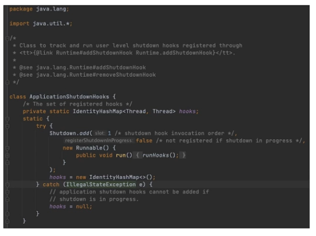
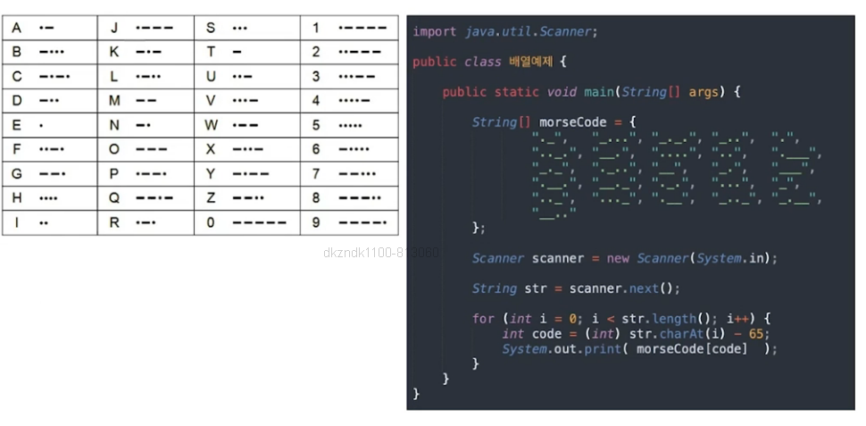

## 목차
1. [static](#static)
2. [final](#final)
3. [멤버변수](#멤버변수)
4. [배열](#배열)

## Static
- 필드나 메소드의 소속을 클래스로 제한하는 키워드
- static을 사용한 정적 변수나 정적 메소드는 클래스 변수와 클래스 메소드
- 정적 필드 PI
    - 클래스에 소속된 저장공간이 하나만 존재하는 변수
    - 할당되는 객체에는 저장공간이 없음
    - 비정적 필드 radius
        - 할당되는 객체마다 저장공간이 할당되는 객체 소속 변수

- 정적 필드 참조 방법
    - 정적 필드는 Circle.PI와 같이 클래스이름.정적필드로 참조하는 방법이 원칙
        - c1.PI나 c2.Pi와 같이 객체 이름으로도 참조 가능

```java
public class Circle{

    public double radius; // 반지름
    private double pi = 3.14; // 파이

    public Circle(double radius){
        this.radius = radius;
    }

    // 원 넓이
    public double getArea(){
        return this.pi * this.radius * this.radius;
    }

    // 원의 둘레
    public double getPerimeter(){
        return 2 * this.pi * this.radius;
    }


}

public class CircleTest{

    public static void main(String[] args){
        Circle c1 = new Circle(10);
        System.out.println("원의 넓이:" + c1.getArea());
        System.out.println("원의 둘레:" + c1.getPerimeter());

        Circle c2 = new Circle(100);
        System.out.println("원의 넓이:" + c2.getArea());
        System.out.println("원의 둘레:" + c2.getPerimeter());

        // 싱글톤 패턴
        Calendar calendar = Calendar.getInstance();

    }
}
```

## final

1. 지역 변수의 상수
- 키워드 final을 명시
- 저장된 값을 더 이상 수정할 수 없도록

2. 소속 변수인 필드를 상수로 선언하기 위해 
- 키워드 finale을 명시
- static도 함께 사용하여 정적으로 하는 것을 권유

```java
public class 달력{
    public static final int LAST_MONTH = 12;
}

public class 달력테스트{

    public static void main(String[] args){
        달력 내달력 = new 달력();
        // 내달력.lastMonth = 13;  바뀌면 안되는 변수값.
        System.out.prinln(내달력.LAST_MONTH); 
    }
}

```

### static final과 final의 차이

> final의 경우는 생성자로 인스턴스 생성시 값 할당이 한번 가능함.
>
> static final의 경우는 값 할당이 아예 불가능함.
```java
public class FinalClass{
    public static final int LAST_VALUE = 12;
    public final int ONE_SET_VALUE;

    public FinalClass(int value){
        // 딱 한번 초기화 가능.
        this.ONE_SET_VALUE = value;
    }

}
```

## 멤버변수

1. 멤버변수의 초기화 방법
    - 명시적 초기화
    - 초기화 블럭
        - 클래스 초기화 블럭
        - 인스턴스 초기화 블럭
    - 생성자



```java
public class Cola{

    // 명시적 초기화
    private static int volume = 20;
    private int createNum = 10;


    // 클래스 초기화 블럭
    static{
        System.out.println(" 클래스 블럭 ");
        volume = 40; // static으로 선언되었기 때문에 이미 메모리에 올라가 있고 이는 가능한 선언임.
        // createNum = 10; 불가능 => instance 객체가 만들어져야 메모리에 올라가고 접근 가능.
    }


    // 인스턴스 초기화 블럭
    {   
        System.out.println(" 인스턴스 블럭 ");
        // volume = 50; 불가능.
        createNum = 10; // 가능 => 인스턴스 객체가 만들어질 때 실행됨.
    }

    public Cola(){
        System.out.println(" 생성자 호출 ");
        volume = 60;
        createNum = 20;
    }

}

public class ColaTest{
    public static void main(String[] args){
       Cola cola1 = new Cola();
       Cola cola2 = new Cola();

       /*
            출력 결과

            클래스 블럭
            인스턴스 블럭
            생성자 호출
            인스턴스 블럭
            생성자 호출
       */
    }
}
```

## 배열
- 같은 타입(형)의 여러 변수를 하나의 묶음(SET)으로 선언해서 처리하는 것
- 배열의 선언과 생성
```java
타입[] 변수이름;
타입 변수이름[];

int[] jumsu;
String[] userName;

int jumsu[];
String userName[];
```
- 배열의 길이와 인덱스
    - 배열의 길이는 int 범위의 0 ~ 양의 정수
    - 인덱스의 범위는 "0"부터 "배열의길이-1"까지

- 배열의 길이 변경
    - 더 큰 배열을 새로 생성
    - 기존 배열의 내용을 새로운 배열에 복사

- 배열의 초기화
- 배열의 복사
- String 배열
```java

// 얕은 복사
int[] a1 = {1, 2, 3, 4};
int[] a2 = a1;

// 깊은 복사
int[] b1 = {1, 2, 3, 4};
int[] b2 = new int[b1.length];
for (int i = 0; i< b1.length; i++){
    b2[i] = b1[i];
}

// 배열복사1 - Object.clone() - 가장 보편적인 방법
int[] c1 = { 1, 2, 3, 4};
int[] c2 = c1.clone();

// 배열복사2 Arrays.copyOf()
int[] d1 = { 1, 2, 3, 4};
int[] d2 = Arrays.copyOf(d1, d1.length);

// 배열복사3 - System.arraycopy()
int[] e1 = { 1, 2, 3, 4};
int[] e2 = new int[e1.length];
System.arraycopy(e1, 0, e2, 0, e1.length);
```

### 배열 예제



- 2차원 배열
- 3차원 배열
- 다차원 배열.