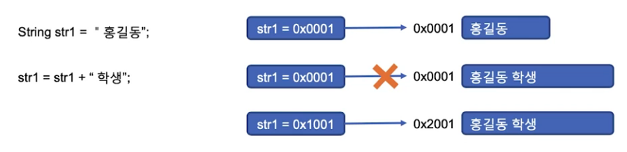
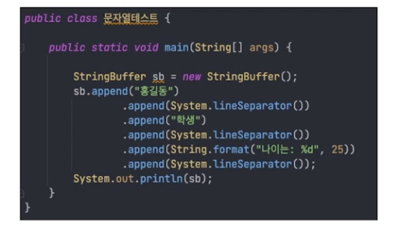
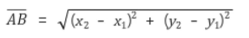
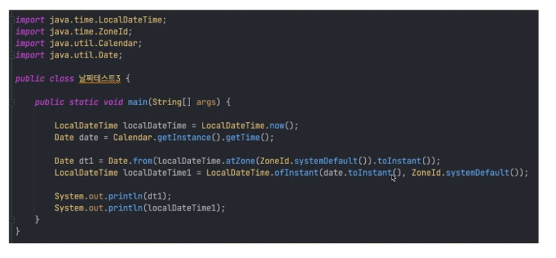

## 목차
1. [StringBuffer, StringBuilder](#stringbuffer--stringbuilder)
2. [Math](#math)
3. [날짜 관련 클래스](#날짜-관련-클래스)

## StringBuffer / StringBuilder

### StringBuffer 클래스
- StringBuffer의 필요성
- 문자열 처리는 보통 String이 하지만, 불변의 속성을 갖는다.

> 문자열 할당 후 추가로 더해지는 연산을 하면 기존 메모리에 추가되는게 아니라, 새로운 메모리에 더해진 문자열의 영역을 잡고 그 곳의 주소를 가리킴. 이전에 저장되어 있던 문자열 부분은 GC가 관리함 
>
> => 문자열의 변경이(추가, 삭제, 수정) 빈번한 경우 메모리에 영향이 클 수 있음.
이를 해결하기 위해서 불변이 아닌 가변의 속성을 가지는 StringBuffer 클래스를 사용
>
> => 따라서, 문자열의 변경이(추가, 삭제, 수정) 빈번하게 발생하는 경우 String 클래스 보다는 StringBuffer 클래스를 사용하여야 함.

- 보통 문자열의 조작에 많이 쓰이나, 요즘 컴파일러는 String 클래스와 크게 차이가 없어 보임.
- String 이나 StringBuffer나 업무에 맞게 편한걸 사용.

### StringBuilder와 StringBuffer와의 차이
- StringBuffer는 멀티쓰레드 환경에서 유리.
- StringBuilder는 싱글쓰레드 환경에서 유리함.

> 쓰레드가 서로 공유하고 수정할 수 있는 data가 존재할 때
스레드간 동기화가 되지 않은 상태에서 멀티쓰레드 프로그램을 수행하면 data의 안전성과 신뢰성을 보장할 수 없음.
>
> StringBuffer의 경우 자바의 `syncronized` 기능을 이용하여 thread-safe를 만족 시켜서 여러개의 스레드가 한 개의 자원을 사용하고자 할 때 현재 데이터를 사용하고 있는 해당 스레드를 제외하고 나머지 스레드 들은 데이터에 접근할 수 없도록 막는 개념

### [Buffer, Builder 예제](classkinds/buffers/StringBufferTest.java)

## Math
- 수학계산 하는데 있어서 유용한 클래스
- 소수점 처리 함수
    - round : 반올림
    - ceil : 올림
    - floor : 버림

- 스마트폰 앱에서 보통 위치기반으로 서비스를 진행
    - 가까운 곳에 있는
    - 내 근처에 있는

- 평면좌표상에서 두 점 사이의 거리 공식

- 두 점 사이의 거리값을 구하는 메소드 구현

### [Math 예제](classkinds/mathc/MathTest.java)

## 날짜 관련 클래스

### 자료 형태에 따른 분류

- 숫자
    - 나이, 순번(ID), 조회수, 주문 건수

- 문자열
    - 이름, 학과, 제목, 내용

- 불린
    - 이메일 수신 여부, SMS 문자 수신 여부, 푸시 수신 여부

- 날짜 / 시간
    - 가입일, 주문일, 미팅 일자, 미팅 시간, 운동 시간

- 바이너리
    - 이미지 파일, 문서 파일

### 날짜 및 시간 자료형 클래스
- 날짜와 시간의 데이터를 처리하기 위해서 Date 클래스 이용
- JDK 1.0부터 제공하는 클래스 -> 현재 대부분의 레거시 시스템 소스에 묻어 있음.
- 이후 기능 추가한 Calendar 클래스 포함
- JDK 1.8에 와서 java.time 패키지에 기존 기능 개선 클래스 추가

- 완전 새로운 시스템을 구축하지 않는 이상, Date 클래스는 사용 안할 수는 없음.
- Calendar 클래스 이후, 대부분의 메서드는 Calendar에서 가져오고 Date는 저장 용도로만 사용

### LocalDate, LocalTime, LocalDateTime
- DateTimeFormatter(java.time.format)

### Date To LocalDateTime, LocalDateTime to Date 변환

