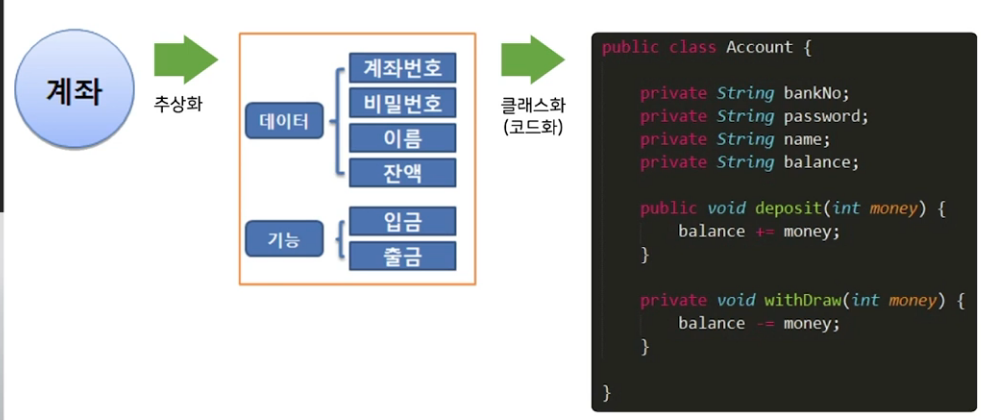
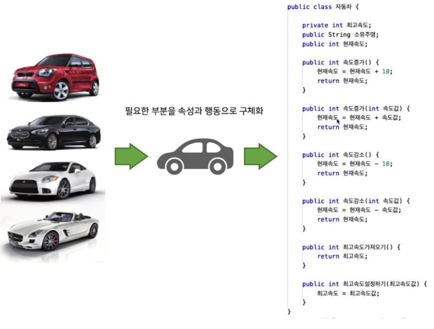
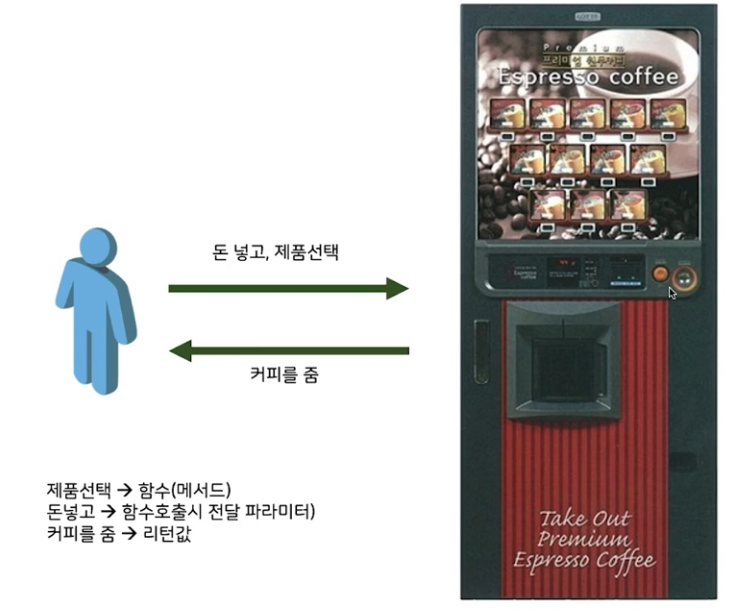
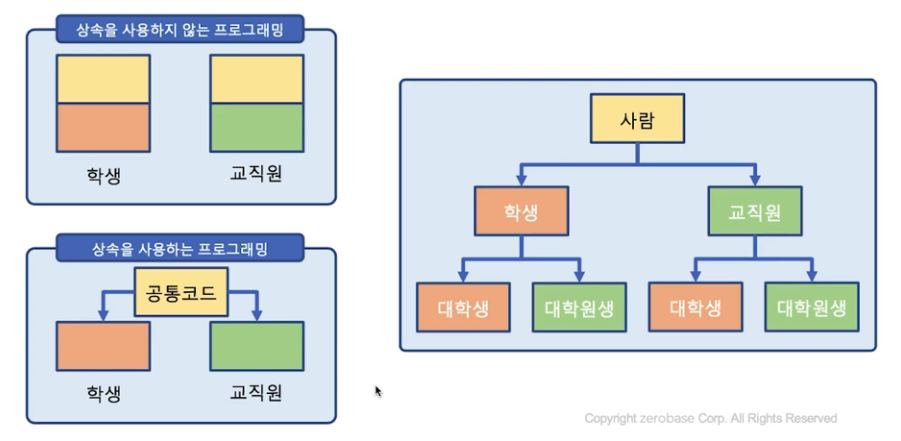
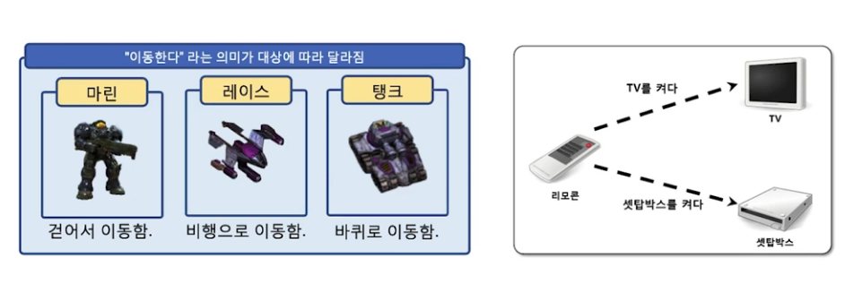

## 목차
1. [객체지향 프로그래밍 이해](#객체지향-프로그래밍-이해)

2. [객체지향언어의 특징](#객체지향-언어의-4가지-특징)

## 객체지향 프로그래밍 이해

- 절차 지향 프로그래밍
    - 객체지향 언어 개념이 나오면서 기존 프로그래밍 방식을 표현하기 위해서 사용함.
    - 큰 틀은 일렬의 동작(모듈, 함수)를 순서에 맞게 단계적 실행
    - 데이터와 속성 보다는 명령어의 순서와 흐름에 포커싱
    - 소프트웨어 규모가 커지면서 기능들이 복잡해지고 추가 개발이나 유지보수 어려움의 한계
    - 절차적 프로그래밍 /구조적 프로그래밍

- 객체지향 프로그래밍
    - 클래스를 생성하고 클래스로부터 객체를 만들어 객체간의 상호작용을 이용하여 주어진 문제를 해결하는 프로그래밍 방식
    - 데이터인 필드와 절차인 메소드를 하나로 묶은 클래스 단위의 프로그램
    - 현실 세계를 객체 단위로 프로그래밍하여, 객체는 필드(데이터)와 메서드(코드)를 하나의 블럭으로 묶어서 표현

- 객체지향 프로그래밍 언어
    - 원조는 시뮬라(simula)라는 프로그램 언어
    - 1960년에 조한 달과 크리스틴이 시뮬라67 발표
    - 클래스라는 개념을 처음으로 도입

### 객체
- 현실 세계의 사물이나 개념을 시스템에서 이용하기 위해 현실 세계를 자연스럽게 표현하여 손쉽게 이용할 수 있도록 만든 소프트웨어 모델
- 객체 = 속성 + 행동
    - 속성(Attributes, Properties)
        - 객체의 특성을 표현하는 정적 성질
        - 프로그래밍에서 속성은 필드라 함
        - 객체를 구별시키는 특성(외모, 상태 등)
    - 행동(Behaviors, Messages, Methods)
        - 객체 내부의 일을 처리하거나 객체들간의 서로 영향을 주고 받는 동적인 일을 처리하는 단위
        - 행동은 메소드(method)라 함
        - 동작을 기술

### 객체 예시 ex) 슬램덩크 강백호
- 속성
    - 이름 : 강백호
    - 출신고등학교 : 북산고
    - 리바운드 실력 : 50
    - 특기 : 리바운드, 골밑덩크 슛

- 행동
    - 연습하기 : 리바운드 + 덩크 슛

### 클래스
- 객체를 만들기 위한 모형 이자 틀(template)
- 객체를 만들려면 반드시 객체의 다양한 특성을 표현할 수 있는 모형 클래스가 필요

### 객체
- 클래스의 구체적인 하나의 실례(instance)
- 객체와 클래스의 예

## 객체지향 언어의 4가지 특징
> 추상화, 캡슐화, 상속, 다형성

### 추상화
> 현실 세계의 사실에서 주어진 문제의 중요한 측면을 주목하여 설명하는 방식
>
> 실세계의 객체에서 불필요한 부분을 제거하여 필요한 부분만을 간결하고 이해하기 쉬운 클래스로 만드는 작업
>
> 속성과 행동으로 추상화를 실현

> 필요한 부분을 속성과 행동으로 구체화

### 캡슐화
1. 객체와 객체간의 의사 소통을 위한 정보만을 노출.
    - 실제 내부 구현 정보는 숨기는 원리
2. 추상화 과정에서 클래스를 정의할 때
    - 객체의 자료와 행위를 클래스 단위로 하나로 묶고, 실제 내부 구현 내용을 외부에 감추는 것

3. 정보 은닉이 발생
    -  캡슐화 과정에서 클래스 내부 구현을 외부에 숨김
    - 내부에서 일어나는 일은 관심가지지 않음

4. 클래스의 단위의 내부 기능 중 일부는 외부에 공개되어 다른 객체와 메시지 전달과 수신을 하며 외부와의 통로 역할 수행

### 캡슐화의 예시

### 상속
1. `물려받는다`라는 특징의 상속
    - 객체지향의 가장 핵심이 되는 개념
    - 프로그램을 쉽게 확장할 수 있도록 해주는 강력한 수단
    - 상위 클래스와 하위 클래스 간의 관계: 계층도
    - 상속 장점
        - 공통의 특성을 하위 클래스마다 반복적으로 기술하지 않고 한번만 기술하기 때문에 중복을 줄여 재사용성의 효과

### 다형성

1. 다형성(polymorphism)
    - 원래 생물학적 용어로 여러(poly) 형태(morphy)를 의미
    - 외부에 보이는 모습은 한 가지 형태이지만 실질적으로 쓰이는 기능은 여러 가지 역할을 수행한다는 의미
    - 다형성의 예
        - 오버로딩(overloading)
        - 오버라이딩(overriding)
        
