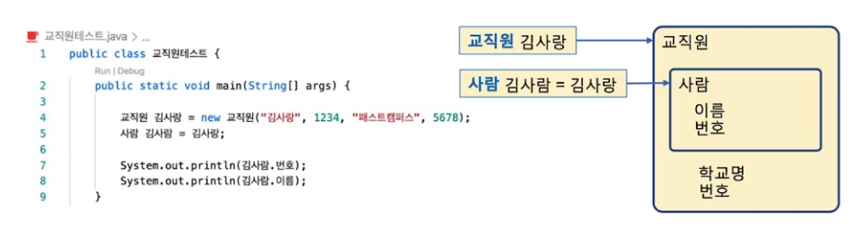
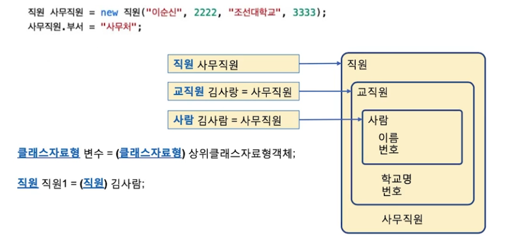
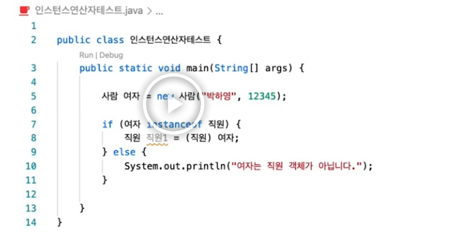

## 다형성 

### 업 캐스팅(Up Casting)
- 하위 객체는 상위 클래스형 변수에 대입이 가능, 상위로의 자료형 변환
- 업 캐스팅은 하위인 교직원은 상위인 사람이라는 개념이 성립

### 업 캐스팅의 제약
- 업 캐스팅된 변수로는 하위 객체의 멤버를 참조할 수 없는 제약
- 교직원 변수 김사랑은 접근 지정자만 허용한다면 모든 멤버에 접근 가능
- 사람 변수 김사람은 사람의 멤버만 접근 가능

### 다운 캐스팅(Down Casting)
> 다운 캐스팅은 일반적으로 업 캐스팅된 인스턴스를 다운 캐스팅한다는 전제가 있다.

- 상위 클래스 형을 하위 클래스 형으로 변환
- 다운 캐스팅은 반드시 명시적인 형변환 연산자 (하위 클래스)가 필요
- 만일 형변환 연산자가 없으면 컴파일 시간에 오류 발생

### instanceof 연산자
- 피연산자1 instanceof 피연산자2
- 피연산자1이 객체변수가 참조하는 객체가 실제 피연산자2 클래스 이름이면 true, 아니면 false를 반환
- 상속관계가 없으면 문법 오류 발생

