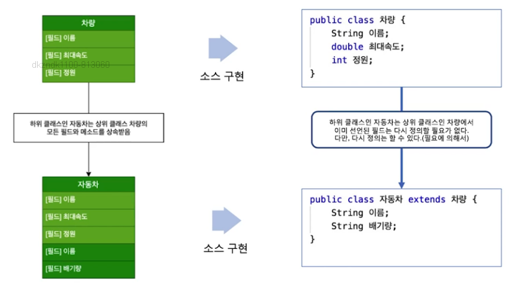

## 상속의 개념과 사례
- 상속(inheritance)
- 하위 클래스는 상위 클래스의 특징인 필드와 메소드를 그대로 물려받을 수 있는 특성
- 사람, 교직원, 학생, 교수, 행정직원, 장학생을 클래스로 표현
- 이들 클래스 간의 계층 구조에서 상속이라는 특징을 파악
- 하위인 교수, 행정직원은 상위 교직원의 특성을 모두 물려 받을 수 있음.

### 상속의 관계
- [A]는 [B]이다 -> 이다 관계(is-a relationship)가 성립
    - [B]는 상위 클래스, [A]는 하위 클래스 관계
    - 하위 클래스는 상위 클래스의 필드와 메소드를 상속받을 수 있는 특징

- 예를 들어, 교직원은 사람이다.
- 사람에 정의된 필드와 메소드는 모두 교직원이 상속 받을 수 있음.
- 자동차는 차량이다.
- 차량에 정의된 필드와 메소드는 자동차에서 상속 받을 수 있음.

- 상위 클래스 -> 부모 클래스(parent class), 슈퍼 클래스(super class), 기본 클래스(base class)
- 하위 클래스 -> 자식 클래스(child class), 서브 클래스(sub class), 유도 클래스(derived class), 파생 클래스(derived class)

- 하위 클래스
- 상위 클래스의 멤버인 필드와 메소드를 다시 구현 없이 사용

### this, super()

- this는 객체 자신을 의미하는 키워드
- super는 상위 객체를 의미하는 키워드

### 생성자
> 기본 생성자 구현 첫 줄에서의 super()

- super()는 상위 클래스의 기본 생성자를 호출하는 문장
- 생성자의 첫 줄에서 상위 생성자를 호출하는 super() 또는 super(...)를 명시적으로 호출하지 않는다면 첫 줄에서 무조건 자동으로 super()를 호출
- 자동으로 사용되는 기본 생성자의 첫 줄은 무조건 super()를 호출

- 키워드 public을 사용한 클래스는 다른 모든 클래스에서 사용 가능
- default 클래스는 package 클래스라고도 부름.
- 접근 지정자를 아무것도 기술하지 않은 default 클래스는 동일한 패키지의 다른 클래스에서만 사용 가능

### 접근 지정자 Scope

