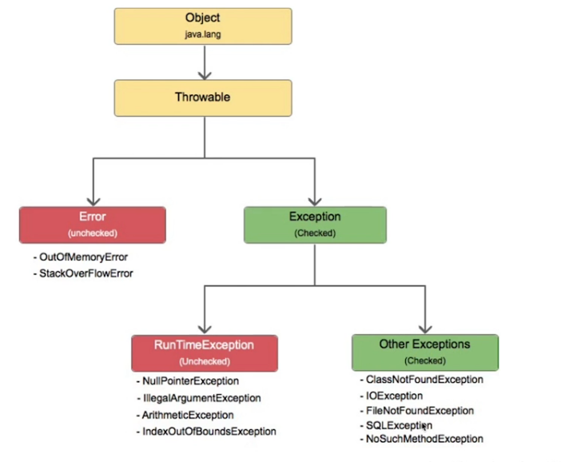
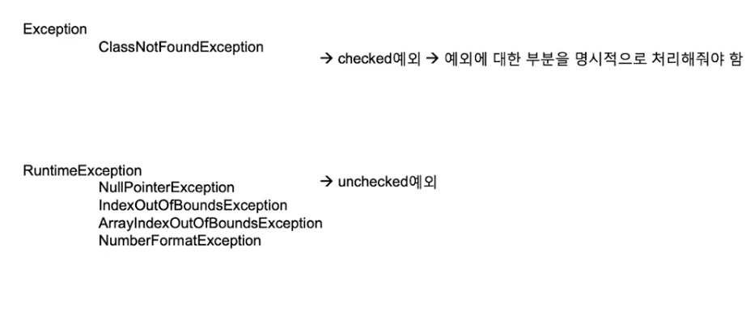
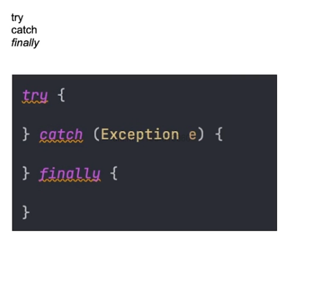
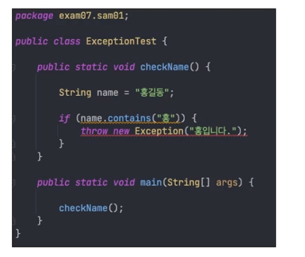

## 예외 처리

- 프로그램 오류 : 프로그램 실행 중 오작동을 하거나 비정상적으로 종류되는 경우
- 발생시점에 따라 컴파일 에러, 런타임 에러로 나눔

- 컴파일에러 : 컴파일 시에 발생하는 에러 -> class 파일을 만들 수 없음
- 런타임에러 : 실행 시에 발생하는 에러
- 논리적에러 : 실행은 되지만, 의도와 다르게 동작

- 기본적으로 프로그램에서 오류가 발생하면 프로그램은 대부분 비정상적으로 종류딘다.
- 하지만, 이런 오류 중에서 프로그램으로 나름 대응할 수 있는 오류가 있다.
- 이런 대응 가능한 부분을 예외라고 함.

### 예외처리 클래스

### 예외 처리 2가지 방법

1. 직접 내가 처리한다.
2. 내가 처리하지 않고, 호출하는 곳으로 넘긴다.

