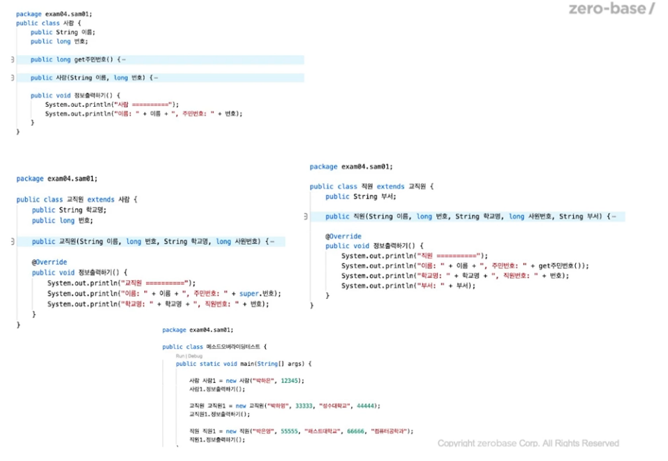
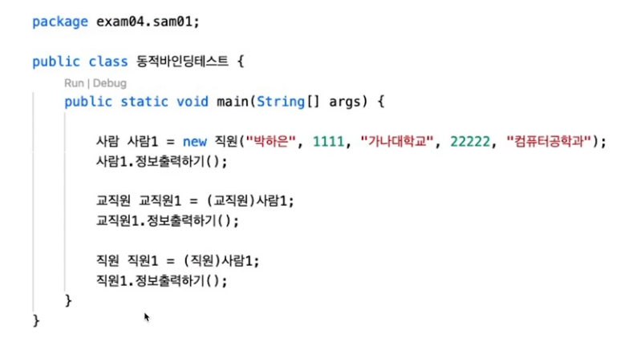
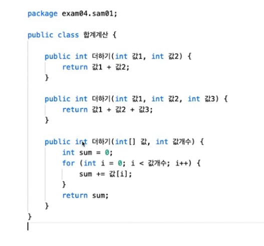

## 오버라이딩/ 오버로딩

- 메소드 오버라이딩(method overriding) 정의
    - 상위 클래스의 동일한 메소드를 하위 클래스에서 다시 정의(코드를 다시 구현)
        - 메소드 재정의(method redefinition)
        - 또는 메소드 대체(method replacement) 라고도 표현

- 메소드 오버라이딩의 목적 
    - 상위 클래스에서 이미 정의한 메소드 다시 수정하지 않고 하위 클래스에서 좀 더 보완 수정하거나 완전히 새로운 것으로 대체하기 위한 방법

### 오버라이딩의 조건
- 메소드의 반환 값과 메소드 이름, 매개변수는 반드시 같아야 함.
- 접근 지정자는 하위 클래스의 메소드가 보다 공개적
    - 상위 클래스의 메소드가 public이면, 오버리이딩 메소드는 public만 가능
    - 상위 클래스의 메소드가 protected이면, 하위 메소드는 public, protected만 가능
    - 상위 클래스의 메소드가 default이면, 하위 메소드는 public, protected, default만 가능
- 메소드 수정자가 final, private인 메소드는 오버라이딩 불가

### 오버라이딩 메소드 - 가장 하위 객체의 메소드 실행

## 메소드 오버로딩

- 클래스 내부에서 인자가 다르나 이름이 같은 메소드가 여러개 정의, 반환값은 다룰 수 있지만, 인자가 같을 수는 없음

> 오버 로딩의 경우 메소드와 정적 메소드는 무관
정적 메소드의 오버로딩은 이름이 같고 매개변수(파라미터)가 다르면 가능
>
> 다만, 정적 메소드의 경우 클래스 내부에 소속된 변수들의 접근 못함.
>
> 또한, 정적 메소드 내부에서는 this.super 사용 불가
