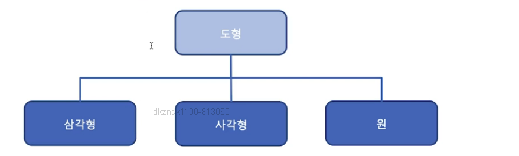
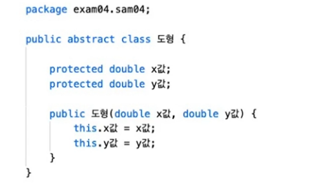
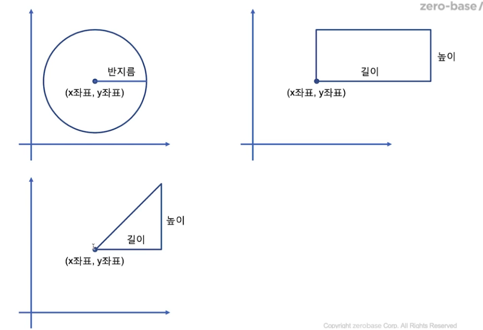

## 추상 클래스

### 추상 클래스(abstract class)의 의미
- 클래스 계층구조에서 상위에 위치, 하위 클래스를 대표하는 캘릇
- 추상의 의미대로 `구체적`이지 않은 클래스
    - 보다 구체적인 하위 클래스를 대표하는 클래스

### 다른 일반 클래스와 구별되는 특징
- 추상 클래스는 직접 객체화(instantiation)될 수 없다. -> 즉 생성자를 사용하여 객체를 생성할 수 없다.

- 추상 클래스는 다른 클래스에 의하여 상속되어야 한다. -> 즉 하위 클래스가 없는 추상 클래스는 의미가 없다.

- 추상 클래스는 하위 클래스가 있어야 하므로 구현 시 클래스 앞에 키워드 final이 올 수 없다.

