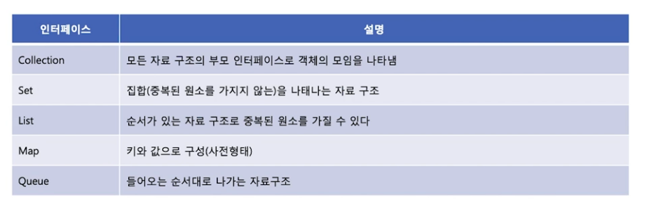
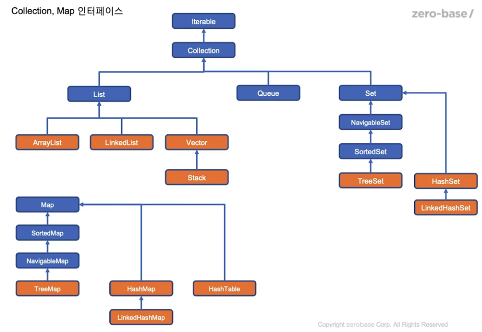
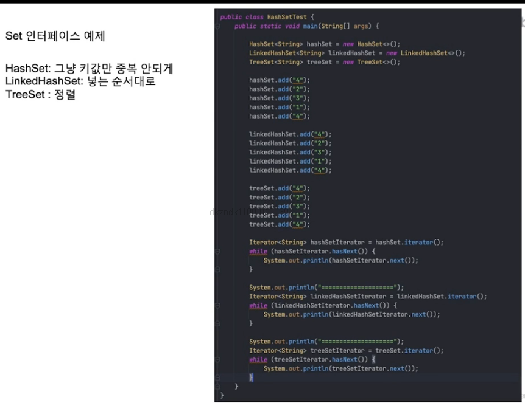
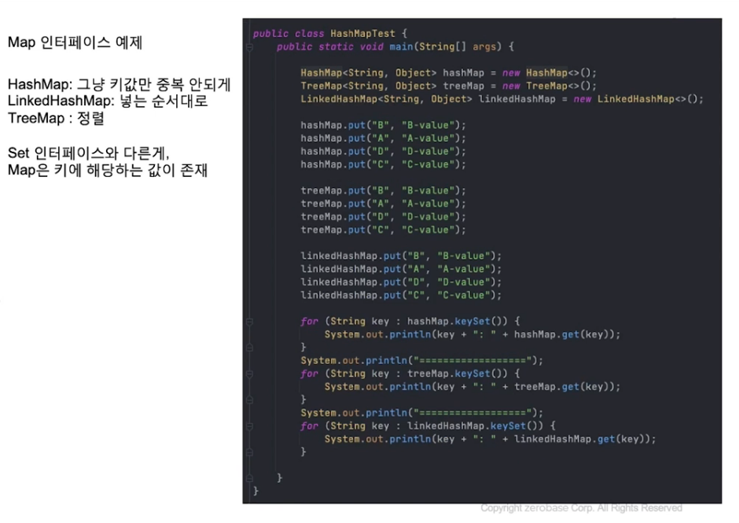

## 컬렉션
- 자바에서 자료구조를 구현한 클래스
- 자료 구조란 자료를 저장하기 위한 구조
- 대부분의 프로그램은 자료를 저장하기 때문에 필요에 따라서 적절한 자료 구조를 사용할 지를 결정
    - 전화번호를 저장
    - 시간표를 저장

- 자료구조의 종류 : 리스트(list), 스택(stack), 큐(queue), 집합(set), 해시 테이블(hash table)등
    => 자료구조는 자료를 저장하는 기능만 중요한게 아니라 빠르게 검색하거나 정렬할 수 있는 기능도 중요

### Vector 클래스
- 벡터 클래스는 JAVA에서 가장 오래된 자료구조 구현 클래스
- 배열의 경우, 크기가 고정되어 있기 때문에 사용이 불편함
- Vector는 가변 크기의 배열을 구현
- 요소의 개수가 늘어나면 자동으로 배열의 크기가 늘어남
- 어떤 타입의 객체도 저장(기본형 데이터도 저장)

### 컬렉션의 종류
- 자바는 컬렉션 인터페이스와 컬렉션 클래스로 나누어서 제공
- java.util에 포함
- 컬렉션 라이브러리들은 모두 제네릭 기능을 지원



### Collection, Map 인터페이스



### Set 인터페이스 예제
- HashSet : 그냥 키 값만 중복 안되게
- LinkedHashSet : 넣는 순서대로
- TreeSet : 정렬 순



### Map 인터페이스 예제
- HashMap : 그냥 키 값만 중복 안되게
- LinkedHashMap : 넣는 순서대로
- TreeMap : 정렬

```
Set은 인터페이스와 다른게,
Map은 키에 해당하는 값이 존재
```



### List 인터페이스 예제

- ArrayList:
```
순차적인 추가삭제는 빠르지만, 중간에 있는
데이터를 추가삭제 하는경우는
LinkedList에 비해 상적으로 느림
추가삭제를 반복할 경우 메모리 사용이
비효율적일 수 있음
```

- LinkedList:
```
데이터를 처리하는데 있어서
개수가 계속해서 변하는 경우는
LinkedList를 사용하고
그 이외는 대부분 ArrayList를 사용
(꼭 그렇치 많은 않음)
```

