## 목차

1. [클래스의 필드 구현](#클래스의-필드-구현)
2. [기본 값](#기본-값)
3. [객체생성과 필드 참조](#객체-생성과-필드-참조)
4. [클래스의메소드구현](#메소드-구현)
5. [메소드지정자](#메소드-지정자)
6. [객체생성](#객체-생성)
7. [Setter,Getter](#setter와-getter)
8. [생성자](#생성자)

## 클래스의 필드 구현

### 필드 구현 예제
- 신용카드를 추상화한 클래스 CreditCard를 구현
- 신용카드의 속성
    - 카드번호(cardNumber)
    - 소유자(cardOwner) 등을 고려

### 필드 지정자
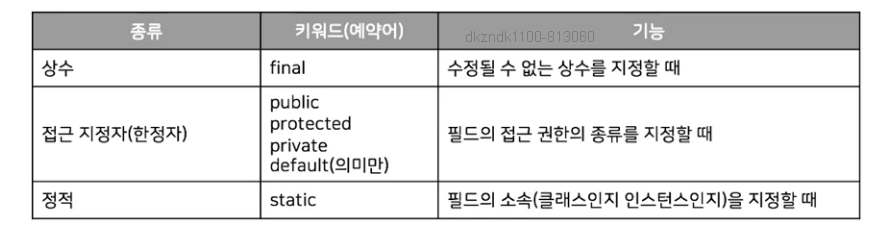

## 기본 값
> 선언 시 초기 값이 없으면 자동으로 저장되는값
>
> 타입에 따라 기본이 되는 0

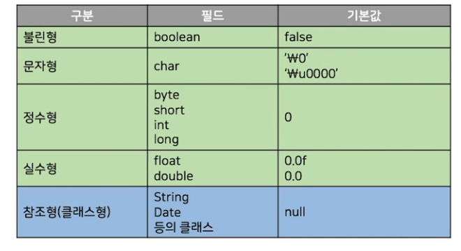

## 객체 생성과 필드 참조

### 키워드 new
- 객체를 생성하기 위해서는
    - 키워드 new 이후에 CreditCard()와 같이 생성자를 호출

```java

// 클래스의 구현부(template)
/*
    CreditCard template(구현부)
        public long cardNumber(외부 접근 가능)
        public String cardOwner(외부 접근 가능)
*/
class CreditCard{
    public long cardNumber;
    public String cardOwner;

    CreditCard(int cardNumber, String cardOwner){
        this.cardNumber = cardNumber;
        this.cardOwner = cardOwner;
    }
}

// 클래스의 선언 부
/*
    CreditCard Instance(객체 상태) myCared
        cardNumber = 1234
        cardOwner = HongGilDong
*/
public class Main{
    public static void main(String[] args){
        CreditCard myCard = new CreditCard(1234, "HongGilDong")
        myCard.cardNumber = 1234_5678_1234_1234L;
        // => myCard의 cardNumber = 1234567812341234;
    }
}

```

- 필드 참조 연산자
    - 참조형 변수인 guestCard를 사용하여 필드 cardNumber와 cardOwner를 참조
        - guestCard.cardOwner, guestCard.cardNumber

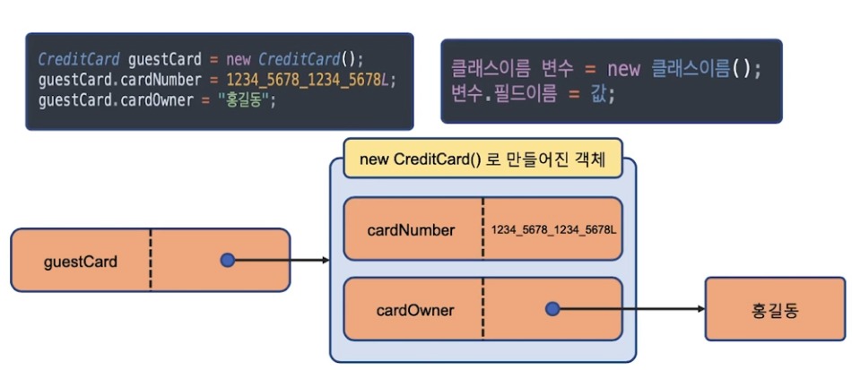

## 메소드 구현

### 지정자 반환형 메소드이름(매개변수) {구현}
- 메소드 use()
    - 신용카드를 사용하는 메소드
- 메소드 payBill()
    - 매월 또는 수시로 카드 비용을 지불하는 메소드
- 메소드 addPoint()
    - 카드 사용실적에 따른 포인트 합산하는 메소드

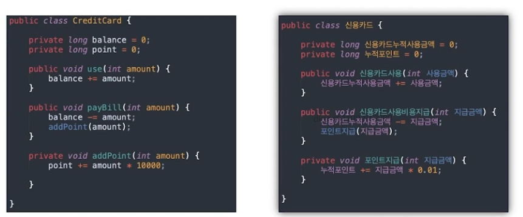

```java
class CreditCard{
    public long cardNumber;
    public String cardOwner;
    public long useCardPrice;
    public long cardPoints;

    /*
        useCard() 카드 사용
        useCardPrice = accumulatedPrice + nowUsePrice
    */

    public void useCard(long usedAmount){
        this.useCardPrice = this.useCardPrice + usedAmount;
    }

    /*
        payCardPoint() 카드 비용 지급
        누적 사용금액에서 사용금액 일부분을 포인트로 변환
    */
    public void payCardPoint(long paymentAmount){
        this.useCardPrice = this.useCardPrice - paymentAmount;
        long cardPoint = paymentAmount / 1000; // 1000원당 1 포인트
        addPoint(cardPoint);
    }

    /* 
        addPoint() 포인트 지급
    */
    private void addPoint(long pointPrice){
        this.cardPoints = this.cardPoints + pointPrice;
    }
}

public class Main(){
    
    public static void main(String[] args){
        CreditCard myCard = new CreditCard();
        myCard.cardNumber = 1111_2222_3333_4444;
        myCard.cardOwner = "HongGilDong";

        System.out.println(myCard.cardNumber);
        System.out.println(myCard.cardOwner);
        System.out.println(myCard.useCardPrice);
        System.out.println(myCard.cardPoints);

        myCard.useCard(8000); // cardNumber += 8000
        myCard.useCard(15000); // cardNumber += 15000
        myCard.useCard(21000); // cardNumber += 21000

        /* 
            로직
            cardNumber -= 30000;
            cardPoints += (30000 / 1000)
        */
        myCard.payCardPoint(30000); 

        System.out.println(myCard.cardNumber);
        System.out.println(myCard.cardOwner);
        System.out.println(myCard.useCardPrice);
        System.out.println(myCard.cardPoints);

    }
}
```

## 메소드 지정자

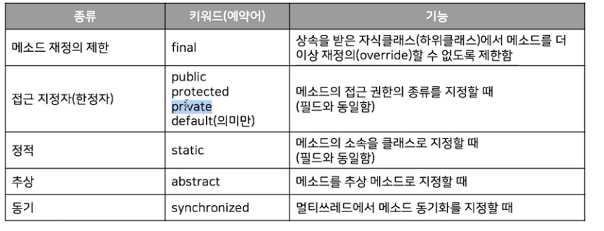

## 객체 생성

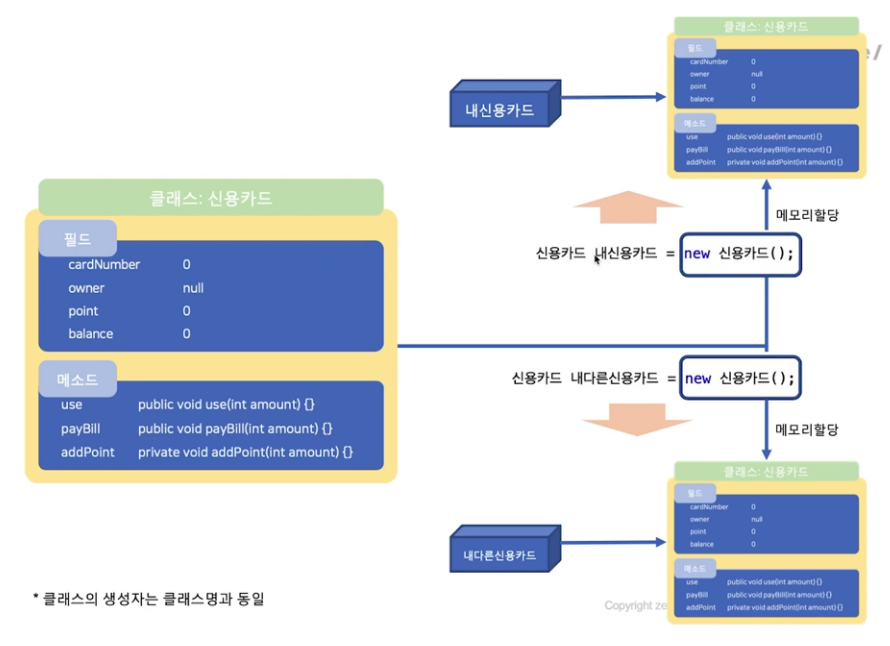

### 참조 연산자
- 참조 변수의 필드와 메소드를 사용

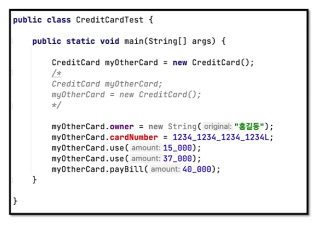

## Setter와 Getter
> 필드의 값을 저장하는 메소드 setter
>
> 필드의 값을 가져오는 메소드 getter

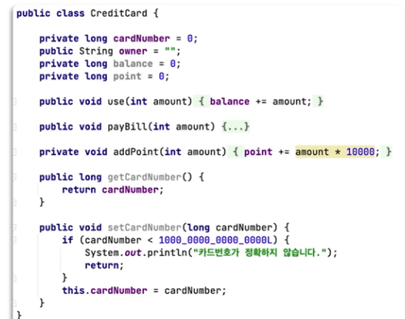

### 키워드 this
> 객체 자신을 의미하는 키워드

## 생성자

### 생성자 개요
- 객체를 만드는 틀인 클래스에서 필요하면 생성자를 구현
    - 객체가 생성될 때 필요한 작업을 수행하는 특별한 메소드
    - 주로 객체 필드에 초기 값을 저장하거나 객체의 사용을 위해 필요한 초기화 작업이 수행
- 생성자의 구성
    - 반환형을 기술하지 않으며 이름은 반드시 클래스 이름
    - 생성자의 인자는 필요하면 기술
    - 생성자는 주로 접근 지정자 public을 사용
        - 만일 필요하다면 생성자의 접근 지정자도 private 또는 protected도 가능

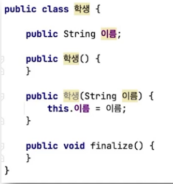

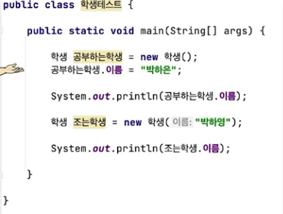

> 임의 생성자를 추가하면 클래스 생성시 기본으로 생성되는 생성자는 만들어지지 않음
>
> 만약 임의 생성자를 추가한 상태에서 기본 생성자를 만들고 싶으면 사용자가 명시 해주어야함.

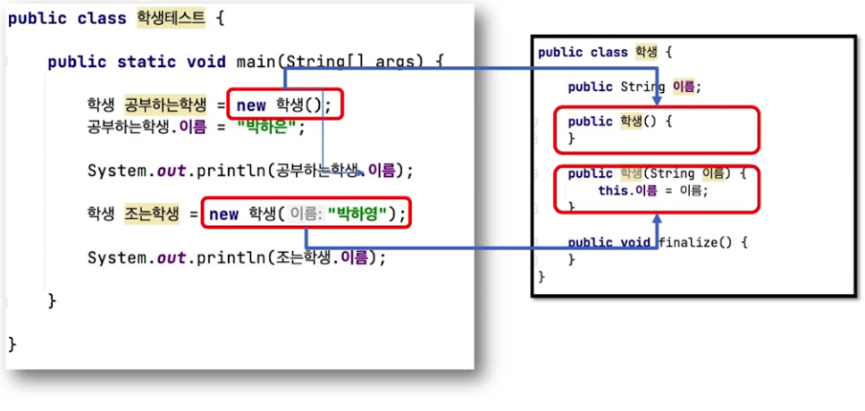

### 기본 생성자(default constructor)
- 인자가 없는 생성자
- 클래스 Student에서 생성자가 하나도 구현되지 않았다면
    - new Student()와 같이 인자가 없는 생성자를 호출하여 객체 생성
    - 생성자를 전혀 구현하지 않은 클래스는 자동으로 기본 생성자를 제공

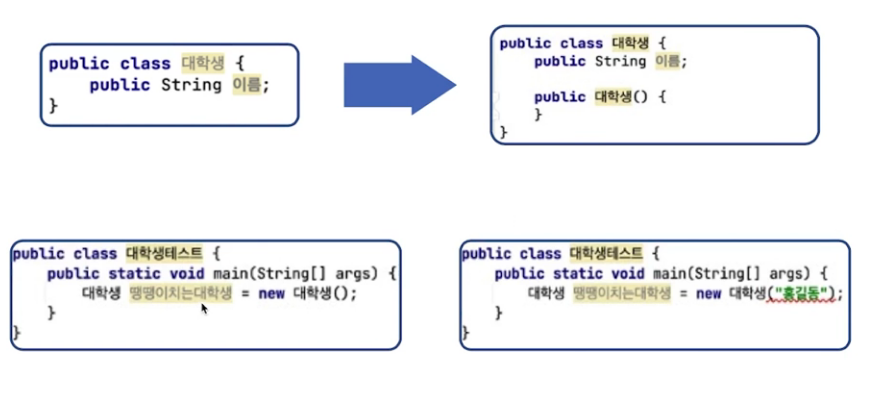

- 클래스에서 인자가 있는 생성자가 적어도 하나 구현되었다면
    - 더 이상 기본 생성자는 자동으로 사용 불가능
    - 기본 생성자를 사용하려면 기본 생성자도 직접 구현해야 함

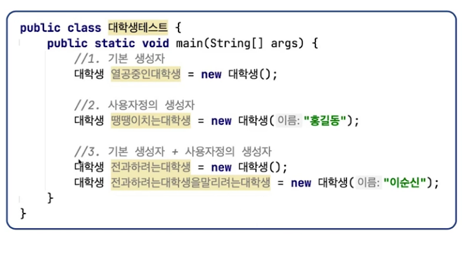

### 생성자 오버로딩
> 동일한 메서드에 대해서 매개변수가 다른 메서드를 구현하는 것.
>
> 하나의 클래스에서 인자가 다르면 생성자를 여러 개 구현 가능

```java
class Student{
    public String name;
    public int age;
    
    public Student(){
        System.out.println("기본 생성자입니다.");
    }

    public Student(String name){
        this.name = name;
        System.out.println("이름 : " + name + "매개변수가 추가된 생성자입니다.");
    }

    public Student(int age){
        this.age = age;
        System.out.println("나이 : " + age + "매개변수가 추가된 생성자입니다.");
    }

    public Student(String name, int age){
        this(name);
        //this(age) => 불가능 위에 이미 this(생성자)를 사용
        this.name = name;
        this.age = age;
        System.out.println("이름 : " + name + "매개변수와 나이 : " + age + "매개변수가 추가된 생성자입니다.");
    }

}

public class Main(){
    
    public static void main(String[] args){
        Student std1 = new Student();
        Student std2 = new Student("Hong Gil Dong");
        Student std3 = new Student(20);
        Student std4 = new Student("Hong Gil Dong", 20);

    }
}
```

### this(...)
- 구현된 자기 자신의 다른 생성자를 호출하는 문장
- 생성자 구현에서 첫 줄에는
    - this(인자)로 다른 생성자를 호출하여 사용 가능
- 두 번째 줄부터는 사용 불가